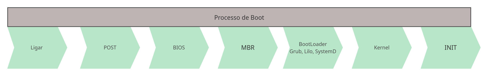
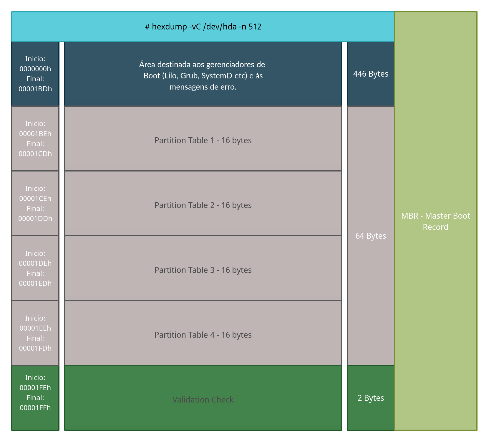
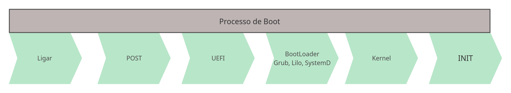

# Índice

[toc]

[<span style="color:yellow">Voltar</span>](../101.1/1011.html)
[<span style="color:yellow">Próximo</span>](../101.3/1013.html) 
[<span style="color:yellow">Índice Geral</span>](../main.html)


# 101.1 Arquitetura do Sistema

## MBR - Master Boot Record

Um Master Boot Record, é um tipo de setor de inicialização no início do HD, nele ficam informações que possibilitam a inicialização do sistema, também possibilitam gravar e ler informações mantidas no dispositivo, assim como informações sobre partições, filesystems entre outros.

Um dispositivo MBR pode dividir-se em até no máximo 4 partições primárias, possui um tamanho máximo de 2TB por disco e toda a informação das partições é guardada em apenas num único local. Pode ter apenas 1 partição extendida e várias partições lógicas.


### Inicialização do Sistema

Vamos entender os passos ocorridos durante a inicialização do computador.

1. Ao ligar o computador, inicia-se o [POST](https://whatis.techtarget.com/definition/POST-Power-On-Self-Test) (AutoTeste de Inicialização).

2. Após o término do POST, a *BIOS* começa o processo de iniciar o hardware necessário para fazer o boot do sistema (inicia discos, controladores USB, PCI e outros dispositivos).

3. Agora a [BIOS](https://www.computerhope.com/jargon/b/bios.htm) vai iniciar o programa que está nos primeiros 440 bytes (MBR) do primeiro disco na sua ordem boot (Geralmente esse bootloader é o Grub, Lilo ou SystemD) (1° estágio de boot).

4. Agora esse pequeno programa vai carregar e executar o BootLoader na memória do computador.
   O gerenciador de inicializaçãoou Boot-Loader é iniciado, e a partir daqui podemos ver a tela de menu do boot (2° estágio).
   
5. A inicialização do sistema operacional começa quando o carregador de  inicialização carrega o kernel na RAM. Nesse momento, o kernel assume o  controle da CPU e começa a detectar e configurar os aspectos  fundamentais do sistema operacional, como a configuração básica de hardware e o endereçamento de memória.

   O kernel abre então o *initramfs* (*initial RAM filesystem*). O initramfs é um arquivo que contém um sistema de arquivos raiz  temporário usado durante o processo de inicialização. O principal  objetivo de um arquivo initramfs é fornecer os módulos necessários para que o kernel possa acessar o sistema de arquivos raiz "de verdade" do  sistema operacional.

   Logo que o sistema de arquivos raiz fica disponível, o kernel monta todos os sistemas de arquivos configurados em `/etc/fstab` e, em seguida, executa o primeiro programa, um utilitário chamado `init`. O programa `init` é responsável por executar todos os scripts de inicialização e daemons do sistema. Existem implementações distintas desses iniciadores de sistema além do tradicional init, como o *systemd* e o *Upstart*. Depois que o programa init é carregado, o initramfs é removido da RAM.




Informações da MBR:




## UEFI - Unified Extensible Firmware Interface

O UEFI trablha com a partição ESP (EFI System Partition) para inicialização do sistema. Aqui temos um layout novo, teve um aumento significativo no limite de partições primárias, podendo ter até no máximo 128 partições primárias, suporte para discos acima dos 2 TB, também temos mecanismos para detecção da dados e partições corrompidas entre outras melhorias.


### Inicialização do Sistema

Vamos entender os passos ocorridos durante a inicialização do computador.


1. Ao ligar o computador, inicia-se o [POST](https://whatis.techtarget.com/definition/POST-Power-On-Self-Test) (AutoTeste de Inicialização).

2. Após o término do POST, a *UEFI* começa o processo de iniciar o hardware necessário para fazer o boot do sistema (inicia discos, controladores USB, PCI e outros dispositivos).

3. O firmware lê as entradas de inicialização na NVRAM para determinar qual aplicativo EFI iniciar e de onde (por exemplo, de qual disco e partição), geralmente essa aplicação que será iniciada é um bootloader.

4. Uma entrada de inicialização pode ser simplesmente um disco. Neste caso, o firmware procura uma partição de sistema EFI (conhecido por ter a flag ESP) nesse disco e tenta encontrar um aplicativo EFI no caminho de inicialização de fallback `\EFI\BOOT\BOOTX64.EFI` (`BOOTIA32.EFI` em sistemas com um IA32 (32 bits) UEFI) . É assim que a mídia removível inicializável UEFI funciona. Agora esse pequeno programa vai carregar e executar o BootLoader na memória do computador.

   O firmware inicia o aplicativo EFI e a partir daqui podemos ver a tela de menu do boot.

   > A partição ESP deve ter alguns dos filesystems a seguir:  FAT12, FAT16 ou FAT32. Para mídias como DVD/CD, devemos usar o filesystem ISO-9660.

5. Este poderia ser um carregador de boot ou o próprio kernel usando EFISTUB, pode ser também algum outro aplicativo EFI, como um shell UEFI ou um gerenciador de boot, como systemd-boot, rEFInd, Grub, Lilo entre outros.

   > Se a inicialização segura estiver ativada, o processo de inicialização verificará a autenticidade do binário EFI por assinatura.
   >
   > Como cada sistema operacional ou fornecedor pode manter seus próprios arquivos na partição do sistema EFI sem afetar o outro, a inicialização múltipla usando UEFI é apenas uma questão de iniciar um aplicativo EFI diferente correspondente ao carregador de inicialização do sistema operacional específico. Isso elimina a necessidade de confiar nos mecanismos de carregamento em cadeia de um carregador de boot para carregar outro sistema operacional.



O UEFI não trabalha com MBR por definição, mas é possível usar. O UEFI fica montado em `/boot/efi`, com UEFI é possível termos Boot Seguro, para isso precisamos assinar o Kernel, ele também é compatível com a BIOS (Bios Legacy), podemos configurado pelo UEFI Boot Manager ou com o comando `efibootmgr`.


## Bootloader


O `bootloader` é um software iniciado pelo firmware (BIOS ou UEFI) que serve para carregar o Sistema Operacional na memória, enquanto que o `initrd` ou `initramfs` servem para dar suporte ao Kernel. Filesystem temporário carregador na memória ram.

No caso de UEFI, o próprio kernel pode ser iniciado diretamente pelo UEFI usando o stub de inicialização EFI. Um carregador de boot ou gerenciador de boot separado ainda pode ser usado com o propósito de editar os parâmetros do kernel antes da inicialização. 

No GRUB, as vezes a lista de menus não aparece automaticamente, para que ela possa ser exibida pressione `Shift` na inicialização, para BIOS e `Esc` para UEFI. No menu do GRUB podemos não somente escolher qual Kernel vai iniciar, mas também podemos passar alguns parâmetros para ele:

- `acpi`

  Ativa/desativa o suporte a ACPI. `acpi=off` desabilita o suporte a ACPI.

- `init`

  Define um iniciador de sistema alternativo. Por exemplo, `init=/bin/bash` define o shell Bash como iniciador (O bash vira o novo INIT). Assim, uma sessão do shell será iniciada logo após o processo de inicialização do kernel.

- `systemd.unit`

  Define o destino do *systemd* a ser ativado. Por exemplo, `systemd.unit=graphical.target`. O systemd também aceita os níveis de execução numéricos definidos para *SysV*. Para ativar o nível de execução 1, por exemplo, é necessário apenas incluir o número `1` ou a letra `S` (abreviação de “single”) como parâmetro do kernel.

- `mem`

  Define a quantidade de RAM disponivel para o sistema. Este parâmetro é útil para limitar a RAM disponível para cada convidado em uma máquina  virtual. Assim, `mem=512M` limita a 512 megabytes a quantidade de RAM disponível para um sistema convidado em particular.

- `maxcpus`

  Limita o número de processadores (ou núcleos de processador) visíveis ao sistema em máquinas multiprocessador simétricas. Também é útil para  máquinas virtuais. Um valor de `0` desativa o suporte a máquinas multiprocessador e tem o mesmo efeito do parâmetro do kernel `nosmp`. O parâmetro `maxcpus=2` limita a dois o número de processadores disponíveis para o sistema operacional.

- `quiet`

  Oculta a maioria das mensagens de inicialização.

- `splash`

  Coloca uma tela, pode ser uma imagem, onde teríamos as mensagens de Boot.

- `vga`

  Seleciona um modo de vídeo. O parâmetro `vga=ask` mostra uma lista dos modos disponíveis a escolher.

- `root`

  Define a partição raiz, diferente da que está configurada no bootloader. Por exemplo, `root=/dev/sda3`.

- `rootflags`

  Opções de montagem para o arquivo de sistemas raiz.

- `ro`

  Torna somente para leitura a montagem inicial do arquivo de sistemas raiz.

- `rw`

  Permite escrever no arquivo de sistemas raiz durante a montagem inicial.

Geralmente não é necessário alterar os parâmetros do kernel, mas isso  pode ser útil para detectar e resolver problemas relacionados ao sistema operacional. Os parâmetros do kernel devem ser adicionados ao arquivo `/etc/default/grub` na linha `GRUB_CMDLINE_LINUX` para que persistam após a inicialização. É necessário gerar um novo  arquivo de configuração para o carregador de inicialização a cada vez  que `/etc/default/grub` é alterado, o que é feito com o comando `grub-mkconfig -o /boot/grub/grub.cfg`. Quando o sistema operacional estiver rodando, os parâmetros do kernel  usados para carregar a sessão ficam disponíveis para leitura no arquivo `/proc/cmdline`.


## INIT - Initialization Processes

O INIT tem função de iniciar os primeiros processos e serviços do Linux, possui o ID 1, pai de todos os outros processos.

O init funciona atráves de RunLevels (SysV) ou Targets (SystemD) que vão definir diferentes modos de operação. Os inits atuais são:

- SystemV (SysV) - Init original;
- SystemD (mais atual);
- Upstart (Muito usado também)


## DMESG

Podemos ver todas as mensagens do Boot com os logs, use o comando `dmesg`.

| Opções  | Descrição                              |
| ------- | -------------------------------------- |
| -H      | Faz paginação (--human)                |
| --clear | Apaga as mensagens de boot do sistema. |
|         |                                        |


## Journalctl

É o sistema de log do `systemd`, ele coleta logs tanto do sistema como de aplicações (em ambientes systemd), podemos usar para verificar os logs do boot também. 

| Opções       | Descrição                                                    |
| ------------ | ------------------------------------------------------------ |
| -b           | Mostra logs do boot atual ou um especifico                   |
| -k           | Mensagens do Kernel referente ao boot atual (dmesg)          |
| -f           | Fica monitorando                                             |
| -x           | Adiciona mensagem explicativas quando possível               |
| -e           | Joga para o final da página de logs                          |
| --list-boots | Mostra uma lista de números de inicialização relativos à inicialização  atual, seu hash de identificação e os registros de data e hora da  primeira e última mensagens correspondentes |
| -D           | Usado para inspecionar o conteúdo dos arquivos de journal de uma partição X. Ex: `journalctl -D /mnt/hd/var/log/journal`. (--directory) |


Exemplos:

```bash
# Para ver o status do serviço:
sudo systemctl status systemd-journald

# Exibir tudo:
sudo journalctl

# Mensagem de Boot:
sudo journalctl -b
```


[<span style="color:yellow">Voltar</span>](../101.1/1011.html)
[<span style="color:yellow">Próximo</span>](../101.3/1013.html) 
[<span style="color:yellow">Índice Geral</span>](../main.html)
