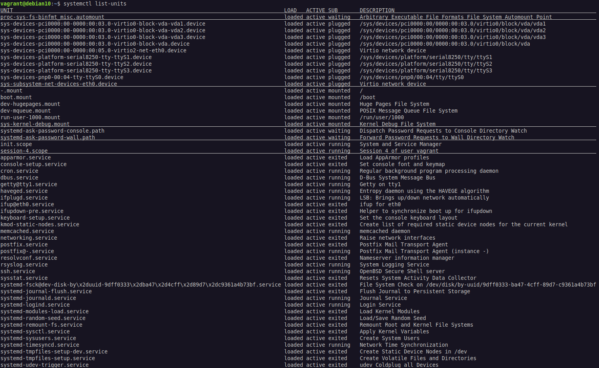

# Índice

[toc]

[Voltar](../101.2/1012.html)
[Próximo](../102.1/1021.html) 
[Índice Geral](../main.html)


# 101.3 Runlevel, Shutdown e Reboot

O processo INIT é o pai de todos os processos no sistema, isso porque ele tem ID 1, é o primeiro processo do Linux, hoje em dia temos alguns tipos de INIT:

- SystemV (SysV) - Init original;

- SystemD (mais atual) - Gerenciador de sistemas e serviços compatível com SysV;

- Upstart (Muito usado também) - Gerenciador de serviços substituto ao INIT, possui compatibilidade.

## SysV init

O SystemV (SysV) trabalha com `runlevels` ou níveis de execução. Cada `runlevel` carrega conjunto de Programas, Scripts e Serviços na inicialização do sistema.

As configurações principais ficam em `/etc/inittab`, e os scripts ficam em `/etc/init.d/` (Scripts de inicialização de cada Serviço) e `/etc/rcX.d/` (onde X é o valor do Runlevel. Lista dos serviços que devam ser inicializados em cada Runlevel, Serviços começando com `S` serão iniciados (Start) e Serviços começando com `K` não serão (Kill)).


Códigos do Runlevels

| Códigos           | Descrição                                                  |
| ----------------- | ---------------------------------------------------------- |
| 0                 | Desligamento                                               |
| 1, s, S ou Single | Single User (Usado para manutenção), só permite 1 usuário. |
| 2                 | MultiUser sem rede                                         |
| 3                 | MultiUser com rede                                         |
| 4                 | MultiUser definido pelo user                               |
| 5                 | MultiUser com rede e Interface gráfica (usado em desktops) |
| 6                 | Reinicialização                                            |

Podemos ver o INIT default olhando o no arquivo `/etc/inittab`, o comando `runlevel` exibe o runlevel atual, os comando `init X` e `telinit X` (Onde X é o valor do Runlevel) são usados para mudar de Runlevel.
O comando `telinit Q` ou `telinit q` recarrega o daemon levando em consideração o arquivo `/etc/inittab`, então toda vez que fizer uma modificação nesse arquivo, devemos invocar esse comando. Já as opções `U` ou `u` faz um reload sem olhar o arquivo.


Exemplo de inittab:

```
# Default runlevel
id:3:initdefault:

# Configuration script executed during boot
si::sysinit:/etc/init.d/rcS

# Action taken on runlevel S (single user)
~:S:wait:/sbin/sulogin

## id:runlevels:action:process
# Configuration for each execution level
l0:0:wait:/etc/init.d/rc 0
l1:1:wait:/etc/init.d/rc 1
l2:2:wait:/etc/init.d/rc 2
l3:3:wait:/etc/init.d/rc 3
l4:4:wait:/etc/init.d/rc 4
l5:5:wait:/etc/init.d/rc 5
l6:6:wait:/etc/init.d/rc 6

# Action taken upon ctrl+alt+del keystroke
ca::ctrlaltdel:/sbin/shutdown -r now

# Enable consoles for runlevels 2 and 3
1:23:respawn:/sbin/getty tty1 VC linux
2:23:respawn:/sbin/getty tty2 VC linux
3:23:respawn:/sbin/getty tty3 VC linux
4:23:respawn:/sbin/getty tty4 VC linux

# For runlevel 3, also enable serial
# terminals ttyS0 and ttyS1 (modem) consoles
S0:3:respawn:/sbin/getty -L 9600 ttyS0 vt320
S1:3:respawn:/sbin/mgetty -x0 -D ttyS1
```

`id` é um nome genérico de até quatro caracteres usado para identificar a entrada. O `runlevels` é uma lista de números dos níveis de execução nos quais uma ação especificada deve ser executada (Números de 1 até 5, 0 e 6 não devem ser usados). O termo `action` define como `init` executará o processo indicado pelo termo `process`. As ações disponíveis são:

| Ações      | Descrição                                                    |
| ---------- | ------------------------------------------------------------ |
| boot       | O processo será executado durante a inicialização do sistema. O campo `runlevels` é ignorado. |
| bootwait   | O processo será ignorado durante a inicialização do sistema e o `init` aguardará sua conclusão para continuar. O campo `runlevels` é ignorado. |
| sysinit    | O processo será executado após a inicialização do sistema, qualquer que seja o nível de execução. O campo `runlevels` é ignorado. |
| wait       | O processo será executado nos níveis de execução dados e `init` aguardará sua conclusão para continuar. |
| respawn    | O processo será reiniciado caso seja encerrado.              |
| ctrlaltdel | O processo será executado quando o processo init receber o sinal `SIGINT`, disparado quando o atalho de teclado Ctrl+Alt+Del for pressionado. |
| Once       | Inicia o processo uma vez ao entrar no nível de processo especificado. |


Scripts de inicialização:

```bash
# Vendo os scripts de inicialização do Runlevel 3:
$ ls -lh /etc/rc3.d/
total 0
lrwxrwxrwx 1 root root 14 Aug 13  2020 K01cups -> ../init.d/cups
lrwxrwxrwx 1 root root 27 Aug 13  2020 K01speech-dispatcher -> ../init.d/speech-dispatcher
lrwxrwxrwx 1 root root 15 Aug 13  2020 S01acpid -> ../init.d/acpid
lrwxrwxrwx 1 root root 17 Aug 13  2020 S01anacron -> ../init.d/anacron
lrwxrwxrwx 1 root root 22 Aug 13  2020 S01avahi-daemon -> ../init.d/avahi-daemon
lrwxrwxrwx 1 root root 24 Nov 13 17:45 S01binfmt-support -> ../init.d/binfmt-support
lrwxrwxrwx 1 root root 19 Aug 13  2020 S01bluetooth -> ../init.d/bluetooth
lrwxrwxrwx 1 root root 26 Aug 13  2020 S01console-setup.sh -> ../init.d/console-setup.sh
lrwxrwxrwx 1 root root 14 Aug 13  2020 S01cron -> ../init.d/cron
lrwxrwxrwx 1 root root 22 Aug 13  2020 S01cups-browsed -> ../init.d/cups-browsed
lrwxrwxrwx 1 root root 14 Aug 13  2020 S01dbus -> ../init.d/dbus
lrwxrwxrwx 1 root root 17 Mar 19 16:59 S01glances -> ../init.d/glances
lrwxrwxrwx 1 root root 21 Aug 13  2020 S01grub-common -> ../init.d/grub-common
lrwxrwxrwx 1 root root 17 Aug 13  2020 S01hddtemp -> ../init.d/hddtemp
lrwxrwxrwx 1 root root 20 Aug 13  2020 S01irqbalance -> ../init.d/irqbalance
lrwxrwxrwx 1 root root 20 Aug 13  2020 S01kerneloops -> ../init.d/kerneloops
lrwxrwxrwx 1 root root 17 Aug 13  2020 S01lightdm -> ../init.d/lightdm
lrwxrwxrwx 1 root root 23 Aug 13  2020 S01lvm2-lvmpolld -> ../init.d/lvm2-lvmpolld
lrwxrwxrwx 1 root root 20 Jan 12 19:13 S01mintsystem -> ../init.d/mintsystem
lrwxrwxrwx 1 root root 27 Feb 28 20:58 S01nfs-kernel-server -> ../init.d/nfs-kernel-server
lrwxrwxrwx 1 root root 17 Aug 13  2020 S01openvpn -> ../init.d/openvpn
lrwxrwxrwx 1 root root 18 Aug 13  2020 S01plymouth -> ../init.d/plymouth
lrwxrwxrwx 1 root root 37 Aug 13  2020 S01pulseaudio-enable-autospawn -> ../init.d/pulseaudio-enable-autospawn
lrwxrwxrwx 1 root root 15 Aug 13  2020 S01rsync -> ../init.d/rsync
lrwxrwxrwx 1 root root 17 Aug 13  2020 S01rsyslog -> ../init.d/rsyslog
lrwxrwxrwx 1 root root 15 Aug 13  2020 S01saned -> ../init.d/saned
lrwxrwxrwx 1 root root 23 Mar 19 09:29 S01smartmontools -> ../init.d/smartmontools
lrwxrwxrwx 1 root root 23 Mar 26 11:47 S01spice-vdagent -> ../init.d/spice-vdagent
lrwxrwxrwx 1 root root 13 Jan 22 19:02 S01ssh -> ../init.d/ssh
lrwxrwxrwx 1 root root 15 Aug 13  2020 S01uuidd -> ../init.d/uuidd
lrwxrwxrwx 1 root root 20 Mar 22 12:33 S01virtualbox -> ../init.d/virtualbox

# Verificando do Runlevel 1:
$ ls -lh /etc/rc1.d/
total 0
lrwxrwxrwx 1 root root 20 Aug 13  2020 K01alsa-utils -> ../init.d/alsa-utils
lrwxrwxrwx 1 root root 22 Aug 13  2020 K01avahi-daemon -> ../init.d/avahi-daemon
lrwxrwxrwx 1 root root 19 Aug 13  2020 K01bluetooth -> ../init.d/bluetooth
lrwxrwxrwx 1 root root 14 Aug 13  2020 K01cups -> ../init.d/cups
lrwxrwxrwx 1 root root 22 Aug 13  2020 K01cups-browsed -> ../init.d/cups-browsed
lrwxrwxrwx 1 root root 17 Mar 19 16:59 K01glances -> ../init.d/glances
lrwxrwxrwx 1 root root 17 Aug 13  2020 K01hddtemp -> ../init.d/hddtemp
lrwxrwxrwx 1 root root 20 Aug 13  2020 K01irqbalance -> ../init.d/irqbalance
lrwxrwxrwx 1 root root 20 Aug 13  2020 K01kerneloops -> ../init.d/kerneloops
lrwxrwxrwx 1 root root 17 Aug 13  2020 K01lightdm -> ../init.d/lightdm
lrwxrwxrwx 1 root root 23 Aug 13  2020 K01lvm2-lvmpolld -> ../init.d/lvm2-lvmpolld
lrwxrwxrwx 1 root root 20 Feb 28 20:58 K01nfs-common -> ../init.d/nfs-common
lrwxrwxrwx 1 root root 27 Feb 28 20:58 K01nfs-kernel-server -> ../init.d/nfs-kernel-server
lrwxrwxrwx 1 root root 17 Aug 13  2020 K01openvpn -> ../init.d/openvpn
lrwxrwxrwx 1 root root 37 Aug 13  2020 K01pulseaudio-enable-autospawn -> ../init.d/pulseaudio-enable-autospawn
lrwxrwxrwx 1 root root 17 Feb 28 20:58 K01rpcbind -> ../init.d/rpcbind
lrwxrwxrwx 1 root root 17 Aug 13  2020 K01rsyslog -> ../init.d/rsyslog
lrwxrwxrwx 1 root root 15 Aug 13  2020 K01saned -> ../init.d/saned
lrwxrwxrwx 1 root root 23 Mar 19 09:29 K01smartmontools -> ../init.d/smartmontools
lrwxrwxrwx 1 root root 27 Aug 13  2020 K01speech-dispatcher -> ../init.d/speech-dispatcher
lrwxrwxrwx 1 root root 23 Mar 26 11:47 K01spice-vdagent -> ../init.d/spice-vdagent
lrwxrwxrwx 1 root root 13 Aug 13  2020 K01ufw -> ../init.d/ufw
lrwxrwxrwx 1 root root 15 Aug 13  2020 K01uuidd -> ../init.d/uuidd
lrwxrwxrwx 1 root root 20 Mar 22 12:33 K01virtualbox -> ../init.d/virtualbox

# Runlevel 0 (desligar) e 6 (reiniciar) devem matar os processos para tal efeito:
$ ls -lh /etc/rc6.d/
total 0
lrwxrwxrwx 1 root root 20 Aug 13  2020 K01alsa-utils -> ../init.d/alsa-utils
lrwxrwxrwx 1 root root 22 Aug 13  2020 K01avahi-daemon -> ../init.d/avahi-daemon
lrwxrwxrwx 1 root root 19 Aug 13  2020 K01bluetooth -> ../init.d/bluetooth
lrwxrwxrwx 1 root root 20 Aug 13  2020 K01cryptdisks -> ../init.d/cryptdisks
lrwxrwxrwx 1 root root 26 Aug 13  2020 K01cryptdisks-early -> ../init.d/cryptdisks-early
lrwxrwxrwx 1 root root 22 Aug 13  2020 K01cups-browsed -> ../init.d/cups-browsed
lrwxrwxrwx 1 root root 17 Mar 19 16:59 K01glances -> ../init.d/glances
lrwxrwxrwx 1 root root 17 Aug 13  2020 K01hddtemp -> ../init.d/hddtemp
lrwxrwxrwx 1 root root 20 Aug 13  2020 K01irqbalance -> ../init.d/irqbalance
lrwxrwxrwx 1 root root 20 Aug 13  2020 K01kerneloops -> ../init.d/kerneloops
lrwxrwxrwx 1 root root 17 Aug 13  2020 K01lightdm -> ../init.d/lightdm
lrwxrwxrwx 1 root root 23 Aug 13  2020 K01lvm2-lvmpolld -> ../init.d/lvm2-lvmpolld
lrwxrwxrwx 1 root root 20 Aug 13  2020 K01networking -> ../init.d/networking
lrwxrwxrwx 1 root root 20 Feb 28 20:58 K01nfs-common -> ../init.d/nfs-common
lrwxrwxrwx 1 root root 27 Feb 28 20:58 K01nfs-kernel-server -> ../init.d/nfs-kernel-server
lrwxrwxrwx 1 root root 17 Aug 13  2020 K01openvpn -> ../init.d/openvpn
lrwxrwxrwx 1 root root 18 Aug 13  2020 K01plymouth -> ../init.d/plymouth
lrwxrwxrwx 1 root root 37 Aug 13  2020 K01pulseaudio-enable-autospawn -> ../init.d/pulseaudio-enable-autospawn
lrwxrwxrwx 1 root root 17 Feb 28 20:58 K01rpcbind -> ../init.d/rpcbind
lrwxrwxrwx 1 root root 17 Aug 13  2020 K01rsyslog -> ../init.d/rsyslog
lrwxrwxrwx 1 root root 15 Aug 13  2020 K01saned -> ../init.d/saned
lrwxrwxrwx 1 root root 23 Mar 19 09:29 K01smartmontools -> ../init.d/smartmontools
lrwxrwxrwx 1 root root 27 Aug 13  2020 K01speech-dispatcher -> ../init.d/speech-dispatcher
lrwxrwxrwx 1 root root 23 Mar 26 11:47 K01spice-vdagent -> ../init.d/spice-vdagent
lrwxrwxrwx 1 root root 14 Aug 13  2020 K01udev -> ../init.d/udev
lrwxrwxrwx 1 root root 15 Aug 13  2020 K01uuidd -> ../init.d/uuidd
lrwxrwxrwx 1 root root 20 Mar 22 12:33 K01virtualbox -> ../init.d/virtualbox

# Runlvel 0
$ ls -lh /etc/rc0.d/
total 0
lrwxrwxrwx 1 root root 20 Aug 13  2020 K01alsa-utils -> ../init.d/alsa-utils
lrwxrwxrwx 1 root root 22 Aug 13  2020 K01avahi-daemon -> ../init.d/avahi-daemon
lrwxrwxrwx 1 root root 19 Aug 13  2020 K01bluetooth -> ../init.d/bluetooth
lrwxrwxrwx 1 root root 20 Aug 13  2020 K01cryptdisks -> ../init.d/cryptdisks
lrwxrwxrwx 1 root root 26 Aug 13  2020 K01cryptdisks-early -> ../init.d/cryptdisks-early
lrwxrwxrwx 1 root root 22 Aug 13  2020 K01cups-browsed -> ../init.d/cups-browsed
lrwxrwxrwx 1 root root 17 Mar 19 16:59 K01glances -> ../init.d/glances
lrwxrwxrwx 1 root root 17 Aug 13  2020 K01hddtemp -> ../init.d/hddtemp
lrwxrwxrwx 1 root root 20 Aug 13  2020 K01irqbalance -> ../init.d/irqbalance
lrwxrwxrwx 1 root root 20 Aug 13  2020 K01kerneloops -> ../init.d/kerneloops
lrwxrwxrwx 1 root root 17 Aug 13  2020 K01lightdm -> ../init.d/lightdm
lrwxrwxrwx 1 root root 23 Aug 13  2020 K01lvm2-lvmpolld -> ../init.d/lvm2-lvmpolld
lrwxrwxrwx 1 root root 20 Aug 13  2020 K01networking -> ../init.d/networking
lrwxrwxrwx 1 root root 20 Feb 28 20:58 K01nfs-common -> ../init.d/nfs-common
lrwxrwxrwx 1 root root 27 Feb 28 20:58 K01nfs-kernel-server -> ../init.d/nfs-kernel-server
lrwxrwxrwx 1 root root 17 Aug 13  2020 K01openvpn -> ../init.d/openvpn
lrwxrwxrwx 1 root root 18 Aug 13  2020 K01plymouth -> ../init.d/plymouth
lrwxrwxrwx 1 root root 37 Aug 13  2020 K01pulseaudio-enable-autospawn -> ../init.d/pulseaudio-enable-autospawn
lrwxrwxrwx 1 root root 17 Feb 28 20:58 K01rpcbind -> ../init.d/rpcbind
lrwxrwxrwx 1 root root 17 Aug 13  2020 K01rsyslog -> ../init.d/rsyslog
lrwxrwxrwx 1 root root 15 Aug 13  2020 K01saned -> ../init.d/saned
lrwxrwxrwx 1 root root 23 Mar 19 09:29 K01smartmontools -> ../init.d/smartmontools
lrwxrwxrwx 1 root root 27 Aug 13  2020 K01speech-dispatcher -> ../init.d/speech-dispatcher
lrwxrwxrwx 1 root root 23 Mar 26 11:47 K01spice-vdagent -> ../init.d/spice-vdagent
lrwxrwxrwx 1 root root 14 Aug 13  2020 K01udev -> ../init.d/udev
lrwxrwxrwx 1 root root 15 Aug 13  2020 K01uuidd -> ../init.d/uuidd
lrwxrwxrwx 1 root root 20 Mar 22 12:33 K01virtualbox -> ../init.d/virtualbox

# Verificando o Runlevel atual:
$ runlevel 
N 5
# O 'N' indica que o runlevel não mudou desde que o sistema foi iniciado.
```


Para ver os serviços podemos usar os comandos abaixo:

```bash
# Ver status de todos os serviços:
$ service --status-all

# Ver staus do ssh:
$ sudo service sshd status
openssh-daemon (pid  1392) is running...

# Reiniciar um serviço:
$ sudo service rsyslog restart
Shutting down system logger:                               [  OK  ]
Starting system logger:                                    [  OK  ]

# Parar um serviço:
$ sudo service rsyslog stop
Shutting down system logger:                               [  OK  ]

# Iniciar um serviço:
$ sudo service rsyslog start
Starting system logger:                                    [  OK  ]
```


### CHKCONFIG

O comando `chkconfig` fornece uma ferramenta de linha de comando simples para manter a hierarquia de diretórios `/etc/rc[0-6].d`, liberando os administradores do sistema da tarefa de manipular diretamente os vários links simbólicos nesses diretórios.

Esse comando "estava" disponível em SysVinit para distribuições RedHat apenas. Nem todo os script presentes em `/etc/init.d/` estão mapeados na inicialização do boot, isso significa que você terá scripts que não irão aparecer na saída do comando `chkconfig`.

Opções:

```
--del		= Remove um script da Inicialização (Remove ele dos diretórios /etc/rc[0-6].d)
--add		= Adiciona um script da Inicialização (Adiciona ele nos diretórios /etc/rc[0-6].d)
--list		= Exibe todos os scripts que vão ou não iniciar com o sistema, mas que estão    
			  mapeados
--level <Runlevel Code> SCRIPT_NAME <on|off>
```


```bash
# Verificando os scripts do sistema que estão na inicialização:
$ chkconfig 
NetworkManager 	0:off	1:off	2:on	3:on	4:on	5:on	6:off
auditd         	0:off	1:off	2:on	3:on	4:on	5:on	6:off
blk-availability	0:off	1:on	2:on	3:on	4:on	5:on	6:off
crond          	0:off	1:off	2:on	3:on	4:on	5:on	6:off
dnsmasq        	0:off	1:on	2:off	3:off	4:off	5:off	6:off
haveged        	0:off	1:off	2:on	3:on	4:on	5:on	6:off
ip6tables      	0:off	1:off	2:on	3:on	4:on	5:on	6:off
iptables       	0:off	1:off	2:on	3:on	4:on	5:on	6:off
iscsi          	0:off	1:off	2:off	3:on	4:on	5:on	6:off
iscsid         	0:off	1:off	2:off	3:on	4:on	5:on	6:off
ktune          	0:off	1:off	2:off	3:on	4:on	5:on	6:off
lvm2-monitor   	0:off	1:on	2:on	3:on	4:on	5:on	6:off
mdmonitor      	0:off	1:off	2:on	3:on	4:on	5:on	6:off
messagebus     	0:off	1:off	2:on	3:on	4:on	5:on	6:off
multipathd     	0:off	1:off	2:off	3:off	4:off	5:off	6:off
netconsole     	0:off	1:off	2:off	3:off	4:off	5:off	6:off
netfs          	0:off	1:off	2:off	3:off	4:off	5:off	6:off
network        	0:off	1:off	2:on	3:on	4:on	5:on	6:off
postfix        	0:off	1:off	2:on	3:on	4:on	5:on	6:off
pppoe-server   	0:off	1:off	2:off	3:off	4:off	5:off	6:off
qemu-ga        	0:off	1:off	2:on	3:on	4:on	5:on	6:off
rdisc          	0:off	1:off	2:off	3:off	4:off	5:off	6:off
restorecond    	0:off	1:off	2:off	3:off	4:off	5:off	6:off
rsyslog        	0:off	1:off	2:on	3:on	4:on	5:on	6:off
saslauthd      	0:off	1:off	2:off	3:off	4:off	5:off	6:off
sshd           	0:off	1:off	2:on	3:on	4:on	5:on	6:off
sysstat        	0:off	1:on	2:on	3:on	4:on	5:on	6:off
tuned          	0:off	1:off	2:on	3:on	4:on	5:on	6:off
udev-post      	0:off	1:on	2:on	3:on	4:on	5:on	6:off
wpa_supplicant 	0:off	1:off	2:off	3:off	4:off	5:off	6:off

# Verificando um script que não está mapeado:
$ chkconfig --list lvm2-lvmetad
service lvm2-lvmetad supports chkconfig, but is not referenced in any runlevel (run 'chkconfig --add lvm2-lvmetad')

# Adicionando este escript ao chkconfig:
$ sudo chkconfig --add lvm2-lvmetad

# Verificando se ele foi adicionado:
$ chkconfig --list lvm2-lvmetad
lvm2-lvmetad   	0:off	1:on	2:on	3:on	4:on	5:on	6:off
# Ele foi adicionado ao runlevel 1 até o 5!

# Desabilitando esse script no runlevel 1:
$ sudo chkconfig --level 1 lvm2-lvmetad off

# Verificando novamente:
$ chkconfig --list lvm2-lvmetad
lvm2-lvmetad   	0:off	1:off	2:on	3:on	4:on	5:on	6:off

# Para habilitar basta usar 'on' ao invés de 'off'.
```


### UPDATE-RC.D

O comando `update-rc.d` tem a mesma finalidade do `chkconfig`, mas nesse caso, ele foi projetado para distribuições Debian.

```bash
# Iniciando um script no boot (Para o runlevel 5):
$ sudo update-rc.d cups enable 5

# Desabilitando este script do runlevel 5:
$ sudo update-rc.d cups disable 5

## Se omitir o id do runlevel, ele será habilitado ou desabilitado nos runlevels [1-5]

# Remova todos os links para um script:
$ sudo update-rc.d cups remove
# Apaga ele dos diretórios /etc/rc[1-5].d/

# Adicionando um script no mapeamento (Podemos usar ele de novo com o Enable e Disable):
$ sudo update-rc.d cups defaults
# Adiciona ele dos diretórios /etc/rc[1-5].d/
```


## SystemD

Traz melhorias de paralelização, usado apara dBus e etc. Não existe mais runlevels, agora é chamado de **Units**, um **Target** é um grupo de **Unit**, equivalente ao Runlevel.

As Unidades podem ser do tipo:

- Service 

  Onde ficam os daemons como sshd.service, bind.service, apache2.service entre outros. Eles podem ser interrompidos, reiniciados, recarregados e etc.

- Socket

  O tipo de unidade socket pode ser um socket de sistema de arquivos ou um socket de rede. Todas as unidades socket possuem uma unidade de  serviço correspondente, carregada quando o socket recebe uma  solicitação.

- Device

  Uma unidade de dispositivo está associada a um dispositivo de hardware identificado pelo kernel. Um dispositivo só será considerado  como uma unidade systemd se existir uma regra udev para isso. Uma  unidade de dispositivo pode ser usada para resolver dependências de  configuração quando determinado hardware é detectado, uma vez que as  propriedades da regra udev podem ser usadas como parâmetros para a  unidade de dispositivo.

- Mount

  Uma unidade de montagem é uma definição de ponto de montagem no sistema de arquivos, semelhante a uma entrada em `/etc/fstab`.

- Automount

  Uma unidade de montagem automática também é uma definição de ponto de montagem no sistema de arquivos, mas nesse caso montada automaticamente. Cada unidade de montagem automática possui uma unidade  de montagem correspondente, que é iniciada quando o ponto de montagem automática é acessado.

- Target 

  Equivalente ao Runlevel (Existe um Target default). Uma unidade de destino é um agrupamento de outras unidades, gerenciadas como uma única unidade.

- Snapchat

  Uma unidade snapshot é um estado salvo do gerenciador do systemd (não disponível em todas as distribuições Linux).

- Timer

As Units (Unidades, descrito acima) do sistema ficam em `/lib/systemd/system`, aqui temos todos eles misturados (.service, .target, .socket etc). Uma unidade é composta por `UNIT = NOME.TIPO`, alguns exemplos:

- httpd.service - Nome=httpd, Tipo=service
- initrd.target - Nome=initrd, Tipo=target
- apt-daily.timer - Nome=apt-daily, Tipo=timer
- systemd-fsckd.socket - Nome=systemd-fsckd, Tipo=socket

| Opções                      | Descrição                                                    |
| --------------------------- | ------------------------------------------------------------ |
| start \<unit.service\>      | Inicia a `unit`.                                             |
| stop \<unit.service\>       | Interrompe `unit`.                                           |
| restart \<unit.service\>    | Reinicia `unit`.                                             |
| status \<unit.service\>     | Mostra o estado de `unit`, incluindo se está ou não em execução. Se está ou não ativa no boot. |
| is-active \<unit.service\>  | Exibe *active* se `unit` estiver rodando, ou *inactive* se não estiver. |
| is-enabled \<unit.service\> | Verifica se `unit` é iniciado com o sistema. A resposta é armazenada na variável `$?`. O valor `0` indica que `unit` inicia com o sistema e o valor `1` indica que não. |
| enable \<unit.service\>     | Habilita `unit` na inicialização, ou seja, `unit` será carregado durante a inicialização do sistema. |
| disable \<unit.service\>    | `unit` não será iniciada com o sistema.                      |
| isolate \<unit.target\>     | Muda de target (Igual a telnet X, muda o runlevel atual)     |
| set-default \<unit.target\> | Configura um novo runlevel (Target nesse caso) default       |
| get-default                 | Exibe o target default.                                      |
| list-unit-files             | Lista todas as unidades disponíveis e mostra se elas estão habilitadas para iniciar quando o sistema é inicializado |
| list-units                  | Mostra as unidades ativas ou as que estiveram ativas durante a sessão atual do sistema. |
| --type=\<Unit\>             | Faz um filtro pelo tipo de Unit.                             |
| suspend                     | Coloca o sistema no modo de baixo consumo de energia, mantendo os dados atuais na memória. |
| hibernate                   | Copia todos os dados da memória no disco, para que o estado atual do sistema possa ser recuperado após o desligamento. |
| poweroff                    | Desliga a máquina.                                           |
| reboot                      | Reinicia a máquina.                                          |
| list-jobs                   | Liste os trabalhos que estão em andamento.                   |

Para criar uma compatibilidade, temos runlevels apontando para `targets`:

```bash
#### Listando os targets que fazem compatibilidade com os Runlevels:
$ ls -lh /lib/systemd/system/runle*
/lib/systemd/system/runlevel0.target -> poweroff.target
/lib/systemd/system/runlevel1.target -> rescue.target
/lib/systemd/system/runlevel2.target -> multi-user.target
/lib/systemd/system/runlevel3.target -> multi-user.target
/lib/systemd/system/runlevel4.target -> multi-user.target
/lib/systemd/system/runlevel5.target -> graphical.target
/lib/systemd/system/runlevel6.target -> reboot.target

# Vendo o Target/Runlevel default:
$ ls -l /lib/systemd/system/default.target 
/lib/systemd/system/default.target -> graphical.target

# Vendo o Target/Runlevel default através do systemctl:
$ systemctl get-default 
graphical.target

#### Podemos configurar um novo target default (runlevel) com o comando:
$ sudo systemctl set-default multi-user.target
Created symlink /etc/systemd/system/default.target → /lib/systemd/system/multi-user.target.

# Consulte novamente:
$ systemctl get-default 
multi-user.target

# Para mudar apenas de target (não muda o default)
$ systemctl isolate nome.target

# Iniciar o target Default
$ systemctl default

# Listar unidades específicas (podemos ver o status de todos os serviços do sistema)
$ systemctl list-units --type=service 

# Listar unidades específicas (podemos ver o status de todos os serviços do sistema)
systemctl list-units -t service --full

### Listando as Units
$ systemctl list-units
```

Segue a imagem do comando acima:



Existe também o diretório `/etc/systemd/system` onde possamos criar serviços, targets entre outros tipos de de Unidades.


Comandos no SystemD:

```bash
# Reiniciar a máquina
$ sudo systemctl reboot

# Desligar a máquina
$ sudo systemctl poweroff

# Verificar estatus do serviço
$ sudo systemctl status nome.service

# Reiniciar o serviço
$ sudo systemctl restart nome.service

# Parar um serviço
$ sudo systemctl stop nome.service

# Habilitar um serviço na inicialização
$ sudo systemctl enable nome.service

# Para desabilitar da inicialização
$ sudo systemctl disable nome.service

# Para verificar se está habilitado na inicialização
$ sudo systemctl is-enabled sshd.service
enabled

# Verificando se o serviço do ssh esta ativo:
$ sudo systemctl is-active sshd.service
active
```


## UPSTART

Gerenciador de inicialização substituto ao Init. Ainda usa os scripts em `/etc/init.d/` por compatibilidade, os arquivos de configuração ficam em `/etc/init/`.

Os comandos principais são:

```bash
# Lista os trabalhos e instancias conhecidas, exibe o status de cada um numa saída padrão.
$ initctl list

# Exibir o status
$ initctl status SERVIÇO

# Iniciar o serviço
$ initctl start SERVIÇO

# Para o serviço
$ initctl stop SERVIÇO
```


## Shutdown e Restart

Reinicia ou Desliga o computador, enviando mensagens de aviso para todos os usuários conectados no sistema, podemos também agendar o desligamento.

Opções:

```
-P		= Desliga o Linux e a máquina
-h		= Desliga o Linux mas não a máquina (depende do hardware)
-r		= Reinicia
-c		= Cancela o desligamento
```

Por padrão ele notifica os usuários que será feito o desligamento. Primeiro ele envia um SIGTERM e depois um SIGKILL.


Programando os desligamentos:

```bash
#### Default desligar depois de 1 minuto ####

#### +N agenda para N minutos o desligamento.
# Agendar para daqui 3 minutos
$ date ; sudo shutdown +3
Tue Mar 30 18:00:12 UTC 2021
Shutdown scheduled for Tue 2021-03-30 18:03:12 UTC, use 'shutdown -c' to cancel.

# Escolher um horario para desligar:
$ sudo shutdown 17:24

# Escolher um horario para desligar com power off:
$ sudo shutdown -P 17:24

# Escolher um horario para reiniciar:
$ sudo shutdown -r 17:24

# Para desligar ou reiniciar agora, usar 'now' ou '+0':
$ sudo shutdown -P now
$ sudo shutdown -r now

$ sudo shutdown -P +0
$ sudo shutdown -r +0

# Informando uma mensagem para delisgar o sistema:
$ sudo shutdown +3 "O Sistema será desligado em 3 minutos" &
```


Outros comandos que fazem isso:

```bash
# Desligar
poweroff
halt
systemctl poweroff
systemctl halt

# Reiniciar
reboot
systemctl reboot
```


## WALL

Usado para enviar uma mensagem para todos os usuários do sistema, ou para um grupo de usuários.


```bash
# enviar a mensagem
$ wall "vamos desligar o sistema"
                                                                               
Broadcast message from vagrant@debian10.localdomain (pts/0) (Tue Mar 30 18:16:3
                                                                               
vamos desligar o sistema
```


## ACPID - Advanced Configuration and Power Interface

O daemon `acpid` é o principal gerenciador de energia do  Linux e permite ajustes mais refinados das ações após eventos relacionados ao consumo de energia, como fechar a tampa do laptop,  bateria fraca ou níveis de carga da bateria.

Pode não vir instalado em algumas distros.


[Voltar](../101.2/1012.html)
[Próximo](../102.1/1021.html) 
[Índice Geral](../main.html)

