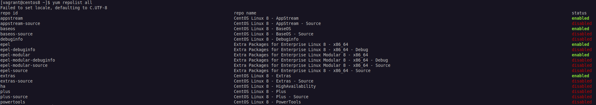

# Índice

[toc]

[Voltar](../102.4/1024.html)
[Próximo](../102.6/1026.html) 
[Índice Geral](../main.html)


# 102.5 Gerenciamento de pacotes RedHat

Toda distribuição pode trabalhar com sistema de instalação de aplicações em 2 níveis, o primeiro é o nível local e o segundo é o nivel remoto ou online. No local o pacote (aplicação que será instalada), está localmente na máquina, não tendo que baixar ela e na online/remoto, devemos primeiro baixar o pacote de um repositório (diretório onde ficam armazenados as aplicações) para que ele seja instalado.


## RPM

O `rpm` é o gerenciador de pacotes locais na máquina, não podendo efetuar a instalação de pacotes que estejam em reposítorios online.


A sintaxe das opções é *-q* de `--query` mais uma letra, que é a representação resumida, tipo *-qa* é igual a `--query --all`, *-qi* é `--query --install`, *-ql* é `--query --list`, *-qc* é `--query --configfiles`.


Opções:

| Comando                                                | Descrição                                                    |
| ------------------------------------------------------ | ------------------------------------------------------------ |
| rpm -qa                                                | Mostra os pacotes instalados. (--all)                        |
| rpm -qi \<pacote.rpm\> ou \<pacote\>                   | Mostra informações do pacote.                                |
| rpm -ql \<pacote\>                                     | Mostra os arquivos contidos dentro do pacote, seja .rpm ou instalado. (-l,--list) |
| rpm -qc \<pacote\>                                     | Mostra arquivos de configuração seja .rpm ou instalado.(--configfiles) |
| rpm -qd \<pacote\>                                     | Mostra arquivos de documentação seja .rpm ou instalado. (-d,--docfiles) |
| rpm -qf \<file\>                                       | Mostra qual pacote gerou esse arquivo. (--file)              |
| rpm -qlp \<pacote.rpm\>                                | Lista os arquivos do pacote, igual `rpm -ql`. (--package)<br />O `p` no meio fa flag informa que o pacote ainda não está instalado e habilita o auto-completion |
| rpm -i \<pacote.rpm\>                                  | Instala o pacote. (--install)                                |
| rpm -U \<pacote.rpm\>                                  | Faz um upgrade do pacote. (--upgrade). Se não houver uma versão anterior do `PACKAGENAME`, uma nova cópia será instalada. Para evitar isso e *apenas* atualizar um pacote que esteja *instalado*, use a opção `-F`. |
| **Os parâmetros devem ser usados com as opções acima** |                                                              |
| -v                                                     | Verbose.                                                     |
| -h                                                     | Progresso da instalação. (--hash, use com -v)                |
| --nodeps \<pacote.rpm\>                                | Ignora dependências.                                         |
| --force \<pacote.rpm\>                                 | Força a instalação.                                          |
| --test \<pacote.rpm\>                                  | Testa a instalação, mas nao instala.                         |
| -e \<pacote\>                                          | Desinstala o pacote (e=--erase). Pode ser usado direto com rpm. |
| --checksig \<pacote.rpm\>                              | Verifica o signatures (pode ser usado direto com rpm)        |
| -V \<pacote.rpm\>                                      | Trás algumas informações do pacote como libs, dependências insatisfeitas, mostra arquivos de documentação, de configuração entre outros **Se não tiver nada OK, se tiver OK não vai exibir nada**. |
| --verify \<pacote.rpm\> ou \<pacote\>                  | Exibe informações sobre alteração nos arquivos.<br />Segue o que ele pode exibir, são coisas que ele monitora nos arquivos do pacote:<br /><br />S file Size differs<br/>M Mode differs (includes permissions and file type)<br/>5 digest (formerly MD5 sum) differs<br/>D Device major/minor number mismatch<br/>L readLink(2) path mismatch<br/>U User ownership differs<br/>G Group ownership differs<br/>T mTime differs<br/>P caPabilities differ |
| -qR \<pacote\> ou \<pacote.rpm\>                       | Mostra apenas as dependências. (--requires)                  |


## YUM

O gerenciador `yum` é usado para fazer o gerenciamento de pacotes online.

Os arquivos de configuração do yum ficam em `/etc/yum.conf` e `/etc/yum.repos.d` (aqui ficam os mirros do CentOS).

| Comandos                              | Descrição                                                    |
| ------------------------------------- | ------------------------------------------------------------ |
| yum update                            | Atualiza todos os pacotes (diferente do Debian).             |
| yum upgrade                           | Mesma coisa acima, mas remove pacotes marcados como obsoletos. (perigoso) |
| yum install \<pacote\>                | Instala um pacote.                                           |
| yum check-update                      | Igual apt-get update (atualiza os mirrors).                  |
| yum list --installed                  | Lista tudo que está instalado.                               |
| yum search \<pacote\>                 | Busca por um pacote.                                         |
| yum remove \<pacote\>                 | Remove um pacote.                                            |
| yum erase \<pacote\>                  | Remove um pacote e os arquivos de configuração.              |
| yum install --downloadonly \<pacote\> | Apenas baixa num diretório temporário, pode usar a opção `--downloaddir=Diretório` para salvar nesse diretório. |
| yum whatprovides \<arquivo\>          | Mostra qual pacote fornece esse arquivo, pode ser um pacote, uma lib. |
| yum info \<pacote\>                   | Obtém informações sobre um pacote.                           |


### Repository

Para o `yum`, os "repos" estão listados no diretório `/etc/yum.repos.d/`. Cada repositório é representado por um arquivo `.repo`, como `CentOS-Base.repo`.

Repositórios adicionais podem ser incluídos pelo usuário acrescentando um arquivo `.repo` no diretório mencionado acima, ou no final de `/etc/yum.conf`. No entanto, a maneira recomendada de adicionar ou gerenciar repositórios é usar a ferramenta `yum-config-manager`.

Para adicionar um repositório, use o parâmetro `--add-repo`, seguido da URL para um arquivo `.repo`.

```bash
yum-config-manager --add-repo https://rpms.remirepo.net/enterprise/remi.repo
```

Para obter uma lista de todos os repositórios disponíveis, use `yum repolist all`. A saída obtida será semelhante a esta:




Habilitando e Desabilitando Repos:

```bash
# Desabilitando:
$ sudo yum-config-manager --disable powertools


# Habilitando:
$ sudo yum-config-manager --enable powertools
```

> O Yum armazena os pacotes baixados e os metadados associados em um diretório de cache (geralmente `/var/cache/yum`). À medida que o sistema é atualizado e novos pacotes são instalados,  essa cache pode ficar bem grande. Para limpar a cache e recuperar o  espaço em disco, podemos usar o comando `yum clean`, seguido pelo que deve ser removido. Os parâmetros mais úteis são `packages` (`yum clean packages`) para excluir pacotes baixados e `metadata` (`yum clean metadata`) para excluir os metadados associados. Consulte a página de manual do `yum` (digite `man yum`) para obter mais informações.


## DNF

É o mesmo gerenciador que o yum, mas possui um melhor desempenho, melhor consumo de memória ram e melhor resoluçõa de dependências. Ambos os comandos `yum` e `dnf` são links para o verdadeiro comando (binário) chamado `dnf-3` no CentOS 8, esse novo binário tem a mesma função do yum, só muda o nome e o backend do binário, inclusive as opções são as mesmas.

```bash
# Verificando o yum:
[vagrant@centos8 ~]$ ls -lh /usr/bin/yum
lrwxrwxrwx. 1 root root 5 Aug  4  2020 /usr/bin/yum -> dnf-3

# Verificando o DNF:
[vagrant@centos8 ~]$ ls -lh /usr/bin/dnf
lrwxrwxrwx. 1 root root 5 Aug  4  2020 /usr/bin/dnf -> dnf-3

# Verificando o binário dnf-3:
[vagrant@centos8 ~]$ ls -lh /usr/bin/dnf-3 
-rwxr-xr-x. 1 root root 2.0K Aug  4  2020 /usr/bin/dnf-3
```

Para adicionar um repositório, use `dnf config-manager --add_repo URL`, onde `URL` é a URL completa do repositório. Para habilitar um repositório, use `dnf config-manager --set-enabled REPO_ID`.

Da mesma forma, para desativar um repositório, use `dnf config-manager --set-disabled REPO_ID`. Nos dois casos, `REPO_ID` é o ID exclusivo do repositório, que pode ser obtido com `dnf repolist`. Os repositórios adicionados são ativados por padrão. Os repositórios são armazenados em arquivos `.repo` no diretório `/etc/yum.repos.d/`, com exatamente a mesma sintaxe usada para o `yum`.


## Zypper

O gerenciador `zypper` é usado para fazer o gerenciamento de pacotes online. Como distros Suse e baseadas também usam pacotes .rpm, vamos ver um pouco da sintaxe do gerenciador de pacotes usado em distros Suse.


Comandos:

| Comandos                            | Descrição                                                    |
| ----------------------------------- | ------------------------------------------------------------ |
| zypper \<repos ou ls\>              | Lista os repositórios atuais. Os repos ficam em `/etc/zypper/repos.d/` |
| zypper install \<pacote\>           | Instala o pacote.                                            |
| zypper remove \<pacote>             | Remove o pacote.                                             |
| zypper verify \<pacote>             | Verifica a integridade.                                      |
| zypper update                       | Atualiza todos os pacotes.                                   |
| zypper list-update                  | Lista as atualizações                                        |
| zypper refresh                      | Mesmo que update no Debian.                                  |
| zypper dist-upgrade                 | Usado para fazer uma atualização da Distribuição Linux.      |
| zypper search \<pacote>             | Pesquisa pelo pacote                                         |
| zypper info \<pacote>               | Exibe informações de um pacote específico                    |
| zypper search --provides \<arquivo> | Para ver quais pacotes contêm um arquivo específico          |
| zypper search -i  \<pacote\>        | Confere se o pacote esta instalado.                          |


[Voltar](../102.4/1024.html)
[Próximo](../102.6/1026.html) 
[Índice Geral](../main.html)