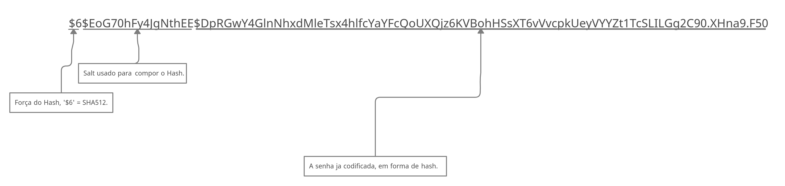

# Índice

[toc]

[Voltar](../106.3/1063.html)
[Próximo](../107.2/1072.html) 
[Índice Geral](../main.html)


# 107.1 Tarefas administrativas

Cada usuário tem um grupo padrão e grupos secundários, quando um usuário é criado, suas informações são armazenadas em `/etc/passwd`, `/etc/shadow`, `/etc/group` e `/etc/gshadow`.


## /etc/passwd

Toda vez que criamos um usuário no Linux, as informações do usuário em sí são armazenadas aqui, como veremos mais abaixo:

```bash
$ cat /etc/passwd
root:x:0:0:root:/root:/bin/bash
daemon:x:1:1:daemon:/usr/sbin:/usr/sbin/nologin
bin:x:2:2:bin:/bin:/usr/sbin/nologin
sys:x:3:3:sys:/dev:/usr/sbin/nologin
sync:x:4:65534:sync:/bin:/bin/sync
games:x:5:60:games:/usr/games:/usr/sbin/nologin
man:x:6:12:man:/var/cache/man:/usr/sbin/nologin
lp:x:7:7:lp:/var/spool/lpd:/usr/sbin/nologin
mail:x:8:8:mail:/var/mail:/usr/sbin/nologin
news:x:9:9:news:/var/spool/news:/usr/sbin/nologin
uucp:x:10:10:uucp:/var/spool/uucp:/usr/sbin/nologin
proxy:x:13:13:proxy:/bin:/usr/sbin/nologin
www-data:x:33:33:www-data:/var/www:/usr/sbin/nologin
backup:x:34:34:backup:/var/backups:/usr/sbin/nologin
list:x:38:38:Mailing List Manager:/var/list:/usr/sbin/nologin
irc:x:39:39:ircd:/var/run/ircd:/usr/sbin/nologin
gnats:x:41:41:Gnats Bug-Reporting System (admin):/var/lib/gnats:/usr/sbin/nologin
nobody:x:65534:65534:nobody:/nonexistent:/usr/sbin/nologin
_apt:x:100:65534::/nonexistent:/usr/sbin/nologin
systemd-timesync:x:101:102:systemd Time Synchronization,,,:/run/systemd:/usr/sbin/nologin
systemd-network:x:102:103:systemd Network Management,,,:/run/systemd:/usr/sbin/nologin
systemd-resolve:x:103:104:systemd Resolver,,,:/run/systemd:/usr/sbin/nologin
messagebus:x:104:110::/nonexistent:/usr/sbin/nologin
sshd:x:105:65534::/run/sshd:/usr/sbin/nologin
vagrant:x:1000:1000:vagrant,,,:/home/vagrant:/bin/bash
systemd-coredump:x:999:999:systemd Core Dumper:/:/usr/sbin/nologin
memcache:x:106:113:Memcached,,,:/nonexistent:/bin/false
postfix:x:107:115::/var/spool/postfix:/usr/sbin/nologin
```

Vamos entender a intentificação dos campos:

| N° do campo | Campo     | Descrição                                                    |
| ----------- | --------- | ------------------------------------------------------------ |
| 1           | Nome      | É o nome do usuário.                                         |
| 2           | Senha     | Antigamente o `passwd` continha a senha do usuário, hoje em dia essa senha fica armazenada em outro lugar, então normalmente você sempre verá um `x` no segundo campo. |
| 3           | UID       | O número referente ao ID do usuário.                         |
| 4           | GID       | O número referente ao ID do grupo desse usuário.             |
| 5           | Descrição | É dado qualquer descrição para o usuário, o comando `adduser` é um script que nesse campo insere informações como `Full Name, Room Number, Work Phone, Home Phone, Other`. |
| 6           | Home      | Aqui fica a localização da Home do usuário. Uma coisa bem legal, se ele não for ter uma Home, você pode colocar como `/nonexistent`. |
| 7           | Shell     | Aqui é o Shell padrão desse usuário.<br />Quando você não quer que esse usuário logue, você pode usar como shell o `/usr/sbin/nologin` ou `/bin/false`, tudo vai depender do seu sistema ter 1 desses binários ou ambos. |

O Linux trabalha somente com UID e GID, ele não trabalha com o nome do usuário, vendo isso, você pode ter 2 usuários com mesmo UID/GID, o problema é que se forem pessoas diferentes, ambos teriam acesso as coisas um do outro.

> Não é recomendado editar diretamente o `passwd`, para isso temos comandos como gpasswd, usermod, groupmod entre outros comandos.
>
> Caso você tenha que editar o `passwd` diretamente, use o comando `vipw`.


## /etc/shadow

Aqui ficam as senhas dos usuários, elas são armazenadas em hash, normalmente usando o sha512.

```bash
$ sudo getent shadow
root:!$6$nskk4G6FApGIgmZJ$3X/k81QuR1CfzO2n49OcyACZH3LLV6IV/mm7sxxy0FM5wyoLj4m9aI4hX7.qQOoyBfNgoCUbCPQM1bVQFY2Ak/:18669:0:99999:7:::
daemon:*:18669:0:99999:7:::
bin:*:18669:0:99999:7:::
sys:*:18669:0:99999:7:::
sync:*:18669:0:99999:7:::
games:*:18669:0:99999:7:::
man:*:18669:0:99999:7:::
lp:*:18669:0:99999:7:::
mail:*:18669:0:99999:7:::
news:*:18669:0:99999:7:::
uucp:*:18669:0:99999:7:::
proxy:*:18669:0:99999:7:::
www-data:*:18669:0:99999:7:::
backup:*:18669:0:99999:7:::
list:*:18669:0:99999:7:::
irc:*:18669:0:99999:7:::
gnats:*:18669:0:99999:7:::
nobody:*:18669:0:99999:7:::
_apt:*:18669:0:99999:7:::
systemd-timesync:*:18669:0:99999:7:::
systemd-network:*:18669:0:99999:7:::
systemd-resolve:*:18669:0:99999:7:::
messagebus:*:18669:0:99999:7:::
sshd:*:18669:0:99999:7:::
vagrant:$6$vBQNRSCwtEZ89TPd$MwvF6eKzvgeF2k29uVdBPRJi8nNdb.XPXgWTWskuDfoUQYo44OiAUKbidj4x5RLssdh2ryRIevdSIOe2.41ur1:18669:0:99999:7:::
systemd-coredump:!!:18669::::::
memcache:!:18669:0:99999:7:::
postfix:*:18669:0:99999:7:::
roberto:$6$EoG70hFy4JgNthEE$DpRGwY4GlnNhxdMleTsx4hlfcYaYFcQoUXQjz6KVBohHSsXT6vVvcpkUeyVYYZt1TcSLILGg2C90.XHna9.F50:18784:0:99999:7:::
```


Vamos ver como funciona cada campo.

| N° do campo | Campo                           | Descrição                                                    |
| ----------- | ------------------------------- | ------------------------------------------------------------ |
| 1           | Usuário                         | Nome do usuário.                                             |
| 2           | Senha                           | Contém o hash com a senha do usuário.                        |
| 3           | Data de mudança                 | Informa a ultima mudança da senha, o padrão número é desde 1 de Jan de 1970.<br />O valor 0 siginifica que a senha deve ser alterada no próximo login. Um campo vazio significa que os recursos de expiração de senha estão desativados. |
| 4           | Idade mínima da senha           | Tempo que o usuário deve esperar até poder mudar a senha de novo. Um campo vazio significa que isso não existe. |
| 5           | Idade máxima da senha           | A duração máxima da senha é o número de dias após os quais o usuário terá que alterar sua senha.<br />Um campo vazio significa que não há duração máxima da senha.<br />Se a duração máxima da senha for inferior à duração mínima da senha, o usuário não poderá alterar sua senha. |
| 6           | Período de aviso de senha       | O número de dias antes que uma senha expire (consulte a idade máxima da senha acima) durante os quais o usuário deve ser avisado. Um campo vazio e o valor 0 significam que não há período de aviso de senha. |
| 7           | Período de inatividade da senha | O número de dias após a expiração de uma senha (veja a idade máxima da senha acima) durante os quais a senha ainda deve ser aceita (e o usuário deve atualizar sua senha no próximo login).<br />Após a expiração da senha e decorrido este período de expiração, não é possível fazer o login com a senha do usuário atual. O usuário deve entrar em contato com seu administrador. Um campo vazio significa que não há aplicação de um período de inatividade. |
| 8           | Data de expiração da conta      | A data de vencimento da conta, expressa como o número de dias desde 1º de janeiro de 1970. <br />Observe que a expiração de uma conta é diferente de uma expiração de senha. Em caso de expiração de conta, o usuário não terá permissão para fazer o login. Em caso de expiração de senha, o usuário não tem permissão para fazer o login com a senha dela. <br />Um campo vazio significa que a conta nunca irá expirar. <br />O valor 0 não deve ser usado, pois é interpretado como uma conta sem vencimento ou como vencimento em 1º de janeiro de 1970. |
| 9           | Campo reservado                 | Este campo está reservado para uso futuro.                   |

Algumas observações sobre o campo de senhas, se você ver um `*` ou `!` e não ver uma senha (vide algum hash), isso significa que o usuário não será capaz de usar uma senha unix para fazer o login (mas o usuário pode fazer o login no sistema por outros meios).

A falta de Hash indica que o usuário não tem uma senha, mas se você ver um `!` seguido de um hash, significa que a conta está bloqueada.




## /etc/group

Vamos ver como são armazenados os grupos.

```bash
$ getent group 
root:x:0:
daemon:x:1:
bin:x:2:
sys:x:3:
adm:x:4:
tty:x:5:
disk:x:6:
lp:x:7:
mail:x:8:
news:x:9:
uucp:x:10:
man:x:12:
proxy:x:13:
kmem:x:15:
dialout:x:20:
fax:x:21:
voice:x:22:
cdrom:x:24:vagrant
floppy:x:25:vagrant
tape:x:26:
sudo:x:27:
audio:x:29:vagrant
dip:x:30:vagrant
www-data:x:33:
backup:x:34:
operator:x:37:
list:x:38:
irc:x:39:
src:x:40:
gnats:x:41:
shadow:x:42:
utmp:x:43:
video:x:44:vagrant
sasl:x:45:
plugdev:x:46:vagrant
staff:x:50:
games:x:60:
users:x:100:
nogroup:x:65534:
systemd-journal:x:101:
systemd-timesync:x:102:
systemd-network:x:103:
systemd-resolve:x:104:
input:x:105:
kvm:x:106:
render:x:107:
crontab:x:108:
netdev:x:109:vagrant
messagebus:x:110:
ssh:x:111:
vagrant:x:1000:
systemd-coredump:x:999:
mlocate:x:112:
memcache:x:113:
ssl-cert:x:114:
postfix:x:115:
postdrop:x:116:
roberto:x:1001:
```


Vamos ver como funciona cada campo.

| N° do campo | Campo    | Descrição                                   |
| ----------- | -------- | ------------------------------------------- |
| 1           | Nome     | É o nome do grupo.                          |
| 2           | Senha    | É a senha do grupo, caso ele tenha.         |
| 3           | GID      | É o ID desse grupo.                         |
| 4           | Usuários | São os usuários que pertencem a esse grupo. |


## /etc/gshadow

Esse tem a mesma função do shadow, com a diferença que aqui, ele guarda as senhas para os grupos e não para usuários.


## /etc/login.defs

Arquivo de configuração de login para o usuários, aqui podemos configurar várias coisas, como: UID mínimo que será atribuido aos usuário (o padrao é começar a partir de 1000, mas podemos mudar isso), mudar o máximo de UID que vai ser permitido, podemos mudar os dias de idade das senhas, mudar a umask padrão atribuida a cada usuário e por ai vai.


## useradd

Usado para adicionar um usuário. Sem argumento adiciona adiciona o usuário, não cria a home, a menos que você modifique o arquivo `login.defs`, mas devemos usar argumentos para facilitar a inserção do usuário.

| Opção                            | Relativo ao campo | Descrição                                                    |
| -------------------------------- | ----------------- | ------------------------------------------------------------ |
| -c \<descrição\>                 | 5                 | Adiciona informações sobre o usuário, deve separar cada conjunto de informações por `,`. |
| -d \<home\>                      | 6                 | Informa a localização do diretório Home na criação do usuário. |
| -m                               | Nenhum            | Cria o diretório home.                                       |
| -s \<caminho completo do shell\> | 7                 | Especifica o shell para o usuário.                           |
| -g \<número\>                    | 3                 | Especifica o GID do usuário (precisa ter criado o grupo antes). |
| -G \<número\>                    | nenhum            | Especifica os grupos adicionais do usuário.                  |
| -u \<numero\>                    | 2                 | Especifica o UID do usuário.                                 |
| -p \<senha\>                     | nenhum            | Adiciona a senha no momento da criação, para isso a senha deve estar com o hash, aconcelho a usar o comando `openssl psswd -6 SENHA`, para gerar esse hash. |
| -d \<data>                       | nenhum            | Define uma data de expiração para a conta                    |


## userdel

Usado para remover um usuário.

Podemos usar apenas o comando `userdel <username>` ou podemos usar a opção `-r`, para remover a home do usuário.


## usermod

Usado para modificar informações de um usuário.

| Opção                            | Relativo ao campo | Descrição                                                    |
| -------------------------------- | ----------------- | ------------------------------------------------------------ |
| -c \<descrição\>                 | 5                 | Adiciona informações sobre o usuário, deve separar cada conjunto de informações por `,`. |
| -d \<home\>                      | 6                 | Informa a localização do novo diretório Home.                |
| -m                               | Nenhum            | Move o conteúdo da home atual para a nova home, deve ser usado com `-d`. |
| -s \<caminho completo do shell\> | 7                 | Especifica o shell para o usuário.                           |
| -g \<número\>                    | 3                 | Especifica o GID do usuário (muda o GID padrão).             |
| -a                               | nenhum            | Faz um append, adiciona.                                     |
| -G \<número\>                    | nenhum            | Especifica os grupos adicionais do usuário, precisa informar a lista completa, caso contrário vai remover de todos os anteriores, para isso, use em conjunto o parametro `-a` (recomendo usar o comando `gpasswd` para trabalhar com a inserção de usuários em grupos). |
| -u \<numero\>                    | 2                 | Especifica o novo UID do usuário.                            |
| -p \<senha\>                     | nenhum            | Muda a senha do usuário, para isso a senha deve estar com o hash, aconcelho a usar o comando `openssl psswd -6 SENHA`, para gerar esse hash. |
| -L                               | nenhum            | BLoqueia a conta.                                            |
| -U                               | nenhum            | Desbloqueia a conta.                                         |
| -l \<login\>                     | 1                 | Informa o novo nome de login da conta.                       |


## groupadd

Cria um grupo.

| Opção         | Relativo ao campo | Descrição                                                    |
| ------------- | ----------------- | ------------------------------------------------------------ |
| -g \<Número\> | 3                 | Informa o GID desse grupo.                                   |
| -p \<senha\>  | nenhum            | Informa a senha desse grupo, aconcelho a usar o comando `openssl psswd -6 SENHA`, para gerar o hash.<br />Pode ser usado o comando `gpasswd grupo` para criar essa senha também. |


## groupdel

Apaga um grupo, é só rodar `groupdel <groupname>`.


## groupmod

Modifica informações de um grupo.

| Opção             | Relativo ao campo | Descrição                                                    |
| ----------------- | ----------------- | ------------------------------------------------------------ |
| -g \<número\>     | 3                 | Especifica o GID do grupo (muda o GID padrão).               |
| -n \<group-name\> | 1                 | Muda o nome do grupo.                                        |
| -p \<senha\>      | nenhum            | Muda a senha do grupo, para isso a senha deve estar com o hash, aconcelho a usar o comando `openssl psswd -6 SENHA`, para gerar esse hash.<br />Pode ser usado o comando `gpasswd grupo` para criar essa senha também. |


Cuidado ao mudar o UID/GID, arquivos e diretórios não vão acompanhar essa mudança, você terá que aplicar as permissões para todos os arquivos e diretórios que antes pertenciam aos UID/GID.


## newgrp

Faz com que o grupo padrão do usuário seja algum outro grupo do qual ele faça parte, lembrando que isso é temporário.

```bash
$ groups 
vagrant cdrom floppy audio dip video plugdev netdev teste

# Perceba os grupos do qual o usuário vagrant faz parte. O grupo padrão é o primeiro.

# Crie um arquivo:
$ touch teste1

# Verifique as permissões desse arquivo:
$ ls -lh teste1
-rw-r--r-- 1 vagrant vagrant 0 Jun  6 18:59 teste1

# Agora altere o grupo padrão momentaneamente, o usuário deve fazer parte desse grupo:
$ newgrp teste

# Crie outro arquivo:
$ touch teste2

# Verifique as permissões desse arquivo:
$ ls -lh teste2
-rw-r--r-- 1 vagrant teste 0 Jun  6 19:01 teste2
# Perceba que o grupo mudou.
```


## ID

O comando `id` é usado para verificar os IDs, sendo eles UID e GID, não só isso, ele mostra os IDs e nomes dos grupos comeplementares do qual o usuário faz parte.

```bash
$ id
uid=1000(vagrant) gid=1000(vagrant) groups=1000(vagrant),24(cdrom),25(floppy),29(audio),30(dip),44(video),46(plugdev),109(netdev),1003(teste)

# Listando de outro usuário:
$ id root
uid=0(root) gid=0(root) groups=0(root)
```


## groups

Similar ao comando acima, mas esse informa somente os grupos, sem argumento, ele mostra os grupos do usuário atual e com argumento (username) ele vai mostrar do usuário selecionado.

```bash
# Listando sem argumentos:
$ groups 
vagrant cdrom floppy audio dip video plugdev netdev teste

# Vendo os grupos que o usuário root pertence:
$ groups root
root : root
```


## getent

O comando getent é usado para obter entradas de uma biblioteca NSS (Name Service Switch), por exemplo, é com ele que você consegue listar os usuários do LDAP, ou do NIS, informações que estão na rede e não são locais, mas com ele você obtém todas as informações.

Por exemplo, imagine que você tem conta locais e tem contas num servidor LDAP ou NIS, ao usar o `getent passwd` você verá as contas locais mais as contas do servidor LDAP e/ou NIS, isso por padrão.

Caso você queira filtrar, obter informações somente de uma base de dados, voce tem que usar a opção `-s <serviço>`, dessa forma só terá informações do serviço escolhido, seja ele NIS, LDAP ou algum outro.

```bash
# Consultando informações de usuários:
$ getent passwd 
root:x:0:0:root:/root:/bin/bash
daemon:x:1:1:daemon:/usr/sbin:/usr/sbin/nologin
bin:x:2:2:bin:/bin:/usr/sbin/nologin
sys:x:3:3:sys:/dev:/usr/sbin/nologin
sync:x:4:65534:sync:/bin:/bin/sync
games:x:5:60:games:/usr/games:/usr/sbin/nologin
man:x:6:12:man:/var/cache/man:/usr/sbin/nologin
lp:x:7:7:lp:/var/spool/lpd:/usr/sbin/nologin
mail:x:8:8:mail:/var/mail:/usr/sbin/nologin
news:x:9:9:news:/var/spool/news:/usr/sbin/nologin
uucp:x:10:10:uucp:/var/spool/uucp:/usr/sbin/nologin
proxy:x:13:13:proxy:/bin:/usr/sbin/nologin
www-data:x:33:33:www-data:/var/www:/usr/sbin/nologin
backup:x:34:34:backup:/var/backups:/usr/sbin/nologin
list:x:38:38:Mailing List Manager:/var/list:/usr/sbin/nologin
irc:x:39:39:ircd:/var/run/ircd:/usr/sbin/nologin
gnats:x:41:41:Gnats Bug-Reporting System (admin):/var/lib/gnats:/usr/sbin/nologin
nobody:x:65534:65534:nobody:/nonexistent:/usr/sbin/nologin
_apt:x:100:65534::/nonexistent:/usr/sbin/nologin
systemd-timesync:x:101:102:systemd Time Synchronization,,,:/run/systemd:/usr/sbin/nologin
systemd-network:x:102:103:systemd Network Management,,,:/run/systemd:/usr/sbin/nologin
systemd-resolve:x:103:104:systemd Resolver,,,:/run/systemd:/usr/sbin/nologin
messagebus:x:104:110::/nonexistent:/usr/sbin/nologin
sshd:x:105:65534::/run/sshd:/usr/sbin/nologin
vagrant:x:1000:1000:vagrant,,,:/home/vagrant:/bin/bash
systemd-coredump:x:999:999:systemd Core Dumper:/:/usr/sbin/nologin
memcache:x:106:113:Memcached,,,:/nonexistent:/bin/false
postfix:x:107:115::/var/spool/postfix:/usr/sbin/nologin
roberto:x:1001:1001::/home/roberto:/bin/sh
teste:x:1003:1003::/home/teste:/bin/bash

# Consultando informações de grupos:
$ getent group 
root:x:0:
daemon:x:1:
bin:x:2:
sys:x:3:
adm:x:4:
tty:x:5:
disk:x:6:
lp:x:7:
mail:x:8:
news:x:9:
uucp:x:10:
man:x:12:
proxy:x:13:
kmem:x:15:
dialout:x:20:
fax:x:21:
voice:x:22:
cdrom:x:24:vagrant
floppy:x:25:vagrant
tape:x:26:
sudo:x:27:
audio:x:29:vagrant
dip:x:30:vagrant
www-data:x:33:
backup:x:34:
operator:x:37:
list:x:38:
irc:x:39:
src:x:40:
gnats:x:41:
shadow:x:42:
utmp:x:43:
video:x:44:vagrant
sasl:x:45:
plugdev:x:46:vagrant
staff:x:50:
games:x:60:
users:x:100:
nogroup:x:65534:
systemd-journal:x:101:
systemd-timesync:x:102:
systemd-network:x:103:
systemd-resolve:x:104:
input:x:105:
kvm:x:106:
render:x:107:
crontab:x:108:
netdev:x:109:vagrant
messagebus:x:110:
ssh:x:111:
vagrant:x:1000:
systemd-coredump:x:999:
mlocate:x:112:
memcache:x:113:
ssl-cert:x:114:
postfix:x:115:
postdrop:x:116:
roberto:x:1001:
teste:x:1003:vagrant

# Você pode especificar o usuário também:
$ getent passwd root
root:x:0:0:root:/root:/bin/bash
```

Ainda é possível verificar do *shadow* e *gshadow*, mas para isso você tem que ser root.


## chage

Usado para alterar as informações de expiração de senha do usuário. Cada user só pode ver suas informações. Sempre podemos usar data como **ano-mes-dia**.
As informações aplicadas pelo comando *chage* ficam no `/etc/shadow`.

| opções                    | Descrição                                                    |
| ------------------------- | ------------------------------------------------------------ |
| -l (L minusculo)          | Lista informações da conta.                                  |
| -d \<dias\>               | Configura a data, essa data representa **quando foi a ultima mudança de senha**. <br />Se for 0, o usuário deve alterar a senha no próximo login. |
| -E \<dias\>               | Configura o numero de dias para a expiração da conta (desde 1º de janeiro de 1970). Depois disso não será mais possível usar essa conta, até que isso seja revertido.<br />O valor `-1` desativa isso. |
| -I (i maiusculo) \<dias\> | Define a quantidade de dias que uma conta ficará inativa, mas somente se a senha expirar, caso passe a quantidade de dias especificados (da conta inativa), ela será bloqueada.<br />O valor `-1` desativa isso. |
| -M \<dias\>               | Indica a quantidade máxima de dias que um usuário terá para mudar a senha, ou seja, ele vai ter X dias para mudar a senha, depois disso ele terá que mudar.<br />Um valor de 0 faz com que possa trocar a qualquer momento.<br />Essa opção pode ser interpretada também sendo: A cada quantos dias o usuário vai ter que trocar a senha.<br />O valor `-1` desativa isso. |
| -m \<dias\>               | Indica a quantidade mínima de dias que um usuário terá que esperar para mudar a senha, ou seja, depois de mudar a senha, tem que esperar esse tempo definido para mudar de novo.<br />Um valor de 0 faz com que possa trocar a qualquer momento. |
| -W \<dias\>               | Define a quantidade de dias que o usuário será avisado antes que ele tenha que alterar a senha, a contagem deve começar a partir do dia que a senha expira e vir regredindo. |

> Para brincar com os testes, desative o NTP `sudo timedatectl set-ntp 0` e mude a data do computador para fazer os testes e entender como funciona `sudo date -s "16 JUN 2021 11:14:00"`.

```bash
# Listando informações do usuário:
$ chage -l vagrant
Last password change					: Feb 11, 2021
Password expires					: never
Password inactive					: never
Account expires						: never
Minimum number of days between password change		: 0
Maximum number of days between password change		: 99999
Number of days of warning before password expires	: 7

# Fazer com que o usuário troque a senha no próximo login:
$ sudo chage -d 0 <username>
```


[Voltar](../106.3/1063.html)
[Próximo](../107.2/1072.html) 
[Índice Geral](../main.html)

