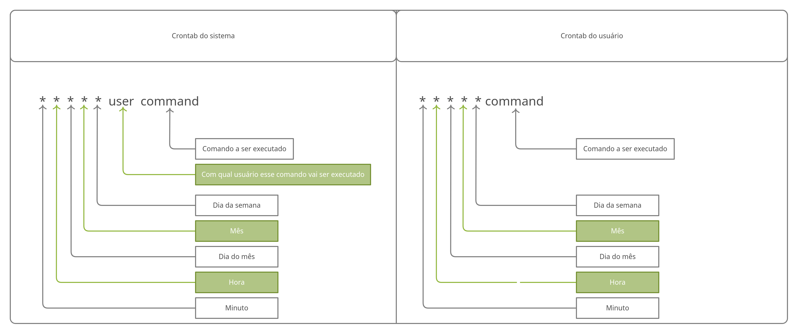
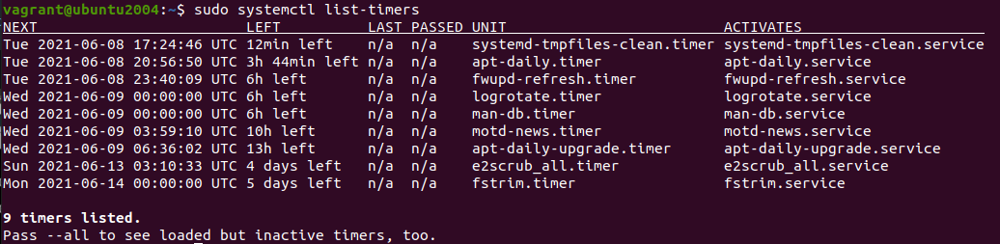

# Índice

[toc]

[Voltar](../107.1/1071.md)
[Próximo](../107.3/1073.md) 
[Índice Geral](../main.md)


# 107.2 Agendamento de tarefas

Vamos ver as possibilidades para fazermos o agendamento de tarefas no Linux, seja usando o Cron, AT ou até mesmo o SystemD.


## Cron

O crontab é utilizado para agendar tarefas que serão executados periodicamente no sistema, ao contrário do comando `at`, que só vai executar comandos pontualmente.

Há dois tipos de *crontab*, são eles: a de usuários e a do sistema. Ambas são arquivos que contem tabelas com informação de quando o comando especificado deve ser executado, sendo que cada linha corresponde a um único agendamento. O *crontab* é gerenciado pelo ***daemon crond***, que a cada um minuto verifica se há algum agendamento que deve ser executado e, se houver, executa-o.

O crontab do sistema fica localizado no arquivo `/etc/crontab` e já possui agendamentos para realizar as tarefas que se encontram
nos diretórios `/etc/cron.{hourly,daily,weekly,monthly,d}`.

```bash
$ ls -lhd /etc/cron.{hourly,daily,weekly,monthly,d}
drwxr-xr-x 2 root root 4.0K Jun  7 11:56 /etc/cron.d
drwxr-xr-x 2 root root 4.0K Apr  2 12:46 /etc/cron.daily
drwxr-xr-x 2 root root 4.0K Apr  2 12:32 /etc/cron.hourly
drwxr-xr-x 2 root root 4.0K Apr  2 12:32 /etc/cron.monthly
drwxr-xr-x 2 root root 4.0K Apr  2 12:44 /etc/cron.weekly

# Dentro de cada uma dessas pastas existem arquivos de Cron para serem executados de tempos em tempos.

# Se você ver um comando 'run-parts' no cron do sistema, esse comando vai executar todos os scripts dentro do diretório.
```




Vamos ver como funcionam cada opção do Crontab.

| Opção         | Descrição                                                    |
| ------------- | ------------------------------------------------------------ |
| Minuto        | Os minutos variam de **0-59**.                               |
| Hora          | As horas variam de **0-23**.                                 |
| Dia           | Os dias variam de **1-31**.                                  |
| Mês           | Os meses variam de **1-12**.                                 |
| Dia da semana | Os dias da semana variam de **0-7**, sendo **0** e **7** domingo. |
| Usuário       | Um usuário válido no sistema no qual o cron será executado.  |
| Comando       | O comando que será executado, pode ser um script também.     |
| **Opções**    | **Abaixo todas as opção são válidas desde *minuto* até *dia da semana* ** |
| *             | Representa todas as possibilidades, qualquer valor.          |
| ,             | Separa valores por vírgula.                                  |
| -             | Identifica um range de valores.                              |
| /             | Especifica “pulos” de valores, por exemplo: se no campo hora utilizarmos "*/4" o comando será executado as **0,4,8,12,16,20**. |

Vamos ver alguns exemplo para assimilar melhor isso.

```bash
# Todo dia, no mês de Agosto, as 00:05:
5 0 * 8 * ...

# Todo dia 1 de qualquer mês, as 14:15:
15 14 1 * * ...

# Toda Segunda até Sexta, as 22:00:
0 22 * * 1-5

# Roda a cada 2 horas e 23 minutos, sempre entre as 00:00 e 20:00 :
23 0-20/2 * * *
# Essa opção acima iria rodar todo dia as:
# as 04:23:00
# as 06:23:00
# as 08:23:00
# as 10:23:00
# as 12:23:00
# as 14:23:00
## Parte do período foi omitido.

# Todo domingo as 4:05 :
5 4 * * sun

# A cada 2 meses, todo dia 1° as 00:00 e 12:00 :
0 0,12 1 */2 *

# As 00:00 de todo domingo:
@weekly
```

> Você não deve usar script que exija interação com o usuário.


As opções abaixo substituem as 5 opções do Cron (minuto, hora, dia do mês, mês e dia da semana).

| Opção                | Descrição                                                    |
| -------------------- | ------------------------------------------------------------ |
| @reboot              | Especifica execução quando a máquina for reiniciada.         |
| @yearly ou @annually | Especificam execução uma vez ao ano, equivale a <br />`0 0 1 1 *`. Roda as 00:00, todo dia 1° do mês 1 (Janeiro). |
| @monthly             | Especifica execução somente uma vez ao mês, equivale a `0 0 1 * *`. Roda as 00:00, todo dia 1°. |
| @weekly              | Especifica execução somente uma vez na semana, equivale a `0 0 * * 0`. Roda as 00:00 de todo domingo. |
| @daily ou @midnight  | Especifica execução uma vez ao dia, equivale a `0 0 * * *`. Roda as 00:00 de todo dia. |
| @hourly              | Especifica execução somente uma vez a cada hora, equivale a `0 * * *`. Roda toda hora com zero minutos (13:00, 14:00, 15:00...). |


### Ativando os logs do Crontab

Para ativar os logs do *crontab* precisamos editar o arquivo `/etc/rsyslog.d/50-default.conf` do *rsyslog*, modifique a linha abaixo, removendo o `#` do começo da linha:

```bash
##### Antes:
#cron.*                         /var/log/cron.log

##### Depois de editar:
cron.*                         /var/log/cron.log
```


Se preferir, pode criar esse arquivo, mas o sistema vai criar para você:

```bash
# Crie o arquivo:
sudo touch /var/log/cron.log

# Aplicando as permissões do arquivo:
sudo chmod 640 /var/log/cron.log

# Aplicando Dono e Grupo dono corretos:
sudo chown syslog.adm /var/log/cron.log
```


### Editando o Crontab

Segue algumas opções para o comando `crontab`:

| Opção            | Descrição                                                    |
| ---------------- | ------------------------------------------------------------ |
| -r               | Remove o arquivo crontab do usuário logado e adiciona um vazio (faz um reset). |
| -e               | Edita o arquivo do crontab do usuário logado.                |
| -l (L minusculo) | Lista os agendamentos do cron do usuário logado.             |
| -u \<username>   | Muda o usuário, precisa ser root.                            |

O arquivo do Cron para o sistema fica em `/etc/crontab`.

Já os Cron dos usuários ficam em `/var/spool/cron/crontabs/`:

```bash
# Exibindo os crontab ativos dos usuários:
sudo ls /var/spool/cron/crontabs/
vagrant

# No caso, só possui o crontab do usuário vagrant.
```


### cront.{allow,deny}

Existe 2 arquivos de controle do Cron, ele ficam em `/etc/cront.{allow,deny}`, o arquivo *cron.allow* vai permitir que o usuário que estiverem dentro dele use o Cron, caso algum usuário esteja fora desse arquivo, mesmo que você não esteja negando ele, ele não poderá usar, só é permitido o uso quem estiver dentro desse arquivo, e os usuários que estiverem dentro de *cront.deny* não poderão usar.

O `.allow` tem prioridade sobre o `.deny`, então por mais que negue um usuário e ele esteja no allow, ele poderá executar. Vale ressaltar que usar os dois arquivos em conjunto não faz muito sentido, já que o *.allow* nega o uso de quem estiver fora dele, sendo assim, pode usar um ou outro.

No Debian, e distribuições baseadas como o Ubuntu, se ambos arquivos não existem, o uso dos recursos da cron é  liberado para todos os usuários. No entanto, em sistemas baseados  em RedHat, como o CentOS, na inexistência dos arquivos, o uso é  bloqueado a todos os usuários, exceto para o usuário root.


## Anacron

O conceito de funcionamento dos agendamentos de tarefas via cron pode ser aplicado a um outro agendador de tarefas chamado anacron.
Este agendador possui a função de executar tarefas que por algum motivo não foram executadas, geralmente pelo fato da máquina estar desligada no momento agendado para execução.


Seu arquivo fica em `/etc/anacrontab`.


## AT

O comando `at` pode agendar tarefas de forma semelhante ao cron, mas ele só roda uma vez. O *at* permite o controle dos usuários que podem agendar comandos através dos arquivos `/etc/at.allow` e `/etc/at.deny`.

Estes arquivos são organizados no formato de um usuário por linha. Durante o agendamento é verificado primeiro o arquivo `/etc/at.allow` (listando quem pode executar o comando) e depois `/etc/at.deny`.

Caso eles não existam, o agendamento de comando é permitido a todos os usuários.

> Utilize nos comandos do script e no agendador, sempre o (path) caminho completo do aplicativo a ser executado, exemplo para o comando `tar`, use `/bin/tar`, também na linha de comando que inserir no cron use o caminho completo para o script, por exemplo, executar um script que está em `/home/fulano`, use a linha: `/home/fulano/nome-do-script` e não somente `nome-do-script`.
>
> Muito cuidado com scripts, o comodismo pode cair no esquecimento e não atualizar o script de backup quando incluir novos serviços, diretórios ou usuários, monitore constantemente, teste e avalie o que está sendo feito.


Uma forma de agendar tarefas com `at` é da seguinte forma:

```bash
### Para agendar uma tarefa para daqui 3 horas, digite:
$ at now +3hour

# Depois disso você vai cair no shell do AT, pode ver porque o prompt vai mudar, provavelmente para 'at> '.

# Agora você deve digitar o que precisar ser agendado, por exemplo: Você pode agendar um bkp, rodar um script, voce deve colocar o caminho completo do script aqui.

# Para finalizar você roda Ctrl+d, e o job será criado.

# Outra forma seria:
$ at 15:16

# Ou até mesmo:
$ at 10:00am 14052021
```

| Comando | Descrição                                               |
| ------- | ------------------------------------------------------- |
| at      | Comando `at`.                                           |
| atq     | Lista os jobs criados pelo comando `at`, igual `at -l`. |


## SystemD Timer

É um recurso do SystemD para fazer o agendamento de tarefas.


Para lista os agendamentos ativo rode o comando `sudo systemctl list-timers`, veja abaixo:



A UNIT sempre terá o mesmo nome do SERVICE, você sempre terá um `.timer` e um `.services`. Você consegue notar para quando é o agendamento e quanto tempo falta para a execução dele.


Vamos ver a sintaxe de um `.timer` padrão:

```bash
$ cat /lib/systemd/system/apt-daily.timer
[Unit]
Description=Daily apt download activities

[Timer]
OnCalendar=*-*-* 6,18:00
RandomizedDelaySec=12h
Persistent=true

[Install]
WantedBy=timers.target

# Olhe em OnCalendar, o 1° asterisco é o Ano, o 2° é o Mês e o 3° é o Dia. Ele vai toda todo ano, todo mês e todo dia as 6:00 e as 18:00.

### Vamos dar uma olhada nuns exemplos:

# Das 6 até as 12h:
*-*-* 6..12:00

# Nas Segundas-feiras, as 7h:
Mon *-*-* 7:00

# Das Segundas até Sexta, as 10h:
Mon..Fri *-*-* 10:00

# Terça e quinta, as 13h:
Tue..Thu *-*-* 13:00

# Se quiser pode colocar ':' deopis dos minutos para especificar os segundos.
```

> Em sistemas Redhat, você deve substituir o `Mon..Fri` por `Mon-Fri`.


Vamos ver algumas opções do `.timer`:

| Opções             | Descrição                                                    |
| ------------------ | ------------------------------------------------------------ |
| OnCalendar         | Especificamos quando vai todar o agendamento.                |
| RandomizedDelaySec | Significa que o agendamento não vai rodar no momento especificado certinho, ele vai randomizar o agendamento com um delay para não rodar muita coisa junta.<br />`RandomizedDelaySec=12h` significa que ele vai rodar com um delay de até 12 horas. |
| Persistent         | Assim que o servicço é executado ele é gravado em disco. Muito bom para executar agendamentos perdidos por algum motivo. <br />Só pode ser usado se `OnCalendar ` estiver em uso. |
| OnBootSec          | Define um cronômetro relativo a quando a máquina foi inicializada. Ex.: `OnBootSec=15min`. |
| OnUnitActiveSec    | Diz para rodar a cada tempo, por ex.: `OnUnitActiveSec=1d`, a cada 24 horas depois que o sistema fica ativo . |

Para mais detalhes, olhe [aqui](https://www.freedesktop.org/software/systemd/man/systemd.timer.html), similar a `man systemd.timer`, Além disso, veja também `man systemd.time`.


Vamos criar um exemplo de agendamento:

```bash
# Vamos começar criando o '.service':
sudo vim /lib/systemd/system/exemplo.service

### Start example service ###
[Unit]
Description=Exemplo systemd-timer
ConditionACPower=true

[Service]
Type=oneshot
ExecStart=/bin/sh -c 'date >> /tmp/teste_systemd-time.txt'
### End example service ###

##############################################################

# Agora vamos criar o '.timer':
sudo vim /lib/systemd/system/exemplo.timer

### Start example timer ###
[Unit]
Description=Teste systemd timer

[Timer]
OnCalendar=*-*-* 21:25:00
AccuracySec=1us

[Install]
WantedBy=timers.target
### End example timer ###
```


Agora vamos iniciar o serviço:

```bash
# Recarregue o damon do systemD:
sudo systemctl daemon-reload

# Inicie o timer:
sudo systemctl start exemplo.timer

# Verifique o status:
sudo systemctl status exemplo
```


## SystemD Run

Similar ao `at`, mas roda sob o SystemD.

```bash
# Rodar um comando daqui 1 minuto:
date && sudo systemd-run --on-active=1m --timer-property=AccuracySec=1us /usr/bin/echo $(date) >> /tmp/novo

# Se for rodar sem root, acrescente a opção '--no-ask-password'.
```


[Voltar](../107.1/1071.md)
[Próximo](../107.3/1073.md) 
[Índice Geral](../main.md)