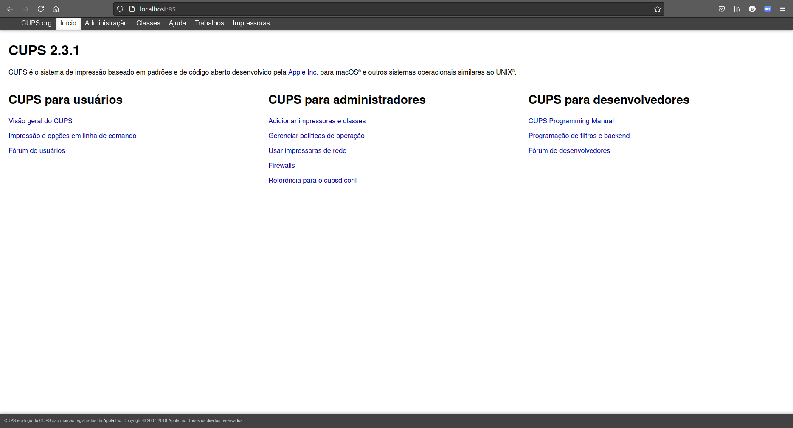
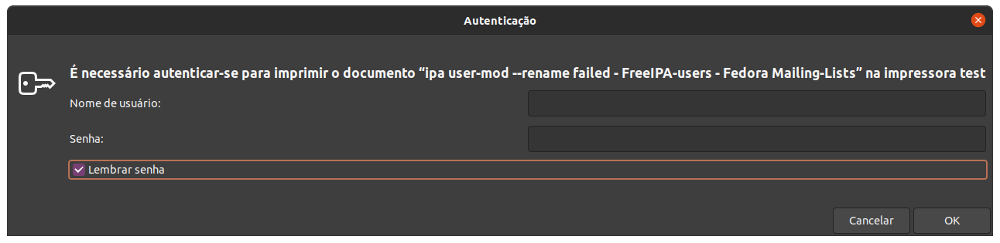
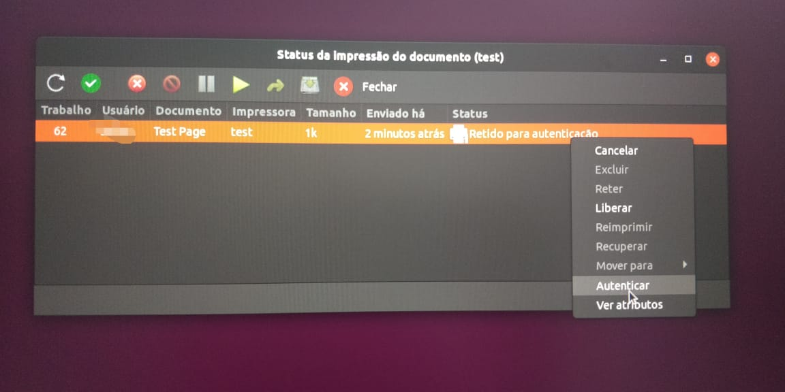
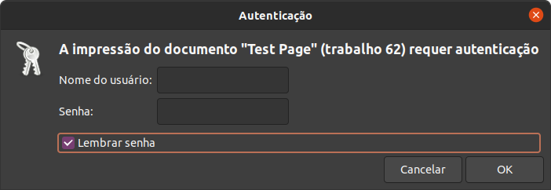
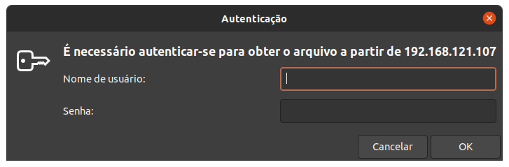

# Índice

[toc]

[Voltar](../108.3/1083.html)
[Próximo](../109.1/1091.html) 
[Índice Geral](../main.html)


# 108.4 Servidor e Impressão

Para podermos ter um servidor de impressão, usamos a aplicação chamada CUPS (Common Unix Printing System), ele é um sistema de gerenciamento de impressão. Como para testar você precisa ter uma impressora, vamos fazer os testes usando uma impressão para PDF.


## Instalação

Siga os passos abaixo para instalar as aplicações necessárias.

```bash
# Instalação do servidor de impressão:
$ sudo apt install cups cups-bsd

# Cups = cliente;
# cups-bsd = server.

# Instalação do módulo de pdf para o cups:
$ sudo apt install cups-pdf
```

O cups roda na porta 631 e para gerenciar por interface gráfica, acesse o IP pelo navegador, informando a porta 631.

Para acessar essa página de outra máquina, faça um redirecionamento usando o ssh:

```bash
$ sudo ssh vagrant@192.168.121.83 -L 85:localhost:631
# Pegar a porta 631 do localhost (maquina que vamos acessar) e redirecionamos para a porta 85 da nossa maquina. Então sempre que entrarmos em localhost:85, vamos estar acessando a máquina 192.168.121.83 na porta 631.
```

Isso precisa ser feito porque o servidor cups roda locamente apenas, a página de gerencia não está aberta para a rede, e não é bom abrir, ja que podemos acessar assim.




## Gerenciando via terminal

Vamos focar em como gerenciar a impressora via linha de comando, apesar do uso da interface gráfica ser mais fácil, o uso via linha de comando é necessária para a LPI e nem sempre você vai poder contar com uma interface gráfica.


### lpinfo

Usado para listar o dispositivos/Drivers de impressão.

| Opção | Descrição                                                |
| ----- | -------------------------------------------------------- |
| -v    | Lista todos os dispositivos que o cups está encontrando. |
| -m    | Mostra os drivers disponíveis.                           |


Vamos ver um exemplo:

```bash
# Listando os dispositivos:
\# lpinfo -v
network beh
network ipps
network ipp14
file cups-pdf:/
network socket
network ipp
network lpd
serial serial:/dev/ttyS0?baud=115200
network https
direct hp
network http
direct hpfax
```


### lpstat

Usado para retornar o status das impressoras. 

```bash
# Verificando o status das impressoras:
\# lpstat -a
print1 accepting requests since Ter 15 Jun 2021 15:10:53 -03
print2 accepting requests since Qui 09 Fev 2017 16:03:19 -02
print3 accepting requests since Sex 15 Mai 2020 18:10:10 -03
PDF accepting requests since Qui 28 Jul 2016 12:25:59 -03

# Verificando mais detalhes:
\# lpstat -t
scheduler is running
system default destination: PDF
device for print1: socket://IP
device for print2: socket://IP
device for print3: socket://IP
device for PDF: cups-pdf:/
print1 accepting requests since Ter 15 Jun 2021 15:10:53 -03
print2 accepting requests since Qui 09 Fev 2017 16:03:19 -02
print3 accepting requests since Sex 15 Mai 2020 18:10:10 -03
PDF accepting requests since Qui 28 Jul 2016 12:25:59 -03
printer print1 is idle.  enabled since Ter 15 Jun 2021 15:10:53 -03
	Waiting for printer to finish.
printer print2 is idle.  enabled since Qui 09 Fev 2017 16:03:19 -02
printer print3 is idle.  enabled since Sex 15 Mai 2020 18:10:10 -03
printer PDF is idle.  enabled since Qui 28 Jul 2016 12:25:59 -03
print1-131430      unknown         356352   Sex 09 Abr 2021 00:00:40 -03

# Mostrar jobs na fila de impressão (igual 'lpq'):
\# lpstat -o
Virtual_PDF_Printer-2   unknown          11264   Thu Jun 17 13:58:17 2021
# Para saber a impressora, temos: NOME_da_IMPRESSORA-JOB

### Lista as tarefas de impressão completa ou que não foram completadas.
### lpstat -W <completed/not-completed> -o

# Verificando os jobs que deram certos:
\# lpstat -W completed -o
Virtual_PDF_Printer-1   unknown          11264   Thu Jun 17 13:49:59 2021

# Verificando os jobs que ainda nao deram certo (ou nem irão dar):
\# lpstat -W not-completed -o
Virtual_PDF_Printer-2   unknown          11264   Thu Jun 17 13:58:17 2021
```


### lpq

Usado para verificar a fila de impressão, para isso, você precisa instalar o pacote `cups-bsd`.

| Opção            | Descrição                                |
| ---------------- | ---------------------------------------- |
| -a               | Lista as filas de todos os dispositivos. |
| -P \<impressora> | Mostra a fila de uma impressora.         |
| -U \<username>   | Mostra a fila de um usuário específico.  |

```bash
# Verificando a fila para a impressora de PDF:
\# lpq -P Virtual_PDF_Printer
Virtual_PDF_Printer is not ready
Rank    Owner   Job     File(s)                         Total Size
1st     unknown 2       unknown                         11264 bytes
```


### loptions

Usado para ver e configurar opções de impressora.

| Opção            | Descrição                                    |
| ---------------- | -------------------------------------------- |
| -p \<impressora> | Mostra os dados da impressora.               |
| -l (L minusculo) | Exibe as configurações da impressora.        |
| -o opcao=valor   | Muda o valor de uma opção para a impressora. |
| -d impressora    | Define a impressora como padrão.             |

```bash
\# #  lpoptions | sed 's/ /\n/g'
copies=1
device-uri=cups-pdf:/
finishings=3
job-cancel-after=10800
job-hold-until=no-hold
job-priority=50
job-sheets=none,none
marker-change-time=0
number-up=1
printer-commands=AutoConfigure,Clean,PrintSelfTestPage
printer-info=PDF
printer-is-accepting-jobs=true
printer-is-shared=false
printer-location
printer-make-and-model='Generic CUPS-PDF Printer'
printer-state=3
printer-state-change-time=1469719559
printer-state-reasons=none
printer-type=10678348
printer-uri-supported=ipp://localhost/printers/PDF

# Vendo outra impressora:
\#  lpoptions -p print1 | sed 's/ /\n/g'
copies=1
device-uri=socket://IP
finishings=3
job-cancel-after=10800
job-hold-until=no-hold
job-priority=50
job-sheets=none,none
marker-change-time=0
number-up=1
printer-commands=ReportLevels
printer-info=print1
printer-is-accepting-jobs=true
printer-is-shared=true
printer-location
printer-make-and-model='HP LaserJet Pro MFP M521 Postscript (recommended)'
printer-state=3
printer-state-change-time=1623783570
printer-state-reasons=none
printer-type=8425556
printer-uri-supported=ipp://localhost/printers/print1
```


### lprm

Usado para remover uma impressão da fila de impressão.

Use o `-P <impressora_nome>` para remover o ultimo item da fila de impressão.

```bash
# Limpando tudo do usuário root (logado no momento):
\# lprm -

# Removendo o job 1:
\# lprm <job-id>

# Para ver o job, você pode usar 'lpq' ou 'lpstat -o'.
```


### cancel

Usado para cancelar impressões também.

| Opção | Descrição                    |
| ----- | ---------------------------- |
| -a    | Cancela todas as impressões. |

```bash
# Cancelando o job 35:
\# cancel 35

# Cancelando tudo:
\# cancel -a
```


### cupsenable e cupsdisable

Usado para habilitar e desabilitar uma impressora.

```bash
# Desabilitando a impressora de pdf:
\# cupsdisable Virtual_PDF_Printer

# Verificando se foi desabilitada:
\# lpc status
PDF:
	printer is on device 'cups-pdf' speed -1
	queuing is enabled
	printing is enabled
	no entries
	daemon present
Virtual_PDF_Printer:
	queuing is enabled
	printing is disabled
	no entries
	daemon present
# Perceba que ela está como 'printing is disabled'.
```


### lpc

Usado para verificar status da impressora.

```bash
\# lpc status
PDF:
	printer is on device 'cups-pdf' speed -1
	queuing is enabled
	printing is enabled
	no entries
	daemon present
Virtual_PDF_Printer:
	queuing is enabled
	printing is enabled
	no entries
	daemon present
```


## Adicionando uma impressora

Antes de adicionarmos um impressora, precisamos saber qual o driver dela. Para gerenciar as impressoras no sistema, usamos o comando `lpadmin`.

| Opção            | Descrição                                                    |
| ---------------- | ------------------------------------------------------------ |
| -p \<nome>       | Especifica um nome para a impressora.                        |
| -E               | Ativa a impressora, aceitando trabalhos da impressora (depois de -p) |
| -v               | Informa o URI (Endereço de busca da impressora), podemos obter a impressora com o comando `lpinfo -v` ou podemos passar uma flag para buscar, por exemplo, para buscar na rede usamos `ipp://IP`. |
| -m               | Informa o modelo/PPD arquivo da impressora (driver).         |
| -d \<nome>       | Define a impressora padrão.                                  |
| -x \<impressora> | Remove uma impressora.                                       |

```bash
# Procurando o driver da impressora:
$ lpinfo -m | grep -i 5264
postscript-hp:0/ppd/hplip/HP/hp-laserjet_flow_mfp_e52645-ps.ppd HP LaserJet Flow MFP E52645 Postscript (recommended)

###### Instalando os driver de impressoras HP ######
# Caso nao encontre nada, instale o pacote abaixo, ele contém os drivers para impressora HP:
$ sudo apt install hplip -y

# Agora vamos adicionar a impressora pela rede:
$ sudo lpadmin -p NOME -E -v ipp://IP/printers/printer1 -m postscript-hp:0/ppd/hplip/HP/hp-laserjet_flow_mfp_e52645-ps.ppd

# Tornando a impressora a padrão:
$ sudo lpadmin -d "NOME"
```


## Enviando arquivo para a impressora

Para podermos imprimir, vamos usar o comando `lpr`.

```bash
# Enviando um arquivo para a impressora padrão:
$ lpr <arquivo>

# Escolhendo a impressora:
$ lpr <arquivo> -P <impressora_nome>

# Uma forma de mandar imprimir também é usando o redirecionamento de saída padrão:
$ grep "root" /etc/passwd | lpr

# Também podemos fazer isso usando o comando 'lp -d <impressora>'
```

Quando você enviar uma impressão, e ela for impressa, ele ficará em `/var/spool/cups/`. Arquivos começando com `d` (arquivos de Dados), são impressões pendentes para serem feitas, e tudo que começar com `c` (arquivos de controle), são arquivos que já foram impressos. 

> Os arquivos de controle são normalmente limpos após o 500º trabalho ser enviado, enquanto os arquivos de dados são removidos imediatamente após a impressão bem-sucedida de um trabalho. Ambos os comportamentos podem ser configurados. 

Os logs ficam em `/var/log/cups/`.


## Implantando um servidor de impressão 

Vou descrever o que você precisa para criar um servidor de impressão para usar em algum lugar.

Edite o arquivo do cups para deixar como abaixo, dessa forma, vamos compartilhar a impressora:

```bash
#### Arquivo está em '/etc/cups/cupsd.conf'

# Name of server
ServerName nome-do-servidor

Listen 631
Browsing Off

DefaultAuthType Basic

# Para liberar apenas para alguns IPs, descomente o que estiver comentado dentro de '/' e '/printers'.
# O localhost é para que o proprio server possa imprimir.
<Location />
  Order allow,deny
#  Order deny,allow
#  Allow From 127.0.0.1
#  Allow From 192.168.0.*
  Allow all
</Location>
```


## Kerberos

Para usar a autenticação com Kerberos, use o exemplo abaixo:

```bash
#### Arquivo está em '/etc/cups/cupsd.conf'

AccessLogLevel all
LogLevel debug2
PageLogFormat
MaxLogSize 32m

Listen 631
Listen /run/cups/cups.sock

Browsing Off
BrowseLocalProtocols dnssd

DefaultAuthType Negotiate

WebInterface Yes

<Location />
  AuthType Basic
  Require valid-user
  Encryption Required
  Order deny,allow
  Allow localhost
</Location>

#<Location />
#  Order allow,deny
#  Allow from 192.168.121./24
#  AuthType Basic
#  Require valid-user
#  Satisfy all
#</Location>

#<Location /printers>
#  Require valid-user
#  Encryption Required
#  Order deny,allow
#  Allow localhost
#</Location>

<Location /admin/conf>
  Require valid-user
  Encryption Required
  Order deny,allow
</Location>

<Location /admin/log>
  Require valid-user
  Encryption Required
  Order deny,allow
</Location>

<Policy kerberos>
  JobPrivateAccess default
  JobPrivateValues default
  SubscriptionPrivateAccess default
  SubscriptionPrivateValues default
  <Limit Create-Job Print-Job Print-URI Validate-Job>
    Require valid-user
    Encryption Required
    Order deny,allow
  </Limit>
  <Limit Send-Document Send-URI Hold-Job Release-Job Restart-Job Purge-Jobs Set-Job-Attributes Create-Job-Subscription Renew-Subscription Cancel-Subscription Get-Notifications Reprocess-Job Cancel-Current-Job Suspend-Current-Job Resume-Job Cancel-My-Jobs Close-Job CUPS-Move-Job CUPS-Get-Document>
    Encryption Required
    Order deny,allow
  </Limit>
  <Limit CUPS-Add-Modify-Printer CUPS-Delete-Printer CUPS-Add-Modify-Class CUPS-Delete-Class CUPS-Set-Default>
    Require user @SYSTEM
    Order deny,allow
  </Limit>
  <Limit Pause-Printer Resume-Printer Enable-Printer Disable-Printer Pause-Printer-After-Current-Job Hold-New-Jobs Release-Held-New-Jobs Deactivate-Printer Activate-Printer Restart-Printer Shutdown-Printer Startup-Printer Promote-Job Schedule-Job-After Cancel-Jobs CUPS-Accept-Jobs CUPS-Reject-Jobs>
    Require user @SYSTEM
    Order deny,allow
  </Limit>
  <Limit Cancel-Job CUPS-Authenticate-Job>
    Require user @OWNER @SYSTEM
    Order deny,allow
  </Limit>
  <Limit All>
    Order deny,allow
  </Limit>
</Policy>

# No arquivo das impressoras `/etc/cups/printers.conf`, ative o compartilhamento da impressora, e mude a política da impressora:
$ sudo vim /etc/cups/printers.conf

# Mude 'Share No' para 'Shared Yed' na impressora que for compartilhar:
Shared Yes

# Mude 'OpPolicy default' para 'OpPolicy kerberos' na impressora que for realizar esse tipo de autenticação:
OpPolicy kerberos

# Agora vamos reiniciar o serviço do cups:
sudo systemctl restart cups

# Verifique se o serviço subiu sem problemas:
sudo systemctl status cups
```


### Desativando o apparmor

O `apparmor` vai impedir a comunicação do `cups` com o `sssd`, no caso o cliente que comunica com o servidor Kerberos, então temos que tirar o `cups` do apparmor para que a autenticação via Kerberos funcione.

```bash
# Coloque o link desativando o cups no apparmor:
sudo ln -sf /etc/apparmor.d/usr.sbin.cupsd /etc/apparmor.d/disable/
sudo ln -sf /etc/apparmor.d/usr.sbin.cups-browsed  /etc/apparmor.d/disable/

# Carregue a mudança no Kernel:
sudo apparmor_parser -R /etc/apparmor.d/disable/usr.sbin.cupsd
sudo apparmor_parser -R /etc/apparmor.d/disable/usr.sbin.cups-browsed
```


### Funcionamento

Por algum motivo o sistema vai pedir senha toda vez que for imprimir, existe duas senhas que você deve salvar e mesmo que ele solicite depois, você pode cancelar porque vai estar salva já.


Adicione a impressora no cliente:

```bash
# Adicionando uma impressora no cliente:
sudo lpadmin -p "NOME" -v ipp://IP/printers/"Nome da impressora" -E

# Ex:
sudo lpadmin -p "test" -v ipp://192.168.121.107/printers/PDF -E
```

Agora abra um site qualquer e mande imprimir, vai aparecer uma solicitação como na imagem abaixo, certifique-se de que os usuário e a senha estejam corretos, **Não esqueça de marcar a caixa para salva a senha**, depois disso, mande imprimir, deve imprirmir sem nenhum problema.




Agora a segunda autenticação é opcional, ela acontece quando você vai enviar uma página de testes, nesse caso não temos uma janela pedindo para colocar a senha, então você deve abrir a fila da impressora, clicar com o botão direito na impressão e ir em *Autenticar*.



Quando clicar em autenticar, será exibido a janela abaixo.



Agora basta colocar a mesma senha que foi usada mais acima, **Não esqueça de marcar a caixa para salva a senha**.

Eventualmente será exibido a janela abaixo pedindo para se autentica de novo, essa caixa aparece mais quando você vai imprimir um documento de texto, quando é via browser essa caixa não costuma aparecer tanto, basta cancelar ou fechar, já temos a autenticação salva, a impressão deve ocorrer sem nenhum problema.



Após clicar em cancelar, você poderá imprimir normalmente caso seja um documento e ainda vá escolher a impressora ou a impressão já será enviada caso a aplicação ja tenha escolhido a impressora (nos casos de navegadores por exemplo).


[Voltar](../108.3/1083.html)
[Próximo](../109.1/1091.html) 
[Índice Geral](../main.html)


## Fontes

https://en.opensuse.org/SDB:CUPS_in_a_Nutshell

https://github.com/ui-kreinhard/go-cups-control-files

https://access.redhat.com/documentation/en-us/red_hat_enterprise_linux/8/html/deploying_different_types_of_servers/configuring-printing_deploying-different-types-of-servers

https://www.cups.org/doc/man-cupsd.conf.html

https://freeipa-users.redhat.narkive.com/4aE4Z2r8/cups-problem-that-may-be-related-to-freeipa

https://linuxconfig.org/how-to-disable-apparmor-on-ubuntu-20-04-focal-fossa-linux


