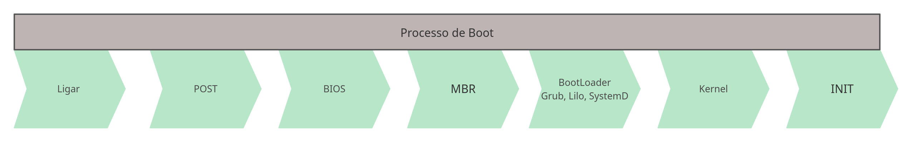
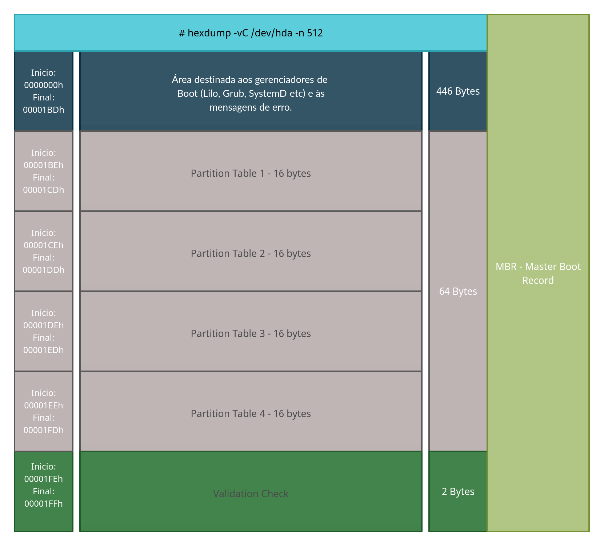
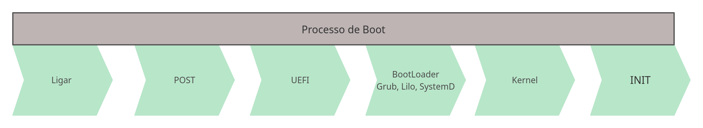

# Índice

[toc]

[Voltar](../101.1/1011.md)
[Próximo](../101.3/1013.md) 
[Índice Geral](../main.md)


# 101.1 Arquitetura do Sistema

## MBR - Master Boot Record

Um Master Boot Record, é um tipo de setor de inicialização no início do HD, nele ficam informações que possibilitam a inicialização do sistema, também possibilitam gravar e ler informações mantidas no dispositivo, assim como informações sobre partições, filesystems entre outros.

Um dispositivo MBR pode dividir-se em até no máximo 4 partições primárias, possui um tamanho máximo de 2TB por disco e toda a informação das partições é guardada em apenas num único local. Pode ter apenas 1 partição extendida e várias partições lógicas.


### Inicialização do Sistema

Vamos entender os passos ocorridos durante a inicialização do computador.

1. Ao ligar o computador, inicia-se o [POST](https://whatis.techtarget.com/definition/POST-Power-On-Self-Test) (AutoTeste de Inicialização).
2. Após o término do POST, a *BIOS* começa o processo de iniciar o hardware necessário para fazer o boot do sistema (inicia discos, controladores USB, PCI e outros dispositivos).
3. Agora a [BIOS](https://www.computerhope.com/jargon/b/bios.htm) vai iniciar o programa que está nos primeiros 440 bytes (MBR) do primeiro disco na sua ordem boot (Geralmente esse bootloader é o Grub, Lilo ou SystemD).
4. Agora esse pequeno programa vai carregar e executar o BootLoader na memória do computador.
   O gerenciador de inicializaçãoou Boot-Loader é iniciado, e a partir daqui podemos ver a tela de menu do boot.
5. O bootloader inicia o Kernel que vai detectar as configurações de hardwares e inicia o sistema de arquivos virtual definido pelo initrd ou initramfs. Se tudo der certo a partição do `/` é iniciada e logo em seguida são montadas as partições em `/etc/fstab` e depois temos o início do processo **"init"** (Em sistemas com SystemD, o INIT é um link para o `systemd`).




Informações da MBR:




## UEFI - Unified Extensible Firmware Interface

O UEFI trablha com a partição ESP (EFI System Partition) para inicialização do sistema. Aqui temos um layout novo, teve um aumento significativo no limite de partições primárias, podendo ter até no máximo 128 partições primárias, suporte para discos acima dos 2 TB, também temos mecanismos para detecção da dados e partições corrompidas entre outras melhorias.


### Inicialização do Sistema

Vamos entender os passos ocorridos durante a inicialização do computador.


1. Ao ligar o computador, inicia-se o [POST](https://whatis.techtarget.com/definition/POST-Power-On-Self-Test) (AutoTeste de Inicialização).

2. Após o término do POST, a *UEFI* começa o processo de iniciar o hardware necessário para fazer o boot do sistema (inicia discos, controladores USB, PCI e outros dispositivos).

3. O firmware lê as entradas de inicialização na NVRAM para determinar qual aplicativo EFI iniciar e de onde (por exemplo, de qual disco e partição), geralmente essa aplicação que será iniciada é um bootloader.

4. Uma entrada de inicialização pode ser simplesmente um disco. Neste caso, o firmware procura uma partição de sistema EFI (conhecido por ter a flag ESP) nesse disco e tenta encontrar um aplicativo EFI no caminho de inicialização de fallback `\EFI\BOOT\BOOTX64.EFI` (`BOOTIA32.EFI` em sistemas com um IA32 (32 bits) UEFI) . É assim que a mídia removível inicializável UEFI funciona. Agora esse pequeno programa vai carregar e executar o BootLoader na memória do computador.

   O firmware inicia o aplicativo EFI e a partir daqui podemos ver a tela de menu do boot.

   > A partição ESP deve ter alguns dos filesystems a seguir:  FAT12, FAT16 ou FAT32. Para mídias como DVD/CD, devemos usar o filesystem ISO-9660.

5. Este poderia ser um carregador de boot ou o próprio kernel usando EFISTUB, pode ser também algum outro aplicativo EFI, como um shell UEFI ou um gerenciador de boot, como systemd-boot, rEFInd, Grub, Lilo entre outros.

   > Se a inicialização segura estiver ativada, o processo de inicialização verificará a autenticidade do binário EFI por assinatura.
   >
   > Como cada sistema operacional ou fornecedor pode manter seus próprios arquivos na partição do sistema EFI sem afetar o outro, a inicialização múltipla usando UEFI é apenas uma questão de iniciar um aplicativo EFI diferente correspondente ao carregador de inicialização do sistema operacional específico. Isso elimina a necessidade de confiar nos mecanismos de carregamento em cadeia de um carregador de boot para carregar outro sistema operacional.



O UEFI não trabalha com MBR por definição, mas é possível usar. O UEFI fica montado em `/boot/efi`, com UEFI é possível termos Boot Seguro, para isso precisamos assinar o Kernel, ele também é compatível com a BIOS (Bios Legacy), podemos configurado pelo UEFI Boot Manager ou com o comando `efibootmgr`.


## Bootloader


O `bootloader` é um software iniciado pelo firmware (BIOS ou UEFI) que serve para carregar o Sistema Operacional na memória, enquanto que o `initrd` ou `initramfs` servem para dar suporte ao Kernel. Filesystem temporário carregador na memória ram.

No caso de UEFI, o próprio kernel pode ser iniciado diretamente pelo UEFI usando o stub de inicialização EFI. Um carregador de boot ou gerenciador de boot separado ainda pode ser usado com o propósito de editar os parâmetros do kernel antes da inicialização. 


## INIT - Initialization Processes

O INIT tem função de iniciar os primeiros processos e serviços do Linux, possui o ID 1, pai de todos os outros processos.

O init funciona atráves de RunLevels (SysV) ou Targets (SystemD) que vão definir diferentes modos de operação. Os inits atuais são:

- SystemV (SysV) - Init original;
- SystemD (mais atual);
- Upstart (Muito usado também)

Podemos ver todas as mensagens do Boot com os logs, use o comando `dmesg`.


## Journalctl

É o sistema de log do `systemd`, ele coleta logs tanto do sistema como de aplicações (em ambientes systemd), podemos usar para verificar os logs do boot também. 


Opções:

```bash
-b		= Mostra logs do boot atual ou um especifico
-k		= Mensagens do Kernel referente ao boot atual (dmesg)
-f		= Fica monitorando
-x		= Adiciona mensagem explicativas quando possível
-e		= Joga para o final da página de logs
```


Exemplos:

```bash
# Para ver o status do serviço:
sudo systemctl status systemd-journald

# Exibir tudo:
sudo journalctl

# Mensagem de Boot:
sudo journalctl -b
```


[Voltar](../101.1/1011.md)
[Próximo](../101.3/1013.md) 
[Índice Geral](../main.md)

