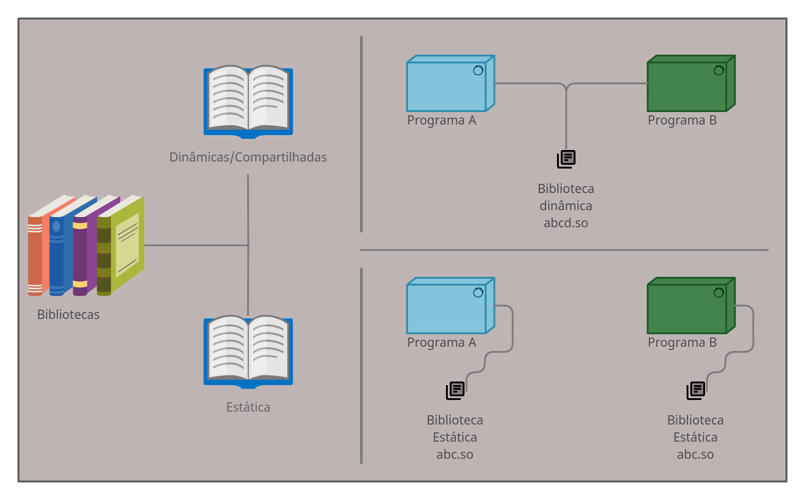

# Índice

[toc]

[<span style="color:yellow">Voltar</span>](../102.2/1022.md)
[<span style="color:yellow">Próximo</span>](../102.4/1024.md) 
[<span style="color:yellow">Índice Geral</span>](../main.md)


# 102.3 Gerenciamento de Bibliotecas compartilhadas

No Linux temos 2 tipos de bibliotecas, estáticas ou dinâmicas (também conhecida como compartilhada).

Biblioteca são pedaços de código que podemos usar, ao invés de criar um código do zero, podemos importar um que já exista e assim não vamos ter que cria-lá novamente.



Principais diferenças entre cada uma:

| Biblioteca Estática                                          | Biblioteca Dinâmia (Compartilha)                             |
| ------------------------------------------------------------ | ------------------------------------------------------------ |
| O software roda de forma independente (isso é bom)           | O software faz referências a uma ou mais bibliotecas (Não é ruim, mas também não é bom) |
| Gasta mais memória, muito código carregado na memória (Ruim) | Gasta menos memória, muito código carregado na memória (Bom) |
| Software fica com uma tamanho maior (Ruim)                   | Software fica com um tamanho menor (Bom)                     |
| Se atualizar a biblioteca vai ter que recompilar o código do software (Ruim) | Se atualizar a biblioteca não vai precisar recompilar o código do software (Bom) |


## LDD - List Dynamic Dependencies

Exibe todas as bibliotecas que um binário utiliza, e caso venha a não ter essa biblioteca no sistema, ele informa também, é usado para ver as bibliotecas compartilhadas.


```bash
# Vendo as libs que são usadas pelo binário do LS:
$ ldd $(which ls)
	linux-vdso.so.1 (0x00007ffe2bedc000)
	libselinux.so.1 => /lib/x86_64-linux-gnu/libselinux.so.1 (0x00007f85327e3000)
	libc.so.6 => /lib/x86_64-linux-gnu/libc.so.6 (0x00007f8532622000)
	libpcre.so.3 => /lib/x86_64-linux-gnu/libpcre.so.3 (0x00007f85325ae000)
	libdl.so.2 => /lib/x86_64-linux-gnu/libdl.so.2 (0x00007f85325a9000)
	/lib64/ld-linux-x86-64.so.2 (0x00007f8532a39000)
	libpthread.so.0 => /lib/x86_64-linux-gnu/libpthread.so.0 (0x00007f8532588000)
	
# Verificando as libs que o binário do iptables usa:
$ ldd /usr/sbin/iptables
	linux-vdso.so.1 (0x00007ffd52fa1000)
	libmnl.so.0 => /lib/x86_64-linux-gnu/libmnl.so.0 (0x00007fa3e36b3000)
	libnftnl.so.11 => /lib/x86_64-linux-gnu/libnftnl.so.11 (0x00007fa3e3685000)
	libnetfilter_conntrack.so.3 => /lib/x86_64-linux-gnu/libnetfilter_conntrack.so.3 (0x00007fa3e3466000)
	libnfnetlink.so.0 => /lib/x86_64-linux-gnu/libnfnetlink.so.0 (0x00007fa3e325f000)
	libxtables.so.12 => /lib/x86_64-linux-gnu/libxtables.so.12 (0x00007fa3e324c000)
	libm.so.6 => /lib/x86_64-linux-gnu/libm.so.6 (0x00007fa3e30c9000)
	libc.so.6 => /lib/x86_64-linux-gnu/libc.so.6 (0x00007fa3e2f06000)
	libdl.so.2 => /lib/x86_64-linux-gnu/libdl.so.2 (0x00007fa3e2f01000)
	/lib64/ld-linux-x86-64.so.2 (0x00007fa3e3965000)

```

Tudo que tiver uma extensão `.so` é uma biblioteca, geralmente o nome delas começa com `lib` também, lembre-se que a extensão no Linux é apenas para informar a nós humanos do que se trata.

A lib `ld.so` é responsável por encontrar e mapear as libs do sistema para que outras aplicações possam achar o local de cada uma das libs (podemos ver isso porque tem um redirecionamento para sua localização `=>`), ou a própria aplicação aponta o local dela (quando nao tem redirecionamento, só tem a localização).


## LD.SO

Como informado acima, usado para mapear as libs, para isso ele procura em alguns lugares, no `/lib`, no `/usr/lib/` e no `/usr/local/lib` isso por padrão, mas podemos ter libs em outros locais e para isso precisaremos informar ao sistema onde estão essas libs.

Assim que o Linux inicia, ele cria um arquivo binário contendo uma relação de todas as libs do sistema, esse arquivo é `/etc/ld.so.cache`, para gerar esse arquivo, usamos o comando `ldconfig`. O `ldconfig` consegue fazer essa relação e salvar em `ld.so.cache` porque ele tem diretórios específicos onde ficam essas libs e porque ele também verifica o arquivo de configuração `/etc/ls.so.conf`, nele ficam armazenado a localização das libs que não estão nos diretório padrões.

Resumo:

- /etc/ld.so.cache

  Binário contendo uma relação de todas as libs do sistema.

- /etc/ld.so.conf

  Arquivo de configuração para incluir libs adicionais.


Exemplo de um arquivo de configuração:

```bash
### Arquivo /etc/ld.so.conf.d/libc.conf
# libc default configuration
/usr/local/lib

### Arquivo /etc/ld.so.conf.d/zz_x32-biarch-compat.conf
# Legacy biarch compatibility support
/libx32
/usr/libx32

### Listando algum desses diretórios:
$ ls -l /libx32/

Mcrt1.o
Scrt1.o
crt1.o
crti.o
crtn.o
gconv
gcrt1.o
grcrt1.o
ld-2.28.so
ld-linux-x32.so.2 -> ld-2.28.so
libBrokenLocale-2.28.so
libBrokenLocale.a
libBrokenLocale.so -> /libx32/libBrokenLocale.so.1
libBrokenLocale.so.1 -> libBrokenLocale-2.28.so
libSegFault.so
libanl-2.28.so
libanl.a
libanl.so -> /libx32/libanl.so.1
libanl.so.1 -> libanl-2.28.so
libasan.so.5 -> libasan.so.5.0.0
libasan.so.5.0.0
libatomic.so.1 -> libatomic.so.1.2.0
libatomic.so.1.2.0
libc-2.28.so
libc.a
libc.so
libc.so.6 -> libc-2.28.so
libc_nonshared.a
libcrypt-2.28.so
libcrypt.a
libcrypt.so -> /libx32/libcrypt.so.1
libcrypt.so.1 -> libcrypt-2.28.so
libdl-2.28.so
libdl.a
libdl.so -> /libx32/libdl.so.2
libdl.so.2 -> libdl-2.28.so
libg.a
libgcc_s.so.1
libgomp.so.1 -> libgomp.so.1.0.0
libgomp.so.1.0.0
libitm.so.1 -> libitm.so.1.0.0
libitm.so.1.0.0
libm-2.28.a
libm-2.28.so
libm.a
libm.so
libm.so.6 -> libm-2.28.so
libmcheck.a
libmemusage.so
libmvec-2.28.so
libmvec.a
libmvec.so -> /libx32/libmvec.so.1
libmvec.so.1 -> libmvec-2.28.so
libmvec_nonshared.a
libnsl-2.28.so
libnsl.a
libnsl.so -> /libx32/libnsl.so.1
libnsl.so.1 -> libnsl-2.28.so
libnss_compat-2.28.so
libnss_compat.so -> /libx32/libnss_compat.so.2
libnss_compat.so.2 -> libnss_compat-2.28.so
libnss_dns-2.28.so
libnss_dns.so -> /libx32/libnss_dns.so.2
libnss_dns.so.2 -> libnss_dns-2.28.so
libnss_files-2.28.so
libnss_files.so -> /libx32/libnss_files.so.2
libnss_files.so.2 -> libnss_files-2.28.so
libnss_hesiod-2.28.so
libnss_hesiod.so -> /libx32/libnss_hesiod.so.2
libnss_hesiod.so.2 -> libnss_hesiod-2.28.so
libnss_nis-2.28.so
libnss_nis.so -> /libx32/libnss_nis.so.2
libnss_nis.so.2 -> libnss_nis-2.28.so
libnss_nisplus-2.28.so
libnss_nisplus.so -> /libx32/libnss_nisplus.so.2
libnss_nisplus.so.2 -> libnss_nisplus-2.28.so
libpcprofile.so
libpthread-2.28.so
libpthread.a
libpthread.so -> /libx32/libpthread.so.0
libpthread.so.0 -> libpthread-2.28.so
libquadmath.so.0 -> libquadmath.so.0.0.0
libquadmath.so.0.0.0
libresolv-2.28.so
libresolv.a
libresolv.so -> /libx32/libresolv.so.2
libresolv.so.2 -> libresolv-2.28.so
librt-2.28.so
librt.a
librt.so -> /libx32/librt.so.1
librt.so.1 -> librt-2.28.so
libstdc++.so.6 -> libstdc++.so.6.0.25
libstdc++.so.6.0.25
libthread_db-1.0.so
libthread_db.so -> /libx32/libthread_db.so.1
libthread_db.so.1 -> libthread_db-1.0.so
libubsan.so.1 -> libubsan.so.1.0.0
libubsan.so.1.0.0
libutil-2.28.so
libutil.a
libutil.so -> /libx32/libutil.so.1
libutil.so.1 -> libutil-2.28.so
rcrt1.o

# Lembrando que nem tudo que esta lá é uma lib.
```


## LDCONFIG

Como informado mais acima, usado para regerar o arquivo onde ficam as libs do sistema `/etc/ld.so.cache`, toda vez que removermos, inserirmos uma lib no sistema, precisamos rodar esse comando para que todas as aplicações consigam encontrar essa(s) lib(s).


Opções:

```
-p		= Exibe as libs que estão carregadas no arquivo.
```


Para usar basta rodar o comando `ldconfig`, para verificar se funcionou, use o `-p`.


## LDCONFIG - Sem acesso root

Usuários sem acesso administrador podem usar uma variável chamada `LS_LIBRARY_PATH` contendo o caminho da lib ou diretório dela e rode o comando novamente.


[<span style="color:yellow">Voltar</span>](../102.2/1022.md)
[<span style="color:yellow">Próximo</span>](../102.4/1024.md) 
[<span style="color:yellow">Índice Geral</span>](../main.md)