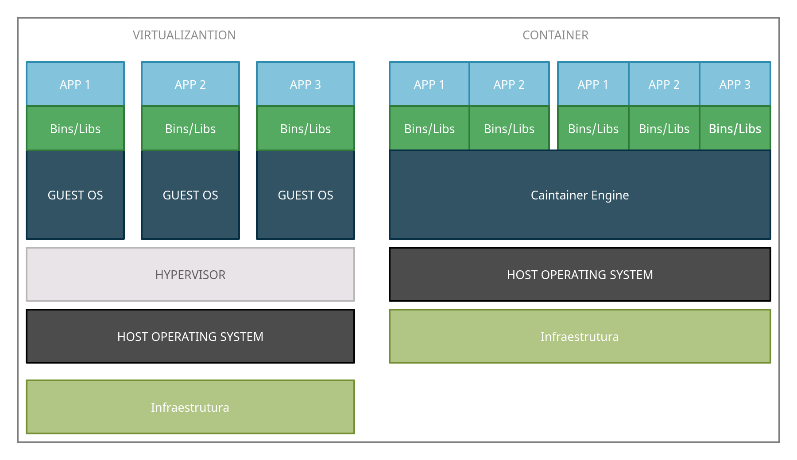

# Índice

[toc]

[Voltar](../102.5/1025.md)
[Próximo](../104.1/1041.md) 
[Índice Geral](../main.md)


# 102.6 Virtualização

Um dos grandes pontos fortes do Linux é sua versatilidade. Um aspecto dessa versatilidade é a capacidade de usar o Linux como meio de hospedar outros sistemas operacionais, ou aplicativos individuais, em um ambiente completamente isolado e seguro. Esta lição enfocará os conceitos de virtualização e tecnologias de contêiner, junto com alguns detalhes técnicos que devem ser levados em consideração ao implantar uma máquina virtual em uma plataforma de nuvem.


Virtual Machine x Container



Virtual Machine é um sistema Operacional completo sendo emulado por um software, chamado de *hipervisor*. O hipervisor é responsável por gerenciar os recursos do hardware físico que podem ser usados por máquinas virtuais individuais. Essas máquinas virtuais são chamadas de *convidados*do hipervisor. Uma máquina virtual tem muitos aspectos de um computador físico emulado em software, como BIOS do sistema e controladores de disco rígido. Uma máquina virtual geralmente usará imagens de disco rígido que são armazenadas como arquivos individuais e terá acesso à RAM e CPU da máquina host por meio do software hipervisor. O hipervisor separa o acesso aos recursos de hardware do sistema host entre os convidados, permitindo assim que vários sistemas operacionais sejam executados em um único sistema host. 

Enquanto que Container usa o Sistema Operacional hospedeiro e cria suas próprias bibliotecas compartilhada e estáticas. Containers usam uma imagem de container estática, geralmente não será muito modificada, mas pode ser, é mais como um snapshot do ambiente, permitindo a restauração mais rápida usando o container.


Existem alguns tipos de virtualização, são eles:

- Virtualização completa (HVM)
  Um convidado totalmente virtualizado é aquele em que o convidado (ou HardwareVM) não sabe que é uma instância de máquina virtual em execução. Para que esse tipo de virtualização ocorra em hardware baseado em x86, as extensões de CPU Intel VT-x ou AMD-V devem ser habilitadas no sistema que possui o hipervisor instalado. Isso pode ser feito a partir de um menu de configuração de firmware BIOS ou UEFI.
  - A vm usa uma réplica do hardware;
  - Não precisa modificar o S.O. do convidado;
  - Requer suporte a CPU.


- Paravirtualização (PVM)

  Um sistema operacional convidado está ciente de que é uma instância de máquina virtual. Esses tipos de convidados usarão um kernel modificado e drivers especiais (conhecidos como *drivers de convidados* ) que ajudarão o sistema operacional convidado a utilizar os recursos de software e hardware do hipervisor. O desempenho de um convidado paravirtualizado geralmente é melhor do que o de um convidado totalmente virtualizado (HVM) devido à vantagem que esses drivers de software fornecem.

  - Requer modificações no S.O. do convidado;
  - O S.O. interage diretamente com o HyperVisor;
  - Não tem suporte a CPU;
  - Uso de paravirtual drivers (Ex: VirtIO, Xen...)

- Híbrido 

  A paravirtualização (PVM) e a virtualização completa (HVM) podem ser combinadas para permitir que sistemas operacionais não modificados recebam desempenho de E/S quase nativo usando drivers paravirtualizados em sistemas operacionais totalmente virtualizados. Os drivers paravirtualizados contêm drivers de dispositivos de armazenamento e rede com disco aprimorado e desempenho de E/S de rede.


Os hipervisores mais comuns do mercado para Linux são:

- Xen

  O Xen é um hipervisor Tipo 1 de software livre, o que significa que não depende de um sistema operacional subjacente para funcionar. Um hipervisor desse tipo é conhecido como *hipervisor bare-metal,* pois o computador pode inicializar diretamente no hipervisor.

- KVM

  O Kernel Virtual Machine é um módulo do kernel Linux para virtualização. O KVM é um hipervisor tanto do hipervisor do Tipo 1 quanto do Tipo 2 porque, embora precise de um sistema operacional Linux genérico para funcionar, é capaz de funcionar como um hipervisor perfeitamente bem integrando-se a uma instalação do Linux em execução. As máquinas virtuais implantadas com KVM usam o daemion `libvirt` e utilitários de software associados para serem criados e gerenciados.

- VirtualBox

  Um aplicativo de desktop popular que facilita a criação e o gerenciamento de máquinas virtuais. O Oracle VM VirtualBox é multiplataforma e funcionará em Linux, macOS e Microsoft Windows. Como o VirtualBox requer um sistema operacional subjacente para ser executado, ele é um hipervisor Tipo 2.


## Containers

Um container usa apenas software suficiente para executar um aplicativo. Dessa forma, há muito menos sobrecarga. Os contêineres permitem maior flexibilidade em relação a uma máquina virtual. Um container de aplicativo pode ser migrado de um host para outro, assim como uma máquina virtual pode ser migrada de um hipervisor para outro. 

No entanto, às vezes, uma máquina virtual precisará ser desligada antes que possa ser migrada, enquanto que em um container, o aplicativo está sempre em execução enquanto estiver sendo migrado. Os containers também facilitam a implantação de novas versões de aplicativos em conjunto com uma versão existente. Conforme os usuários fecham suas sessões com contêineres em execução, esses containers podem ser removidos automaticamente do sistema pelo software de orquestração de containers e substituídos pela nova versão, reduzindo assim o tempo de inatividade.


Principais Containers do mercado:

- Docker

  Docker é um conjunto de produtos de plataforma como serviço que usam virtualização de nível de sistema operacional para entregar software em pacotes chamados contêineres. Os contêineres são isolados uns dos outros e agrupam seus próprios softwares, bibliotecas e arquivos de configuração.

- LXC/LXD

  LXD é a nova experiência LXC. Oferece uma experiência de usuário completamente nova e intuitiva com uma única ferramenta de linha de comando para gerenciar seus contêineres. Os recipientes podem ser gerenciados pela rede de forma transparente através de uma API REST. Também funciona com implantações em grande escala integrando-se ao OpenStack.

  O projeto LXD foi fundado e atualmente é liderado pela Canonical Ltd com contribuições de uma série de outras empresas e colaboradores individuais.

  LXC é bem conhecido como um kit de ferramentas, modelos, bibliotecas e ligações de idiomas. É de baixo nível,          muito flexível e abrange quase todos os recursos suportados pelo kernel.

- SystemD-NSPAWN 

  systemd-nspawn pode ser usado para executar um comando ou sistema operacional em um contêiner de namespace leve. Em muitos aspectos, é semelhante ao chroot, mas mais poderoso, pois virtualiza totalmente a hierarquia do sistema de arquivos, bem como a árvore de processos, os vários subsistemas IPC e o host e o nome de domínio.

- OpenShift

  OpenShift é um produto de software de computador da Red Hat para implantação e gerenciamento de softwares baseados em container. Ele é uma distribuição suportada do Kubernetes usando Docker e ferramentas DevOps para desenvolvimento acelerado de aplicações.


## Cloud-init

É uma ferramenta criada pela Canonical que permite personalizar uma imagem na inicialização do sistema, podendo instalar aplicações, configurar uma gama enorme de aplicações e até mesmo o Linux.

Durante a inicialização inicial de um novo sistema, `cloud-init` irá ler as configurações dos arquivos de configuração YAML e aplicá-las. Esse processo só precisa ser aplicado à configuração inicial de um sistema e facilita a implantação de uma frota de novos sistemas em uma plataforma de provedor de nuvem.


## D-BUS Machine ID

Muitas instalações do Linux utilizarão um número de identificação de máquina gerado no momento da instalação, chamado *D-BUS Machine ID* . No entanto, se uma máquina virtual for *clonada* para ser usada como um modelo para outras instalações de máquina virtual, uma nova ID de máquina D-Bus precisará ser criada para garantir que os recursos do sistema do hipervisor sejam direcionados ao sistema convidado apropriado. Em resumo é usado para identificar uma VM ou Container de forma única dentre os outros Containers/VMs, mas isso não se limita apenas a sistemas virtualizados.


Existem algumas formas de visualizar esse ID:

```bash
# Rode o comando "dbus-uuidgen --get"
[vagrant@centos8 ~]$ dbus-uuidgen --get 
72f091a3377049a3b456ea530f986e1d

# Rode o comando "systemd-machine-id-setup --print"
[vagrant@centos8 ~]$ systemd-machine-id-setup --print
72f091a3377049a3b456ea530f986e1d

# Com o comando hostnamectl:
[vagrant@centos8 ~]$ hostnamectl 
   Static hostname: centos8.localdomain
         Icon name: computer-vm
           Chassis: vm
        Machine ID: 72f091a3377049a3b456ea530f986e1d
           Boot ID: c526df73cebd43f693372c9797f9862d
    Virtualization: kvm
  Operating System: CentOS Linux 8
       CPE OS Name: cpe:/o:centos:centos:8
            Kernel: Linux 4.18.0-240.10.1.el8_3.x86_64
      Architecture: x86-64

#  Com o comando 'dmidecode -t system':
[vagrant@centos8 ~]$ sudo dmidecode -t system
\# dmidecode 3.2
Getting SMBIOS data from sysfs.
SMBIOS 2.8 present.

Handle 0x0100, DMI type 1, 27 bytes
System Information
	Manufacturer: QEMU
	Product Name: Standard PC (i440FX + PIIX, 1996)
	Version: pc-i440fx-focal
	Serial Number: Not Specified
	UUID: 72f091a3-3770-49a3-b456-ea530f986e1d
	Wake-up Type: Power Switch
	SKU Number: Not Specified
	Family: Not Specified

Handle 0x2000, DMI type 32, 11 bytes
System Boot Information
	Status: No errors detected

# Com o comando 'lshw -class system':
[vagrant@centos8 ~]$ sudo lshw -class system
centos8.localdomain         
    description: Computer
    product: Standard PC (i440FX + PIIX, 1996)
    vendor: QEMU
    version: pc-i440fx-focal
    width: 64 bits
    capabilities: smbios-2.8 dmi-2.8 smp vsyscall32
    configuration: boot=normal uuid=72f091a3-3770-49a3-b456-ea530f986e1d
  *-pnp00:00
       product: PnP device PNP0b00
       physical id: 0
       capabilities: pnp
       configuration: driver=rtc_cmos

# Verifique no arquivo '/etc/machine-id'
[vagrant@centos8 ~]$ cat /etc/machine-id
72f091a3377049a3b456ea530f986e1d
```

Uma das forma que o sistema sabe que é uma vm, é quando a flag de hypervisor da CPU está em uso, podemos ver isso assim:

```bash
# Virtual machine:
[vagrant@centos8 ~]$ grep -oi hypervisor /proc/cpuinfo 
hypervisor
hypervisor

# Real machine (não existe essa flag em uso):
$ grep -i hypervisor /proc/cpuinfo | wc
      0       0       0
```


[Voltar](../102.5/1025.md)
[Próximo](../104.1/1041.md) 
[Índice Geral](../main.md)