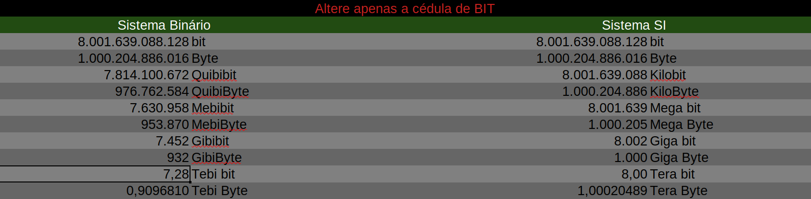
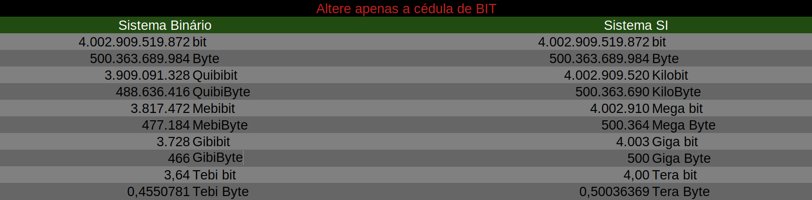

# Índice

[toc]

[Voltar](../103.4/1034.md)
[Próximo](../103.6/1036.md) 
[Índice Geral](../main.md)


# 103.5 Criar, monitorar e eliminar processos

Executar o gerenciamento básico de processos.

Os processos trabalham com diferentes tipos de IDs, sendo eles:

| Nomeclatura | Descrição                                                |
| ----------- | -------------------------------------------------------- |
| PID         | Process ID (ID do processo)                              |
| PPID        | Parent Process ID (ID do processo pai do nosso processo) |
| UID         | User Identifield (ID do usuário)                         |
| GID         | Group Identifield (ID do grupo)                          |
| EUID        | Effective User ID                                        |
| EGID        | Effective Group IP                                       |

Quando um arquivo, um processo, dentre outras coisas são criadas no linux, elas são atribuidas a um usuário dono e um grupo dono, normalmente <span style="color:#F8F8FF">**euid** e <span style="color:#F8F8FF">**egid**</span> são iguais a <span style="color:#F8F8FF">**uid**</span> e <span style="color:#F8F8FF">**gid**</span>. Mas quando usamos comando como `sudo` que invoca as permissões de outro usuário (executa com o outro usuário), ou quando possuem bits especiais setados, <span style="color:#F8F8FF">**euid**</span> e <span style="color:#F8F8FF">**egid**</span> são criados com o <span style="color:#F8F8FF">**uid**</span> e <span style="color:#F8F8FF">**gid**</span> do usuário que realmente efetuou a ação.

**Exemplo:**

```bash
# Crie um arquivo e veja quem é o usuario e dono dele:
linux:/tmp$ touch arquivo1

linux:/tmp$ stat arquivo1 | grep id
Acesso: (0664/-rw-rw-r--)  Uid: ( 1001/   linux)   Gid: ( 1001/   linux)

## Perceba que o usuário efeteivo era o linux (usuário linux) 

# Agora crie um novo arquivo usando o sudo:
linux:/tmp$ sudo touch arquivo2

linux:/tmp$ stat arquivo2 | grep id
Acesso: (0644/-rw-r--r--)  Uid: (    0/    root)   Gid: (    0/    root)

# Perceba que agora foi atribuido o ID 0 (id do root), porque quem criou
# o arquivo foi o root e não meu usuário linux.

# Essa é a diferença entre UID, GID e EUID e EGID.
```


## PS

O comando `ps` exibe os processos ativos no momento de sua execução. Se executado sem argumentos, vai exibir os processos apenas do usuário atual.

**Opções:**

```tex
-u	- Todos os processos por usuário;
-x	- Todos os processos que não tenham um tty atrelado;
-a	- Todos os processos de todos os usuários;
-f	- Mostra os processos em forma de árvore (exibe parentesco);
-l	- Mostra em forma de lista 
-C <string>	- Busca por tudo da string.
-A - Seleciona todos os processos de todos os usuários.
-U <user> - Pesquisa por usuário.

-o <formato> - Seleciona um formato para stdout.
state   = Estado do processo;
tty     = tty do processo;
user    = Usuário do processo;
command = Comando usado para criar o processo;
comm    = Nome do processo;
fname   = 8 bytes do nome do processo (não pega o nome todo);
rss     = Memória usada pelo processo;
ni      = É o valor de espaço do usuário, podemos usar para controlar o 
          valor da prioridade de um processo;
pri     = É a prioridade real do processo que é usada pelo kernel do Linux 
          para agendar uma tarefa. Maior número significa menor prioridade;
state   = Estado do processo em formato Linux moderno.
s       = Estado do processo em formato Linux moderno.
stat    = Estado do processo em formato BSD.

wchan   = Endereço da função do kernel em que o processo está em suspensão 
          (use wchan se desejar o nome da função do kernel).
          As tarefas em execução exibirão um traço ('-') nesta coluna.
```

**Informações fornecidas pelo PS**

```
USER - Nome de usuário efetivo.

PID - O número que representa o ID do processo.

%CPU - Utilização da CPU pelo processo no formato "##.#".
Atualmente, é o tempo de CPU usado dividido pelo tempo em que o
processo está em execução (proporção cputime / realtime), expresso
em porcentagem.

%MEM - Proporção do tamanho do conjunto residente do processo para a
memória física na máquina, expressa como uma porcentagem. 

VSZ - Tamanho da memória virtual do processo em KiB (unidades de
1024 bytes) que o processo está consumindo.

RSS - Tamanho do conjunto residente, a memória física não trocada
que uma tarefa usou (em kilobytes).

TTY - São consoles virtuais. Eles são terminais virtuais (emuladores
de terminal) implementados pelo kernel e independentes do ambiente
gráfico.

START - Hora em que o comando foi iniciado.
Se o processo foi iniciado há menos de 24 horas, o formato de saída
é "HH:MM:SS"; caso contrário, é "Mmm dd" (onde Mmm é um nome de mês
com três letras).

TIME - Tempo acumulado da CPU, formato "[DD-] HH:MM:SS". 
(também conhec ido por cputime).

COMMAND - Comando usado para criar o processo.
```


**Exemplos:**

```bash
# Exibindo os processos do usuário atual:
linux:~$ ps
    PID TTY          TIME CMD
  21362 pts/0    00:00:00 bash
  21556 pts/0    00:00:00 ps
  
# Exibindo todos os processos de todos os usuários:
linux:~$ ps -a
    PID TTY          TIME CMD
  21361 pts/0    00:00:00 su
  21362 pts/0    00:00:00 bash
  21548 pts/1    00:00:00 sudo
  21549 pts/1    00:00:00 vim
  21585 pts/0    00:00:00 ps
  
## Exibindo os processos que não tem uma tty atrelado.
# Para isso vamos ter que exibir outros usuário também:
linux:~$ ps -uxa
root       19146  0.0  0.0      0     0 ?        I    13:40   0:00 [kworker/0:3-events]
root       19229  0.0  0.0      0     0 ?        I    13:41   0:00 [kworker/3:1-events]
root       19278  0.6  0.0      0     0 ?        I    13:45   0:13 [kworker/2:1-events]
root       20894  0.1  0.0      0     0 ?        I    14:01   0:01 [kworker/u8:3-i915]
# Suprimi a saída...

# Mostrando em modo de árvore:
linux:~$ ps -uaf
USER         PID %CPU %MEM    VSZ   RSS TTY      STAT START   TIME COMMAND
linux      21377  0.0  0.0  11048  5332 pts/1    Ss   14:12   0:00 bash
root       21548  0.0  0.0  14048  5284 pts/1    S+   14:14   0:00  \_ sudo vim /usr/bin/ps1
root       21549  0.0  0.1  25104 10236 pts/1    S+   14:14   0:00      \_ vim /usr/bin/ps1
linux       8028  0.0  0.0  11176  5404 pts/0    Ss   11:02   0:00 bash
root       21361  0.0  0.0  13708  4948 pts/0    S    14:11   0:00  \_ su linux
linux      21362  0.0  0.0   9996  4184 pts/0    S    14:11   0:00      \_ bash
linux      21652  0.0  0.0  11912  3736 pts/0    R+   14:21   0:00          \_ ps -uaf

# Em modo de lista:
linux:~$ ps -la
F S   UID     PID    PPID  C PRI  NI ADDR SZ WCHAN  TTY          TIME CMD
4 S     0   21361    8028  0  80   0 -  3427 -      pts/0    00:00:00 su
4 S  1001   21362   21361  0  80   0 -  2499 do_wai pts/0    00:00:00 bash
4 S     0   21548   21377  0  80   0 -  3512 -      pts/1    00:00:00 sudo
4 S     0   21549   21548  0  80   0 -  6276 -      pts/1    00:00:00 vim
0 R  1001   21672   21362  0  80   0 -  2873 -      pts/0    00:00:00 ps

# Pesquisando os PIDs de um processo:
linux:~$ ps -C chrome
    PID TTY          TIME CMD
  17419 ?        00:01:02 chrome
  17430 ?        00:00:00 chrome
  17431 ?        00:00:00 chrome
  17436 ?        00:00:00 chrome
  17454 ?        00:21:10 chrome
  17460 ?        00:00:06 chrome
  17495 ?        00:00:04 chrome
  17795 ?        00:00:09 chrome
  18084 ?        00:00:03 chrome
  18337 ?        00:00:00 chrome
  18365 ?        00:00:03 chrome
  18603 ?        00:28:37 chrome
  18623 ?        00:05:15 chrome
  18636 ?        00:30:35 chrome
  18661 ?        00:00:00 chrome

# Ótimo comando, cria uma saída personalizada:
ps -U USUARIO -o user,tt,state,pid,ppid,command,comm,rss,ni,pri,lstart

# Mesma coisa acima, mas para todos os usuários:
ps -Ao user,tt,state,pid,ppid,command,comm,rss,ni,pri,lstart
```


<span style="color:red">**Observação:**

```
Quando você notar que o campo PRI (PRIORITY) possui um traço (-),
significa que o processo está rodando em tempo real.

O valor do PRI é estranho e não segue as normas de atribuição do valor,
o PRI do comando TOP, parece ser mais correto e segue as normas de atribuição.

Isso porque no PS o campo PRI possui o valor 19 (que é igual a 119), o que não faz sentido porque tendo NI como 0, a PRI deveria ser 120, assim como é no comando TOP.
```


**Entendendo as flags de State, Stat e S**:

```
Aqui estão os diferentes valores que os especificadores de saída s, stat e state 
exibirão para descrever o estado de um processo:

D = sono ininterrupto (geralmente IO)
I = thread ocioso do kernel
R = em execução ou executável (na fila de execução)
S = suspensão interrompível (aguardando a conclusão de um evento)
T = parado pelo sinal de controle do trabalho
t = parado pelo depurador durante o rastreamento
W = paginação (não é válida desde o kernel 2.6.xx)
X = morto (nunca deve ser visto)
Z = processo extinto ("zumbi"), finalizado mas não colhido pelo pai

Para formatos BSD e quando a palavra-chave stat é usada, caracteres adicionais podem ser exibidos:

<= alta prioridade (não é agradável para outros usuários)
N = baixa prioridade (agradável para outros usuários)
L = tem páginas bloqueadas na memória (para E / S personalizadas e em tempo real)
s = é um líder de sessão
l = é multiencadeado (usando CLONE_THREAD, como fazem os pthreads NPTL)
+ = está no grupo de processos em primeiro plano
```


## PSTREE

Exibe uma árvore dos processos.


**Opções**

```
-p = Mostra o PID.
```

**Exemplos:**

```bash
# Mostrando sem argumentos:
linux:~$ pstree
systemd─┬─ModemManager───2*[{ModemManager}]
        ├─NetworkManager───2*[{NetworkManager}]
        ├─accounts-daemon───2*[{accounts-daemon}]
        ├─acpid
        ├─3*[agetty]
        ├─avahi-daemon───avahi-daemon
        ├─blueberry-tray─┬─python3───rfkill
        │                └─4*[{blueberry-tray}]
        ├─bluetoothd
        ├─colord───2*[{colord}]
        ├─cron
        ├─csd-printer───2*[{csd-printer}]
        ├─cups-browsed───2*[{cups-browsed}]
        ├─cupsd
        ├─dbus-daemon
        ├─firefox─┬─Privileged Cont───25*[{Privileged Cont}]
        │         ├─RDD Process───3*[{RDD Process}]
        │         ├─Web Content───36*[{Web Content}]
        │         ├─Web Content───29*[{Web Content}]
        │         ├─Web Content───25*[{Web Content}]
        │         ├─Web Content───19*[{Web Content}]
        │         ├─WebExtensions───23*[{WebExtensions}]
        │         └─81*[{firefox}]

# Exibindo o PID:
linux:~$ pstree -p
systemd(1)─┬─ModemManager(1030)─┬─{ModemManager}(1053)
           │                    └─{ModemManager}(1055)
           ├─NetworkManager(820)─┬─{NetworkManager}(995)
           │                     └─{NetworkManager}(1000)
           ├─accounts-daemon(808)─┬─{accounts-daemon}(892)
           │                      └─{accounts-daemon}(998)
           ├─acpid(813)
           ├─agetty(1056)
           ├─agetty(18531)
           ├─agetty(18545)
           ├─avahi-daemon(815)───avahi-daemon(875)
           ├─blueberry-tray(1749)─┬─python3(1769)───rfkill(1772)
           │                      ├─{blueberry-tray}(1764)
           │                      ├─{blueberry-tray}(1765)
           │                      ├─{blueberry-tray}(1767)
           │                      └─{blueberry-tray}(1768)
           ├─bluetoothd(904)
           ├─colord(1591)─┬─{colord}(1592)
           │              └─{colord}(1594)
           ├─cron(817)
           ├─csd-printer(1597)─┬─{csd-printer}(1598)
           │                   └─{csd-printer}(1599)
           ├─cups-browsed(999)─┬─{cups-browsed}(1036)
           │                   └─{cups-browsed}(1037)
           ├─cupsd(818)
           ├─dbus-daemon(819)
           ├─firefox(2066)─┬─Privileged Cont(2241)─┬─{Privileged Cont}(2244)
           │               │                       ├─{Privileged Cont}(2247)
           │               │                       ├─{Privileged Cont}(2248)
           │               │                       ├─{Privileged Cont}(2252)
           │               │                       ├─{Privileged Cont}(2254)
           │               │                       ├─{Privileged Cont}(2255)
           │               │                       ├─{Privileged Cont}(2256)
           │               │                       ├─{Privileged Cont}(2257)
           │               │                       ├─{Privileged Cont}(2258)
           │               │                       ├─{Privileged Cont}(2259)
           │               │                       ├─{Privileged Cont}(2262)
           │               │                       ├─{Privileged Cont}(2263)
           │               │                       ├─{Privileged Cont}(2264)
           │               │                       ├─{Privileged Cont}(2269)
           │               │                       ├─{Privileged Cont}(2270)
           │               │                       ├─{Privileged Cont}(2285)
           │               │                       ├─{Privileged Cont}(2287)
           │               │                       ├─{Privileged Cont}(2295)
           │               │                       ├─{Privileged Cont}(2297)
           │               │                       ├─{Privileged Cont}(2299)
           │               │                       ├─{Privileged Cont}(2309)
           │               │                       ├─{Privileged Cont}(2310)
           │               │                       ├─{Privileged Cont}(2311)
           │               │                       ├─{Privileged Cont}(2327)
           │               │                       └─{Privileged Cont}(23960)
```


## PGREP

Exibe apenas o PPID do nome do processo.


**Opções:**

```
-u <usuário> = Filtra por usuário.
```


**Exemplos:**

```bash
# Exibindo o PPID do firefox:
linux:~$ pgrep firefox
2066

# Exibindo o PPID do bash:
linux:~$ pgrep bash
8028
21362
23261
23280

# Exibindo o PPID do bash mas para o usuário linux:
linux:~$ pgrep -u linux bash
21362
```


## TOP

Exibe os processos em tempo real.


**Opções:**

```
-- Opções da linha de comando

-u = Faz buscas por um usuário
-b = Joga a informação na tela (Fica atualizando).
-d <N> = Número de segundos entre atualizações.
-n <N> = Número de interações até encerrar.

-- Opções do dashboard do TOP
k = Mata um processo.
u = Filtra por usuário.
L = Filtra por string.
```


<span style="color:red">Para entender sobre Load Average, acesse o link <a href="#Load">O que é Load Average?</a>


**Exemplos:**

```bash
# Jogando a informação na tela, atualizando a cada 2 segundos e com apenas 2 interações,
# Apenas para o usuário linux:
linux:~$ top -b -d 2 -n 2 -u linux
top - 16:24:19 up  6:37,  1 user,  load average: 0,98, 0,83, 0,85
Tarefas: 266 total,   1 em exec., 264 dormindo,   0 parado,   1 zumbi
%CPU(s):  8,8 us,  4,4 sis,  0,0 ni, 85,3 oc,  0,0 ag,  0,0 ih,  1,5 is  0,0 tr
MB mem :   7873,5 total,    486,4 livre,   3106,8 usados,   4280,3 buff/cache
MB swap:   2048,0 total,   2029,0 livre,     19,0 usados,   4096,0 mem dispon.

    PID USUARIO   PR  NI    VIRT    RES    SHR S  %CPU  %MEM    TEMPO+ COMANDO
  25512 linux     20   0   12092   3796   3188 R   6,2   0,0   0:00.02 top
  21362 linux     20   0   10128   4312   3560 S   0,0   0,1   0:00.27 bash
  25461 linux     20   0    9996   4164   3572 S   0,0   0,1   0:00.00 bash

top - 16:24:21 up  6:37,  1 user,  load average: 0,99, 0,83, 0,85
Tarefas: 266 total,   1 em exec., 264 dormindo,   0 parado,   1 zumbi
%CPU(s): 10,1 us,  5,1 sis,  0,0 ni, 84,3 oc,  0,1 ag,  0,0 ih,  0,4 is  0,0 tr
MB mem :   7873,5 total,    486,4 livre,   3106,8 usados,   4280,3 buff/cache
MB swap:   2048,0 total,   2029,0 livre,     19,0 usados,   4096,0 mem dispon.

    PID USUARIO   PR  NI    VIRT    RES    SHR S  %CPU  %MEM    TEMPO+ COMANDO
  25512 linux     20   0   12092   3796   3188 R   0,5   0,0   0:00.03 top
  21362 linux     20   0   10128   4312   3560 S   0,0   0,1   0:00.27 bash
  25461 linux     20   0    9996   4164   3572 S   0,0   0,1   0:00.00 bash
```


## KILL, KILLALL, PKILL

Comandos usados para enviar sinais à processos, cada comando enviar um sinal de um modo diferente do outro.


Sinais são usados para enviar informações a um processo, cada sinal informa uma ação diferente ao processo, a tabela abaixo demonstra alguns sinais e seus significados:

| Nome do Sinal | Número do Sinal | Descrição                                                    |
| ------------- | --------------- | ------------------------------------------------------------ |
| SIGHUP        | 1               | Envia sinal para reler arquivos de configuração, dependendo do processo, pode encerrar; |
| SIGINT        | 2               | Interrompe a execução do processo (é ativado ao pressionar Ctrl+c); |
| SIGQUIT       | 3               | Finaliza o processo (Idem Ctrl+\\);                          |
| SIGABRT       | 6               | Aborta o processo;                                           |
| SIGKILL       | 9               | Finaliza de forma abrupita o processo (mata o processo), esse sinal não pode ser bloqueado ou ignorado, sempre será executado; |
| SIGTERM       | 15              | Sinal correto enviado para finalização normal de um processo; |
| SIGSTOP       | 19              | Pausa a execução do processo (não pode ser ignorado ou bloqueado); |
| SIGTSTP       | 20              | Pausa a execução do processo (o processo pode ignorar ou rejeitar esse sinal); |
| SIGCONT       | 18              | Volta a executar um processo parado;                         |


### KILL

Envia um sinal de finalização, para que o processo se encerre (Sinal padrão é `15 - SIGTERM`).


**Opções:**

```
-l = Lista todos os sinais do kill;
```


**Exemplos:**

```bash
# Criei vários processos no tmux (vários terminais):
linux:~$ ps -u
USER         PID %CPU %MEM    VSZ   RSS TTY      STAT START   TIME COMMAND
linux      25720  0.0  0.0   9748  3628 pts/1    S+   16:39   0:00 tmux
linux      25723  0.0  0.0  10800  4912 pts/2    Ss+  16:39   0:00 -bash
linux      25730  0.0  0.0  10800  5000 pts/3    Ss+  16:39   0:00 -bash
linux      25737  0.0  0.0  10800  4900 pts/4    Ss+  16:39   0:00 -bash
linux      25746  0.0  0.0  10800  4932 pts/5    Ss+  16:39   0:00 -bash
linux      25867  0.2  0.0  10800  4900 pts/6    Ss+  16:44   0:00 -bash

# Vou matar uma sessão em específica do Tmux (Usando processo de kill padrão):
linux:~$ kill -15 25746

# Listando de novo:
linux:~$ ps -u
USER         PID %CPU %MEM    VSZ   RSS TTY      STAT START   TIME COMMAND
linux      25720  0.0  0.0   9748  3628 pts/1    S+   16:39   0:00 tmux
linux      25723  0.0  0.0  10800  4912 pts/2    Ss+  16:39   0:00 -bash
linux      25730  0.0  0.0  10800  5000 pts/3    Ss+  16:39   0:00 -bash
linux      25737  0.0  0.0  10800  4900 pts/4    Ss+  16:39   0:00 -bash
linux      25867  0.0  0.0  10800  4900 pts/6    Ss+  16:44   0:00 -bash

# Matando mais de 1 processo por vez (enviando o sinal de morte imediata):
linux:~$ kill -9 25867 25737

# Matando o PPID (Processo pai do Tmux client):
linux:~$ kill -15 25720
```

Listando todos os sinais disponíveis:

```bash
linux:~$ kill -l
 1) SIGHUP	 2) SIGINT	 3) SIGQUIT	 4) SIGILL	 5) SIGTRAP
 6) SIGABRT	 7) SIGBUS	 8) SIGFPE	 9) SIGKILL	10) SIGUSR1
11) SIGSEGV	12) SIGUSR2	13) SIGPIPE	14) SIGALRM	15) SIGTERM
16) SIGSTKFLT	17) SIGCHLD	18) SIGCONT	19) SIGSTOP	20) SIGTSTP
21) SIGTTIN	22) SIGTTOU	23) SIGURG	24) SIGXCPU	25) SIGXFSZ
26) SIGVTALRM	27) SIGPROF	28) SIGWINCH	29) SIGIO	30) SIGPWR
31) SIGSYS	34) SIGRTMIN	35) SIGRTMIN+1	36) SIGRTMIN+2	37) SIGRTMIN+3
38) SIGRTMIN+4	39) SIGRTMIN+5	40) SIGRTMIN+6	41) SIGRTMIN+7	42) SIGRTMIN+8
43) SIGRTMIN+9	44) SIGRTMIN+10	45) SIGRTMIN+11	46) SIGRTMIN+12	47) SIGRTMIN+13
48) SIGRTMIN+14	49) SIGRTMIN+15	50) SIGRTMAX-14	51) SIGRTMAX-13	52) SIGRTMAX-12
53) SIGRTMAX-11	54) SIGRTMAX-10	55) SIGRTMAX-9	56) SIGRTMAX-8	57) SIGRTMAX-7
58) SIGRTMAX-6	59) SIGRTMAX-5	60) SIGRTMAX-4	61) SIGRTMAX-3	62) SIGRTMAX-2
63) SIGRTMAX-1	64) SIGRTMAX
```


### KILLALL

Mata todos os processos a partir do nome do processo (Sinal padrão é `15 - SIGTERM`).

**Opções:**

```
-u <USER> = Mata todos os processos do usuário.
```


**Exemplos:**

```bash
# Matando o processo cliente do tmux,
# isso só vai "deslogar" o usuário:
linux:~$ killall "tmux: client"

# Matando realmente o tmux (elimina todos os processos relacionados ao tmux):
linux:~$ killall "tmux: server"

# Matando o processo top:
linux:~$ killall -9 top

# Para ver o nome de um comando:
linux:~$ ps -Ao user,pid,tt,comm | grep ^linux
linux      21362 pts/0    bash
linux      25461 pts/1    bash
linux      26184 ?        tmux: server
linux      26185 pts/2    bash
linux      26192 pts/3    bash
linux      26199 pts/4    bash
linux      26206 pts/5    bash
linux      26340 pts/1    tmux: client
linux      26341 pts/0    ps
linux      26342 pts/0    grep

## Matando um usuário.
# Exibindo usuários logados:
linux:~$ who
linux    tty1         2020-07-29 14:56
root     tty7         2020-07-28 09:49 (:0)

# Matando o usuário linux:
root:~\$ killall -u linux

# Exibindo os usuários logados:
linux:~$ who
root     tty7         2020-07-28 09:49 (:0)
```


### PKILL 

O `pkill` é muito semelhante ao `killall`, mas diferente dele, o `pkill` trabalha melhor, por exemplo, no `kill`, para matar um processo de um usuário específico, você deve saber qual o PID desse processo, para isso você deve buscar o processo desse usuário.

Com o `killall` isso fica mais fácil porque você só deve colocar o nome e ele irá matar, mas irá matar de todos os usuários que estiverem esse processo em execução. O `pkill` consegue matar um processo pelo nome de um usuário específico.


(Sinal padrão é `15 - SIGTERM`).


**Opções:**

```
-u      Informa o usuário.
```


**Exemplos:**

```bash
# Listando o processo do bash em execução:
linux:~$ ps -afo user,pid,command,comm,tt | sed -n '1p; /bash/p'
USER         PID COMMAND                     COMMAND         TT
root       26251 bash                        bash            pts/1
root       24270 bash                        bash            pts/0
linux      24460      \_ bash                     \_ bash    pts/0

# Perceba que o root tem 2 processos bash, um bash do login pela interface gráfica (pts/1),
# e outro que foi o terminal aberto (pts/0).
```

Se usarmos o comando `killall` todos esses processo do bash vão morrer, mas queremos matar apenas o processo do bash para o usuário Linux.

**Exemplo:**

```bash
# Matando os bash do usuário Linux:
linux:~$ pkill -9 bash -u linux
Morto
root:~#

## Perceba que somente o bash do usuário em questão foi morto, tente fazer isso 
## você também.

### OBS.: Se você não colocar o -9 ou --signal 9 (sinal SIGKILL),
### será enviado um sinal SIGTERM (ID=15), e caso o processo esteja em 
### execução, ele não será morto nem finalizado.
```


## UPTIME

Exibe informações como: o horário atual, há quanto tempo o sistema está em execução, quantos usuários estão conectados no momento e a média de carga do sistema nos últimos 1, 5 e 15 minutos.

**Opções**

```
 -p, --pretty   
 Mostra o tempo de atividade em um melhor formato.
 
 -s, --since    
 Exibe desde quando o sistema está ativo.
```


<span style="color:#FFFFFF">O que é Load Average?<a name="Load"></a>

Gregg.Brendan. Disponível em <http://www.brendangregg.com/blog/2017-08-08/linux-load-averages.md>. Acesso em 4 Agosto de 2020.

> As médias de carga do Linux são "médias de carga do sistema" que mostram a demanda do encadeamento em execução (tarefa) no sistema como um número médio de encadeamentos em execução e em espera. Isso mede a demanda, que pode ser maior do que o sistema está processando atualmente. A maioria das ferramentas mostra três médias, por 1, 5 e 15 minutos:
>
> 
>
> Algumas interpretações:
>
> - Se as médias forem 0,0, seu sistema estará ocioso.
> - Se a média de 1 minuto for superior às médias de 5 ou 15 minutos, a carga estará aumentando.
> - Se a média de 1 minuto for inferior às médias de 5 ou 15 minutos, a carga estará diminuindo.
> - Se eles forem mais altos que sua contagem de CPU, você poderá ter um problema de desempenho (depende).

Para mais detalhe, consulte a [página do Gregg](http://www.brendangregg.com/blog/2017-08-08/linux-load-averages.md)


**Exemplos:**

```bash
# Executando o uptime sem argumentos:
linux:~$ uptime 
 11:25:23 up 19:59,  1 user,  load average: 1,97, 1,81, 2,21
 
# Executando com a opção -p:
linux:~$ uptime -p
up 19 hours, 59 minutes

# Executando com a opção -s:
linux:~$ uptime -s
2020-08-03 15:26:05
```


## FREE

O comando `free` é usado para verificar o consumo de memória ram da máquina e memória cache.


<span style="color:#FFFFFF">Entendendo a nomeclatura Quibi, Mebi, Gibi etc...<a name="consumo"></a>

Os computadores usam o prefixo binário ([iec]([https://pt.wikipedia.org/wiki/Prefixo_bin%C3%A1rio](https://pt.wikipedia.org/wiki/Prefixo_binário))), mas sistemas de armazenamento, de transmissão dentre outros, muitas vezes usam o sistemas internacional ([si](https://en.wikipedia.org/wiki/Metric_prefix)) erroneamente.

O problema é que os computadores usam e entendem somente binários (`base 2`) e o sistema internacional usa `base 10`. 


**Exemplo do Sistema Internacional de unidades:**

A unidade `kilo` é presentada pela notação (10^3) no Sistema Internacional de unidades; 

A unidade `mega` é presentada pela notação (10^6) no Sistema Internacional de unidades; 

A unidade `giga` é presentada pela notação (10^9) no Sistema Internacional de unidades.


**Exemplo do Prefixo binário:**

A unidade `quibi` é presentada pela notação (2^10) no Sistema Internacional de unidades; 

A unidade `mebi` é presentada pela notação (2^20) no Sistema Internacional de unidades; 

A unidade `gibi` é presentada pela notação (2^30) no Sistema Internacional de unidades.


<span style="color:#FFFFFF">O grande problema!

Quando computadores começaram a se pupolarizar e sistemas de armazenamento começaram a ser vendidos, se popularizou o sistema SI e não o sistema correto (seria o sistema binário), dessa forma, quando você compra um HD, você está comprando a capacidade do HD no Sistema Internacional e não no Sistema Binário.
`Lembrando que o sistema internacional é usado para demonstrar os dados, mas os computadores trabalham no sistema binário `, por esse motivo você nunca consegue ocupar o espaço total do disco ou usar o espaço total da memória, porque ele estão descritos no sistema internacional e o computador usa o sistema binário.


<span style="color:#FFFFFF">Segue a tabela mostrando os valores e notações para o prefixo binário, equivalendo com o Sistema Internacional de medidas:

| Prefixo Binário              | Notação | Valor no Prefixo Binário | Prefixo SI | Notação | Valor no Prefixo SI |
| ---------------------------- | ------- | ------------------------ | ---------- | ------- | ------------------- |
| bit                          | 2^0     | 1                        | bit        | 10^0    | 1                   |
| Byte                         | 2^3     | 8                        | Byte       | 2^3     | 8                   |
| Quibi ou Kibi ou Quiloocteto | 2^10    | 1.024                    | Kilo       | 10^3    | 1.000               |
| Mebi                         | 2^20    | 1.048.576                | Mega       | 10^6    | 1.000.000           |
| Gibi                         | 2^30    | 1.073.741.824            | Giga       | 10^9    | 1.000.000.000       |
| Tebi                         | 2^40    | 1.099.511.627.776        | Tera       | 10^12   | 1.000.000.000.000   |


<span style="color:#FFFFFF">Vou dar 2 exemplos de porque compramos HD ou memória RAM e nunca tem o tamanho total

Estou focando nessa explicação porque muitos comando do Linux utilizam o sistema de nomeclatura correto, não é para se assustar quando ver nomeclaturas como: `KiB`, `MiB`, `GiB` e etc.

```bash
# Vejamos qual é o tamanho do meu HD:
linux:~$ sudo fdisk -l /dev/sda | sed -n '1p'
Disco /dev/sda: 931,53 GiB, 1000204886016 bytes, 1953525168 setores

## Usei o SED apenas para imprimir a 1° linha.

### Como podemos ver, meu HD possui apenas 931 GiB (Gibi Byte) e
### possui 1000204886016 bytes.
```

A imagem abaixo mostra os cálculos e assim como a informação mostrada pelo comando `fdisk`, meu HD só possui 931 GiB, mas no sistema internacional ele diz que meu HD possui 1TB, e realmente possui, mas computadores trabalham com sistemas Binário e no sistema binário ele não tem 1 TiB.




No segundo exemplo vou pegar um HD de 466 GiB:



Perceba que nesse caso, o sistema internacional diz que o HD possui 500 GB, e realmente possui, mas, novamente, os computadores trabalham com o sistema binário que é base 2, então só sera reconhecido 466 GiB.

<span style="color:red">Observação: Não confunda `bit` com `byte`, apesar do `bit` possuir um número muito maior, ele é a menor unidade do sistema binário, lembrando que `8 bits` são `1 byte`.


[Clique aqui para baixar a planilha](Calculo_de_armazenamento.ods)


**Opções do comando FREE:**

```
 -b, --bytes        
     Mostra a saída em bytes.
     
     --kilo          
     Mostra a saída em kilobytes (implica --si).
     
     --mega          
     Mostra a saída em megabytes (implica --si).
     
     --giga          
     Mostra a saída em gigabytes (implica --si).
     
     --tera          
     Mostra a saída em terabytes (implica --si).
     
     --peta          
     Mostra a saída em petabytes (implica --si).
 
 -k, --kibi          
     Mostra a saída em kibibytes (Padrão).
     
 -m, --mebi          
     Mostra a saída em mebibytes.
     
 -g, --gibi          
     Mostra a saída em gibibytes.
     
     --tebi          
     Mostra a saída em tebibytes.
     
     --pebi          
     Mostra a saída em pebibytes.
 
 -h, --human         
     Mostra a saída legível por humanos.
 
     --si            
     Usa potências de 1000 (Sistema SI), e não de 1024 (Sistema Binário).
```

**Exemplos:**

```bash
# Primeiro, vou exibir a versão do meu comando, o seu pode ser diferente e 
# exibir de maneira diferente:
linux:~$ free --version
free de procps-ng UNKNOWN

# Exibindo sem argumentos:
linux:~$ free
              total       usada       livre    compart.  buff/cache  disponível
Mem.:       8062412     3763512     1846124      947800     2452776     3083988
Swap:       2097148      132352     1964796

# Com a opção -h:
linux:~$ free -h
              total       usada       livre    compart.  buff/cache  disponível
Mem.:         7,7Gi       3,6Gi       1,8Gi       941Mi       2,4Gi       2,9Gi
Swap:         2,0Gi       129Mi       1,9Gi

# Exibindo em KibiByte:
linux:~$ free -k
              total       usada       livre    compart.  buff/cache  disponível
Mem.:       8062412     3749292     1852888      955016     2460232     3090976
Swap:       2097148      132352     1964796

# Exibindo em MebiByte:
linux:~$ free -m
              total       usada       livre    compart.  buff/cache  disponível
Mem.:          7873        3662        1804         936        2406        3013
Swap:          2047         129        1918

# Exibindo em GibiByte:
linux:~$ free -g
              total       usada       livre    compart.  buff/cache  disponível
Mem.:             7           3           1           0           2           2
Swap:             1           0           1

###################### Exibindo no formato Internacional:

# Exibindo em Kilo Byte:
linux:~$ free --kilo
              total       usada       livre    compart.  buff/cache  disponível
Mem.:       8255909     3803320     1931603      979439     2520985     3199684
Swap:       2147479      135528     2011951

# Exibindo em Mega Byte:
linux:~$ free --mega
              total       usada       livre    compart.  buff/cache  disponível
Mem.:          8255        3803        1914         996        2537        3182
Swap:          2147         135        2011

# Exibindo em Giga Byte:
linux:~$ free --giga
              total       usada       livre    compart.  buff/cache  disponível
Mem.:             8           3           1           0           2           3
Swap:             2           0           2
```


<span style="color:#FFFFFF">Explicação de cada coluna exibida pela comando `free`:

| Coluna                  | Descrição                                                    |
| ----------------------- | ------------------------------------------------------------ |
| total                   | Memória total instalada (MemTotal e SwapTotal em /proc/meminfo). |
| used ou usado           | Memória usada (calculada como total-livre-buffers-cache).    |
| Free ou livre           | Memória não utilizada (MemFree e SwapFree em /proc/meminfo). |
| Shared ou compartilhada | Memória usada (principalmente) por tmpfs (Shmem em /proc/meminfo). |
| buffers                 | Memória usada pelos buffers do kernel (Buffers em /proc/meminfo). |
| cache                   | Memória usada pela página de cache e por slabs (em cache e SReclaimable em /proc/meminfo). |
| buff/cache              | Soma de buffers e cache.                                     |
| available ou disponível | Estimativa da quantidade de memória disponível para iniciar novos aplicativos, sem troca. Diferente dos dados fornecidos pelo cache ou pelos campos livres, esse campo leva em consideração o cache da página e também que nem todas as placas de memória recuperáveis serão recuperadas devido ao uso de itens (MemAvailable em /proc/meminfo, disponível no kernels 3.14, emulado no kernels 2.6.27+, caso contrário, o mesmo que grátis) |


## SCREEN

O screen é um gerenciador de tela com emulação de terminal VT100/ANSI. Com ele podemos criar terminais emulados (quase a mesma coisa que um terminal virtual) e conectar em diferentes telas e sessões.


<span style="color:#FFFFFF">Tabela com os comandos do Screen:

| Comando                | Descrição                                                    |
| ---------------------- | ------------------------------------------------------------ |
| Ctrl+a,c               | Criar um novo terminal emulado;                              |
| Ctrl+a, Ctrl+a         | lternar entre as duas ultimas janelas;                       |
| Ctrl+a, n              | Avançar para as próximas sessões;                            |
| Ctrl+a, p              | Retrocede para as sessões anteriores;                        |
| Ctrl+a, d              | Sai do screen, mas deixa as os terminais ativos;             |
| Ctrl+a, "              | Lista os terminais e ainda permite escolher em qual terminal ficar; |
| Ctrl+a, A              | Muda o nome do terminal atual;                               |
| Ctrl+a, k              | Matar o terminal atual;                                      |
| Ctrl+a, ?              | Chama ajuda;                                                 |
| Ctrl+a, \              | Sair do screen e mata todas as janelas;                      |
| Ctrl+a, <ID da janela> | Vai para a o terminal que corresponder ao ID da janela;      |
| Ctrl+a, tab            | Troca de painel;                                             |
| Ctrl+a, S              | Divide a tela horizontalmente;                               |
| Ctrl+a, \|             | Divide a tela verticalmente;                                 |
| Ctrl+a, X              | Mata um PAINEL (com ou sem sessão nele), se for uma sessão e não um PAINEL, nada irá acontecer; |

**Opções:**

```
screen -r [nome] 
      Reconecta a uma sessão ativa do screen, mas ela deve estar detached, 
      se estiver attached não vai funcionar, pode passar o nome da sessão (opcional).

screen -S NOME
      Criar uma nova sessão chamada NOME.

screen -ls
      Lista as sessões ativas do screen (se houver).

screen -x session
      Conecta a uma sessão que ja esteja conectada (Attached).
```


## TMUX

O TMUX é um multiplexador de terminal, com ele, podemos controlar diversos terminais em apenas uma sessão.


<span style="color:#FFFFFF">Tabela com os comandos do Tmux:

| Comando                | Descrição                                                    |
| ---------------------- | ------------------------------------------------------------ |
| Ctrl+b, c              | Abre uma nova janela do shell.                               |
| Ctrl+b, l              | Altera para a última janela visitada.                        |
| Ctrl+b, n              | Avança para a próxima janela.                                |
| Ctrl+b, p              | Retrocede para as janelas anteriores.                        |
| Ctrl+b, d              | Irá voltar para o terminal normal, <br />sem que o tmux seja fechado. Desatacha o tmux. |
| Ctrl+b, w              | Lista as janelas e ainda permite escolher em qual janela ficar. |
| Ctrl+b, ,              | Muda o nome da janela atual.                                 |
| Ctrl+b, &              | Mata a janela atual do tmux.                                 |
| Ctrl+b, ?              | Chama ajuda.                                                 |
| Ctrl+b, :kill-server   | Mata todas as sessões ativas.                                |
| Ctrl+b, <ID da janela> | Vai para a janela que corresponder ao ID.                    |
| Ctrl+b, SETAS          | Troca de painel.                                             |
| Ctrl+b, %              | Abre um painel vertical.                                     |
| Ctrl+b, "              | Abre um painel horizontal.                                   |
| Ctrl+b, SETAS+Ctrl     | Permite o redimensionar os paineis.                          |

**Opções:**

```
ls
   Lista as sessões ativas do tmux (se houver).

attach-session ou só attach
   Opção para se conctar a uma sessão, requer -t.

-t <target>
   Informa ao attach o target (alvo) que queremos conectar (nesse caso uma sessão).

kill-session
   Mata uma sessão inteira (requer -t).

kill-server
   Mata todas as sessões ativas do Tmux.

kill-pane 
   Mata o painel de uma janela, em uma sessão específica (requer -t).

new
   Permite a criação de uma nova sessão, para isso é preciso utilizar o -s.

-s 
   Determinar um nome para nova sessão.

-S
   Cria um socket no caminho escolhido.
```


```bash
# Listando sessões ativas do tmux:
linux:~$ tmux ls
0: 3 windows (created Thu Jul 9 15:24:56 2020) [138x32]
1: 1 windows (created Thu Jul 9 15:49:38 2020) [80x23]

### Reconectando nas sessões ativas:
# Entra na sessão 0 do tmux, janela 1
linux:~$ tmux attach-session -t 0:0

# Entra na sessão 0 do tmux, janela 2
linux:~$ tmux attach-session -t 0:1

# Entra na sessão 0 do tmux, janela 3
linux:~$ tmux attach-session -t 0:2

# Entra na sessão 0 do tmux, janela 1
linux:~$ tmux attach-session -t 1:0

### Matando alguns painéis:
# Mata o painel 2 da sessão 1.
linux:~$ tmux kill-pane -t 0:1

# Mata o painel 4 da sessão 3.
linux:~$ tmux kill-pane -t 2:3

# Matando a sessão 0 do TMUX:
linux:~$ tmux kill-session -t 0

# Mata todas as sessões (processo PAI de todas as sessões).
linux:~$ tmux kill-server
```

<span style="color:red">OBS.: lembrando que as sessões e janela começam em 0.


## WATCH

O comando `watch` executa outro comando periódicamente, por padrão ele executa a cada 2 segundos.


**Opções:**

```
-n <segundos>
   Especifica um intervalo em segundos.

-t
   Remove o cabeçalho demonstrativo do watch;
   
   Exemplo do cabeçalho, executando o comando 'ps -u' a cada 5 segundos:
      A cada 5,0s: ps -u                           chiredean: Thu Aug  6 18:06:08 2020
```


**Exemplos:**

```bash
# Executando o comando 'free -m' a cada 2 segundos.
## Dessa forma podemos monitorar o consumo de memória:
linux:~$ watch free -m

# Alterando o intervalo para 10 segundos:
linux:~$ watch -n 10 free -m
```


## JOBS, BG, FG e NOHUP

Trabalhar com processos em 1° (foreground) e 2° (background) plano.


**Explicação rápida de cada comando:**

`BG` - Reinicia um processo que esteja em 2° plano, mantendo ele em 2° plano;

`FG` - Reinicia um processo que esteja em 2° plano, enviando ele para 1° plano;

`JOBS` - São processos iniciados de forma interativa por meio de um terminal, enviados para segundo plano e ainda não finalizados, ou seja, exibe processos que estejam em 2° plano no terminal atual.

`NOHUP` - Continua executando o processo mesmo que o usuário efetue logout do shell ou sistema.


**Opções do** `BG, FG e JOBS`**:**

```
%, %% ou %+    - Referencia o job atual (último executado);
%- ou -        - Referencia o penultimo job;
%ID            - Seleciona um ID em especifico;
```


**Exemplos:**

```bash
[1]   5466 Running                 sleep 60 &    # Primeiro job
[2]   5467 Running                 sleep 80 &    # Segundo job
[3]-  5468 Running                 sleep 120 &   # Penultimo job
[4]+  5475 Running                 sleep 140 &   # Último job
```


Normalmente, todo processo iniciado no terminal fica em 1° plano, podemos envia-lo para background a partir do foreground ou podemos já iniciar o processo em background.

```bash
## Para iniciar um processo em 2° plano, usamos o simbolo &
# Iniciando um processo em 2° plano:
linux:~$ sleep 60 &
[1] 5029
# Acima podemos ver a saída do comando e percebemos
# que ele já nos retorna o PID do processo.

# Listando os processos em segundo plano:
linux:~$ jobs -l
[1]+  5029 Running                 sleep 60 &
# Podemos ver que o processo está em execução e está em 2° plano.

# Quando o processo terminar, será exibido uma mensagem no terminal:
[1]+  Done                    sleep 60
```

<span style="color:red">OBS.: Dependendo do comando, você terá que redirecionar sua saída para /dev/null, se não, mesmo em segundo plano, ele ficará exibindo sua saída no terminal e muito provavelmente irá atrapalhar seu trabalho.

```bash
# Execute o comando ping e veja como ele ficará jogando
# a saída no terminal:
linux:~$ ping -c 5 127.0.0.1 &
[1] 5092
linux:~$ PING 127.0.0.1 (127.0.0.1) 56(84) bytes of data.
64 bytes from 127.0.0.1: icmp_seq=1 ttl=64 time=0.021 ms
64 bytes from 127.0.0.1: icmp_seq=2 ttl=64 time=0.028 ms
64 bytes from 127.0.0.1: icmp_seq=3 ttl=64 time=0.027 ms
64 bytes from 127.0.0.1: icmp_seq=4 ttl=64 time=0.026 ms
64 bytes from 127.0.0.1: icmp_seq=5 ttl=64 time=0.034 ms

--- 127.0.0.1 ping statistics ---
5 packets transmitted, 5 received, 0% packet loss, time 4051ms
rtt min/avg/max/mdev = 0.021/0.027/0.034/0.004 ms

[1]+  Done                    ping -c 5 127.0.0.1

# Para que isso não aconteça, redirecione a saída do comando para /dev/null 
# ou altere o STDOUT para não enviar para o pts do seu terminal:
linux:~$ ping -c 5 127.0.0.1 &>/dev/null &
[1] 5103
linux:~$ 
```


Agora, vamos iniciar um processo normalmente pelo terminal (1° plano) e então envia-lo para 2° plano:

```bash
# Execute o comando abaixo e logo em seguida, pressione ass teclas Ctrl+z:
linux:~$ ping -c 20 127.0.0.1 > aula/saída_ping.txt
```

Para exemplificar melhor, irei usar imagens.


[Na imagem acima](IMG/Selection_087.png) podemos ver que ao iniciar o processo, podemos pressionar o botão `Crtl+z` para parar o processo e deixar ele em 2° plano (após pressionar `Crtl+z` o processo é automaticamente enviado para 2° plano, pelo menos no Bash).

Agora, nós temos 2 opções para voltar a executar o processo, usando o comando `kill -18 $PID` ou usando o comando `bg %ID`, no nosso caso vamos usar o comando `BG`.


[Na imagem acima](IMG/Selection_088.png) podemos ver que ao executar o comando `bg`, o processo volta a ser executado, mas em segundo plano (Ctrl+z envia o processo para segundo plano).


Agora que já sabemos como executar o processo enviando ele automaticamente para 2° plano e como enviar o processo de 1° para 2° plano, vamos ver como tira-lo de segundo plano (enviando para 1° plano).

```bash
# Rode o comando abaixo para iniciar o processo em 2° plano:
linux:~$ sleep 500 &
[1] 20468

# Agora vamos traze-lo para 1° plano:
linux:~$ fg %%
sleep 500

# Perceba que o terminal ficou preso nesse processo.
```


### NOHUP

O `nohup` segue a mesma linha de raciocineo que vimos, mas ele tem um intuito um pouco diferente. O nohup é usado quando você tem a possibilidade de perder a conexão com o servidor, por mais que isso aconteça o comando continua a funcionar (normalmente o comando iria morrer  porque o PPID dele não iria existir mais), nesse caso, o PPID passa a ser o proceso número 1 (processo do systemd (novo init) em máquina que possuem o systemd).


Vamos ver o que acontece quando o processo PPID morre.

```bash
# Vou deixar um comando rodando com o nohup:
linux:~$ nohup ping -c 500 127.0.0.1
nohup: ignoring input and appending output to 'nohup.out'


# Agora vamos ver qual o PID e o PPID do processo de ping:
root:~$ ps -Ao user,tt,state,pid,ppid,command,comm | sed -n '1p; /ping/p' | grep -v sed
USER     TT       S   PID  PPID COMMAND                     COMMAND
linux    pts/0    S 25355 25302 ping -c 500 127.0.0.1       ping
# PID=25355
# PPID=25302

# Agora vamos ver quem é o PPID 25302
root:~$ ps -Ao user,tt,state,pid,ppid,command,comm | sed -n '1p; /25302/p' | grep -v sed
USER     TT       S   PID  PPID COMMAND                     COMMAND
linux    pts/0    S 25302 24880 bash                        bash
linux    pts/0    S 25355 25302 ping -c 500 127.0.0.1       ping
# PID 25302 é o bash do usuário linux, esse bash foi 
# onde rodamos o comando ping. 

# Agora vamos matar esse PID:
root:~$ kill -9 25302

# Agora vamos ver quem é o PPID do processo ping:
root:~$ ps -Ao user,tt,state,pid,ppid,command,comm | sed -n '1p; /ping/p' | grep -v sed
USER     TT       S   PID  PPID COMMAND                     COMMAND
bruno    pts/0    S 25355     1 ping -c 500 127.0.0.1       ping
# O PPID agora é o processo 1, vamos ver quem é ele:
root:~$ ps -Ao user,tt,state,pid,ppid,command,comm | sed -n '1p; /1/p' | grep -v sed
USER     TT       S   PID  PPID COMMAND                     COMMAND
root     ?        S     1     0 /sbin/init maybe-ubiquity   systemd
# Esse é o primeiro processo do Linux, o systemd (antigo init).
```


[Voltar](../103.4/1034.md)
[Próximo](../103.6/1036.md)
[Início](# Índice)
[Índice Geral](../main.md)
