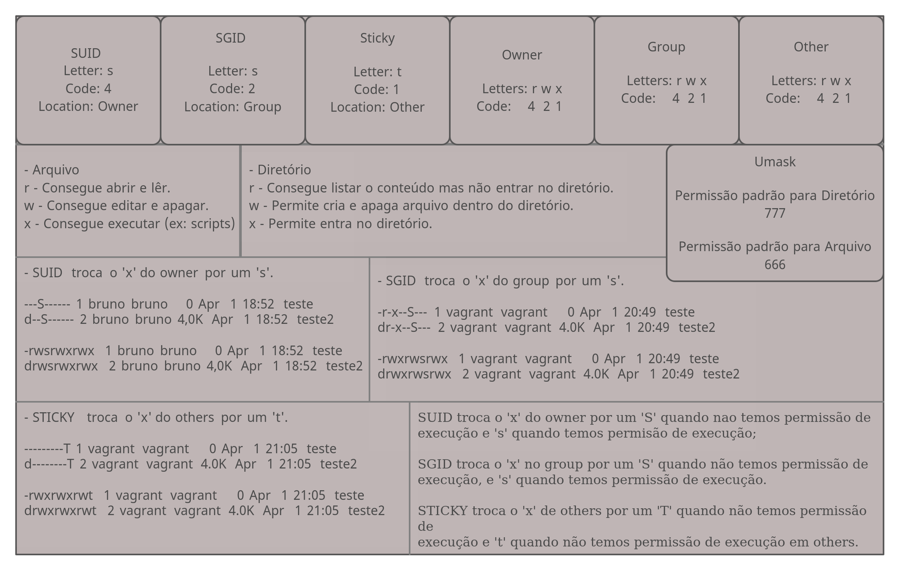

# Índice

[toc]

[Voltar](../104.3/1043.md)
[Próximo](../104.6/1046.md) 
[Índice Geral](../main.md)


# 104.5 Gerenciando Permissões e Propiedades de Arquivos
Por ser um sistema multiusuário, o Linux precisa de alguma forma de rastrear quem é o proprietário de cada arquivo e se um usuário tem ou não permissão para executar ações em um arquivo. Isso é para garantir a privacidade dos usuários que desejam manter o conteúdo de seus arquivos confidenciais, bem como para garantir a colaboração, tornando certos arquivos acessíveis a vários usuários.

Isso é feito por meio de um sistema de permissões de três níveis. Cada arquivo no disco pertence a um usuário e a um grupo de usuários e tem três conjuntos de permissões: um para seu proprietário, um para o grupo que possui o arquivo e um para todos os outros.

Para poder ver as permissões usamos o comando [ls](../103.3/1033.md#ls), na imagem abaixo podemos ver os tipos de permissões, são no total 12 bits reservados para permissões.



Veja a tabela abaixo onde explica o que significa cada letra e código das permissões.

| Permissões em arquivos                                 | Código     | Descrição                                                    |
| ------------------------------------------------------ | ---------- | ------------------------------------------------------------ |
| r                                                      | 4          | Significa lêr e tem um valor octal de 4 (não se preocupe, discutiremos os octais em breve). Isso significa permissão para abrir um arquivo e ler seu conteúdo. |
| w                                                      | 2          | Significa gravação e tem um valor octal de 2. Isso significa permissão para editar ou excluir um arquivo. |
| x                                                      | 1          | Significa executar e tem um valor octal de 1. Isso significa que o arquivo pode ser executado como um executável ou script. |
| **Permissões em diretórios**                           |            | **Descrição**                                                |
| r                                                      | 4          | Significa leitura e tem um valor octal de 4. Isso significa permissão para ler o conteúdo do diretório, como nomes de arquivos. Mas não implica permissão para ler os próprios arquivos. |
| w                                                      | 2          | Significa gravação e tem um valor octal de 2. Isso significa permissão para criar ou excluir arquivos em um diretório ou alterar seus nomes, permissões e proprietários.<br /><br />Se um usuário tiver permissão 'w' em um diretório, ele pode alterar as permissões de qualquer arquivo no diretório (o conteúdo do diretório), mesmo se o usuário não tiver permissões no arquivo ou se o arquivo pertencer a outro usuário.<br /><br />Lembre-se de que ter permissões de gravação em um diretório ou arquivo não significa que você tenha permissão para remover ou renomear o próprio diretório ou arquivo e sim o conteúdo deles. |
| x                                                      | 1          | Significa executar e tem um valor octal de 1. Isso significa permissão para entrar em um diretório, mas não para listar seus arquivos (para isso, 'r' é necessário). |
| **Bits especiais, funcionam em arquivos e diretórios** | **Código** | **Descrição**                                                |
| s                                                      | 4          | SUID, também conhecido como Set User ID, tem o valor octal 4 e é representado por um `s` nas `permissões do usuário` no modo simbólico. <br />`Só se aplica a arquivos` e não tem efeito em diretórios. Seu comportamento é semelhante ao bit SGID, mas o `processo será executado com os privilégios do usuário que possui o arquivo`. Os arquivos com o bit SUID mostram um s substituindo o x nas permissões para o usuário. |
| s                                                      | 2          | Set GID, também conhecido como SGID ou Set Group ID, tem o valor octal 2 e no modo simbólico é representado por um `s` nas `permissões de grupo`. Isso `pode ser aplicado a arquivos executáveis ou diretórios`. `Em arquivos, fará com que o processo seja executado com os privilégios do grupo que possui o arquivo`. Quando aplicado a `diretórios, fará com que cada arquivo ou diretório criado herde o grupo do diretório pai`. |
| t                                                      | 1          | O sticky bit, também chamado de sinalizador de exclusão restrita, tem o valor octal 1 e no modo simbólico é representado por um `t` nas permissões de outro. Isso se `aplica apenas a diretórios` e não tem efeito em arquivos normais. No Linux, `evita que os usuários removam ou renomeiem um arquivo em um diretório`, a menos que sejam proprietários desse arquivo ou diretório. |

Cada arquivo ou diretório possui 3 tipos de aplicação das permissões e cada uma dessas aplicações possuem 4 níveis de permissão, são elas: Baseadas em Dono, Baseadas em Grupo e Baseadas em outros. 

- Baseadas em Dono (Owner)

  As permissões só terão efeito para o Dono do arquivo ou diretório, aqui podemos definir 4 tipos de permissão seja para aquivos ou diretórios, são elas `rwx` fora os bits especiais, consulte a tabela acima para mais detalhes;

- Baseadas em Grupo (Group)

  As permissões só terão efeito sobre o Grupo do arquivo ou diretório, aqui podemos definir 4 tipos de permissão seja para aquivos ou diretórios, são elas `rwx` fora os bits especiais, consulte a tabela acima para mais detalhes;

- Baseadas em Others

  As permissões só terão efeito sobre Outros, que são usuários que não estão no Grupo do arquivo e não são Donos do arquivo ou diretório, aqui podemos definir 4 tipos de permissão seja para aquivos ou diretórios, são elas `rwx` fora os bits especiais, consulte a tabela acima para mais detalhes;

  

## Modo Simbólico

Ao aplicar as permissões em modo simbólico, devemos usar letras que indiquem cada uma das 3 bases de aplicação, são elas: Permissões para o usuário (`u`), Permissões para o grupo (`g`), Permissões para outros (`o`) e/ou Permissões para  todos (`a`).

Em seguida, você precisa dizer ao comando o que fazer: você pode conceder uma permissão (`+`), remover uma permissão (`-`) ou defini-la com um valor específico (`=`), nesse caso, deixará de ter a permissão antiga nessa base de aplicação.

Por último, você especifica em qual permissão deseja agir: ler (`r`), escrever (`w`) ou executar (`x`).

```bash
# listando arquivo/diretório:
$ ls -lh arquivo
-rw-rw-r--. 1 vagrant vagrant 0 Apr  1 22:09 arquivo

# Zere as permissoes do arquivo e diretório:
$ chmod -rwx arquivo 

# Verifique as permissoes:
$ ls -lh
total 0
----------. 1 vagrant vagrant 0 Apr  1 22:09 arquivo
d---------. 2 vagrant vagrant 6 Apr  1 22:09 pasta
# Voce não consegue mais editar o arquivo (ninguém consegue), lêr ou executar.

### Arquivo ###
# Aplique a permissão de leitura:
$ chmod u+r arquivo
# Agora poderá lêr o arquivo.

# Aplique a permissão de escrita:
$ chmod u+w arquivo
# Agora poderá editar o arquivo.

# Aplique a permissão de execução:
$ chmod u+x arquivo
# Agora poderá executar o arquivo.

# Veja a permissão atual do arquivo:
$ ls -lh arquivo 
-rwx------. 1 vagrant vagrant 0 Apr  1 22:09 arquivo

# Defina a permissão do grupo como um todo para apenas leitura e escrita:
$ chmod g=rw arquivo

# Defina a permissão do Others como um todo para leitura, escrita e execução:
$ chmod o=rwx arquivo

# Verifique novamente:
$ ls -lh arquivo
-rwxrw-rwx. 1 vagrant vagrant 0 Apr  1 22:09 arquivo

### Remova a permissão de escrita de Others:
$ chmod o-w arquivo

# Remova a permissão de execução das 3 bases de aplicação:
$ chmod -x arquivo

# Acrescente a permissão de execução apenas para Others:
$ chmod o+x arquivo

# Verifique novamnte o arquivo:
$ ls -lh arquivo
-rw-rw-r-x. 1 vagrant vagrant 0 Apr  1 22:09 arquivo

# Para dar uma permissão para todos das 3 bases de aplicação, basta omitir a base de aplicação, para isso use +w, +r, ou +x. Isso vale para remoção de permissão também.
```


## Modo OCTAL

No modo octal, as permissões são especificadas de uma maneira diferente, aqui usamos o valor dos códigos como um valor de três dígitos na notação octal, um sistema numérico de base 8.

Cada permissão tem um valor correspondente, e eles são especificados na seguinte ordem: primeiro vem read (`r`), que vale `4`, então write (`w`), que vale `2` e o último é execute (`x`), que vale `1`. Para remover todas as permissões de uma base de aplicação use o valor zero (`0`). Portanto, uma permissão de `rwx` seria `7` (4 + 2 + 1) e `r-x` seria `5` (4 + 0 + 1).

O primeiro dos três dígitos no conjunto de permissões representa as permissões para o usuário (`u`), o segundo para o grupo (`g`) e o terceiro para os outros (`o`).

Como trabalhamos com arquivo no Modo Simbólico, vamos trabalhar com diretório aqui:

```bash
# Zere as permissoes do diretório:
$ chmod 000 pasta/

# Verifique as permissoes:
$ ls -lhd pasta
total 0
d---------. 2 vagrant vagrant 6 Apr  1 22:09 pasta
# Voce não consegue mais Entrar no diretório (ninguém consegue), listar ou editar conteúdo dentro dele.

### diretório ###
# Aplique a permissão para listar seu conteúdo:
$ chmod 400 pasta
# Agora poderá listar o arquivo.

# Aplique a permissão de escrita (continue com a permissão anterior):
$ chmod 600 pasta
# Agora para poder editar, criar ou removes itens dentro da pasta, precisamos aplicar execution.

# Aplique a permissão de execução (continue com a permissão anterior):
$ chmod 700 pasta
# Agora poderá entrar na pasta.

# Veja a permissão atual do arquivo:
$ ls -lhd pasta 
drwx------. 2 vagrant vagrant 20 Apr  1 23:41 pasta

# Defina a permissão do grupo como um todo para apenas leitura e escrita:
$ chmod 750 pasta

# Defina a permissão do Others como um todo para leitura, escrita e execução:
$ chmod 757 pasta

# Verifique novamente:
$ ls -lhd pasta
drwxr-xrwx. 2 vagrant vagrant 20 Apr  1 23:41 pasta

### Remova a permissão de escrita de Others:
$ chmod 755 pasta
```


## Bits especiais

### SUID

Também conhecido como Set User ID, tem o valor octal `4`, é representado por um `s` nas permissões do usuário no modo simbólico. `Só se aplica a arquivos` e não tem efeito em diretórios. Seu comportamento é semelhante ao bit SGID, mas o `processo será executado com os privilégios do usuário que possui o arquivo`. 

Os arquivos com o bit SUID mostram um `s` substituindo o `x` nas permissões de `owner` quando temos também a permissão de execução e um `S` quando não temos a permissão de execução em `owner`.

```bash
# Exemplos:
$ chmod 4777 arquivo

# Listando:
$ ls -lh arquivo 
-rwsrwxrwx. 1 vagrant vagrant 0 Apr  1 22:09 arquivo

# removendo a permissão de execução
$ chmod 4444 arquivo

# Listando:
$ ls -lh arquivo 
-r-Sr--r--. 1 vagrant vagrant 0 Apr  1 22:09 arquivo
```


### SGID

Set GID, também conhecido como SGID ou Set Group ID, tem o valor octal `2` e no modo simbólico é representado por um `s` nas permissões de grupo no lugar do `x` quando temos permissão de execução e um `S` quando não temos permissão de execução. Isso pode ser `aplicado a arquivos executáveis ou diretórios`. Em `arquivos, fará com que o processo seja executado com os privilégios do grupo que possui o arquivo`. Quando `aplicado a diretórios, fará com que cada arquivo ou diretório criado herde o grupo do diretório pai`.

```bash
# Removendo execução:
$ chmod 2000 arquivo

# Listando:
$ ls -lh arquivo 
------S---. 1 vagrant vagrant 0 Apr  1 22:09 arquivo

# Adicionando execução:
$ chmod 2070 arquivo

# Listando:
$ ls -lh arquivo 
----rws---. 1 vagrant vagrant 0 Apr  1 22:09 arquivo
```


### STICKY

O sticky bit, também chamado de sinalizador de exclusão restrita, tem o valor octal `1` e no modo simbólico é representado por um `t` nas permissões de Others quando temos permissão de execução e `T` quando não temos permissão de execução. Isso se `aplica apenas a diretórios` e `não tem efeito em arquivos normais`. No Linux, `evita que os usuários removam ou renomeiem um arquivo em um diretório`, a menos que sejam proprietários desse arquivo ou diretório.


## UMASK

Eles vêm da máscara do usuário ou umask, que define as permissões padrão para cada arquivo criado. Você pode verificar os valores atuais com o comando umask:

```bash
$ umask 
0002
```

Por que quando criamos um arquivo as permissões são diferentes?

Bem, não faz sentido definir permissões globais de execução para todos em qualquer arquivo por padrão. Os diretórios precisam de permissões de execução (caso contrário, você não pode entrar neles), mas os arquivos não, portanto, eles não os obtêm. Portanto, o `rw-r--r--`.

Além de exibir as permissões padrão, umask também pode ser usado para alterá-las para sua sessão de shell atual. Por exemplo, se usarmos o comando:

```bash
# Usando o modo simbólica:
$ umask u=rwx,g=rwx,o=

# Usando o modo octal:
$ umask 0004
```


Para que possamos definir a permissão de diretórios e arquivos, eles precisam ter uma permissão padrão, a permissão padrão para arquivos é `666` e  para diretórios é `777`. Vamos aprender a calcular a permissão para arquivos e diretórios, quando você aplica um valor de umask ele passa a valer tanto para arquivo como para diretório, então tenha cuidado:

```bash
#### O UMASK padrão usado é 0002
# diretório:
777-002=775
# 7=permissão total para o dono
# 7=permissão total para o grupo
# 5=leitura e execução para outros

# arquivos:
666-002=664
# 6=leitura e escrita para o dono
# 6=leitura e escrita para o grupo
# 4=leitura para outros
```


## CHOWN

Muda o Dono e Grupo dono, ou só Dono ou Só grupo do arquivo ou diretório.

```bash
# Altera só o grupo:
$ sudo chown .root teste/
 
# Altera só Dono:
$ sudo chown root teste/

# Altera os dois:
$ sudo chown root. teste/
# ou
$ sudo chown root:root teste/
```


## CHGRP

Muda somente o grupo dono.

```bash
# Mudando o grupo do arquivo:
$ sudo chgrp root teste
```


[Voltar](../104.3/1043.md)
[Próximo](../104.6/1046.md) 
[Índice Geral](../main.md)