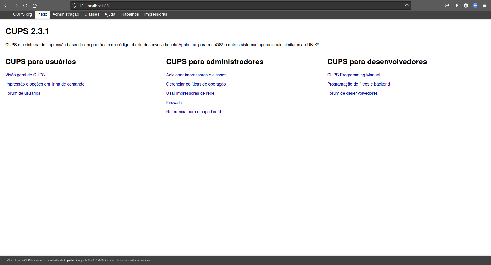

# Índice

[toc]

[Voltar](../108.3/1083.md)
[Próximo](../109.1/1091.md) 
[Índice Geral](../main.md)


# 108.4 Servidor e Impressão

Para podermos ter um servidor de impressão, usamos a aplicação chamada CUPS (Common Unix Printing System), ele é um sistema de gerenciamento de impressão. Como para testar você precisa ter uma impressora, vamos fazer os testes usando uma impressão para PDF.


## Instalação

Siga os passos abaixo para instalar as aplicações necessárias.

```bash
# Instalação do servidor de impressão:
$ sudo apt install cups cups-bsd

# Cups = cliente;
# cups-bsd = server.

# Instalação do módulo de pdf para o cups:
$ sudo apt install cups-pdf
```

O cups roda na porta 631 e para gerenciar por interface gráfica, acesse o IP pelo navegador, informando a porta 631.

Para acessar essa página de outra máquina, faça um redirecionamento usando o ssh:

```bash
$ sudo ssh vagrant@192.168.121.83 -L 85:localhost:631
# Pegar a porta 631 do localhost (maquina que vamos acessar) e redirecionamos para a porta 85 da nossa maquina. Então sempre que entrarmos em localhost:85, vamos estar acessando a máquina 192.168.121.83 na porta 631.
```

Isso precisa ser feito porque o servidor cups roda locamente apenas, a página de gerencia não está aberta para a rede, e não é bom abrir, ja que podemos acessar assim.




## Gerenciando a via terminal

Vamos focar em como gerenciar a impressora via linha de comando, apesar do uso da interface gráfica ser mais fácil, o uso via linha de comando é necessária para a LPI e nem sempre você vai poder contar com uma interface gráfica.


### lpinfo

Usado para listar o dispositivos/Drivers de impressão.

| Opção | Descrição                                                |
| ----- | -------------------------------------------------------- |
| -v    | Lista todos os dispositivos que o cups está encontrando. |
| -m    | Mostra os drivers disponíveis.                           |


Vamos ver um exemplo:

```bash
# Listando os dispositivos:
\# lpinfo -v
network beh
network ipps
network ipp14
file cups-pdf:/
network socket
network ipp
network lpd
serial serial:/dev/ttyS0?baud=115200
network https
direct hp
network http
direct hpfax
```


### lpstat

Usado para retornar o status das impressoras. 

```bash
# Verificando o status das impressoras:
\# lpstat -a
print1 accepting requests since Ter 15 Jun 2021 15:10:53 -03
print2 accepting requests since Qui 09 Fev 2017 16:03:19 -02
print3 accepting requests since Sex 15 Mai 2020 18:10:10 -03
PDF accepting requests since Qui 28 Jul 2016 12:25:59 -03

# Verificando mais detalhes:
lpstat -t
scheduler is running
system default destination: PDF
device for print1: socket://IP
device for print2: socket://IP
device for print3: socket://IP
device for PDF: cups-pdf:/
print1 accepting requests since Ter 15 Jun 2021 15:10:53 -03
print2 accepting requests since Qui 09 Fev 2017 16:03:19 -02
print3 accepting requests since Sex 15 Mai 2020 18:10:10 -03
PDF accepting requests since Qui 28 Jul 2016 12:25:59 -03
printer print1 is idle.  enabled since Ter 15 Jun 2021 15:10:53 -03
	Waiting for printer to finish.
printer print2 is idle.  enabled since Qui 09 Fev 2017 16:03:19 -02
printer print3 is idle.  enabled since Sex 15 Mai 2020 18:10:10 -03
printer PDF is idle.  enabled since Qui 28 Jul 2016 12:25:59 -03
print1-131430      unknown         356352   Sex 09 Abr 2021 00:00:40 -03
```


### lpq

Usado para verificar a fila de impressão, para isso, você precisa instalar o pacote `cups-bsd`.

| Opção            | Descrição                                |
| ---------------- | ---------------------------------------- |
| -a               | Lista as filas de todos os dispositivos. |
| -P \<impressora> | Mostra a fila de uma impressora.         |
| -U \<username>   | Mostra a fila de um usuário específico.  |
| -o               | Mostra os jobs (igual `lpq`).            |


### loptions

Usado para ver e configurar opções de impressora.

| Opção            | Descrição                      |
| ---------------- | ------------------------------ |
| -p \<impressora> | Mostra os dados da impressora. |

```bash
\# #  lpoptions | sed 's/ /\n/g'
copies=1
device-uri=cups-pdf:/
finishings=3
job-cancel-after=10800
job-hold-until=no-hold
job-priority=50
job-sheets=none,none
marker-change-time=0
number-up=1
printer-commands=AutoConfigure,Clean,PrintSelfTestPage
printer-info=PDF
printer-is-accepting-jobs=true
printer-is-shared=false
printer-location
printer-make-and-model='Generic CUPS-PDF Printer'
printer-state=3
printer-state-change-time=1469719559
printer-state-reasons=none
printer-type=10678348
printer-uri-supported=ipp://localhost/printers/PDF

# Vendo outra impressora:
\#  lpoptions -p print1 | sed 's/ /\n/g'
copies=1
device-uri=socket://IP
finishings=3
job-cancel-after=10800
job-hold-until=no-hold
job-priority=50
job-sheets=none,none
marker-change-time=0
number-up=1
printer-commands=ReportLevels
printer-info=print1
printer-is-accepting-jobs=true
printer-is-shared=true
printer-location
printer-make-and-model='HP LaserJet Pro MFP M521 Postscript (recommended)'
printer-state=3
printer-state-change-time=1623783570
printer-state-reasons=none
printer-type=8425556
printer-uri-supported=ipp://localhost/printers/print1
```


### lprm

Usado para remover uma impressão da fila de impressão.

Use o `-P <impressora_nome>` para remover o ultimo item da fila de impressão.

```bash
# Limpando tudo do usuário root (logado no momento):
\# lprm -

# Removendo o job 1:
\# lprm 1
```


## Adicionando uma impressora

Antes de adicionarmos um impressora, precisamos saber qual o driver dela. Para gerenciar as impressoras no sistema, usamos o comando `lpadmin`.

| Opção            | Descrição                                                    |
| ---------------- | ------------------------------------------------------------ |
| -p \<nome>       | Especifica um nome para a impressora.                        |
| -E               | Ativa a impressora, aceitando trabalhos da impressora (depois de -p) |
| -v               | Informa o URI (Endereço de busca da impressora), podemos obter a impressora com o comando `lpinfo -v` ou podemos passar uma flag para buscar, por exemplo, para buscar na rede usamos `ipp://IP`. |
| -m               | Informa o modelo/PPD arquivo da impressora (driver).         |
| -d \<nome>       | Define a impressora padrão.                                  |
| -x \<impressora> | Remove uma impressora.                                       |

```bash
# Procurando o driver da impressora:
$ lpinfo -m | grep -i 5264
postscript-hp:0/ppd/hplip/HP/hp-laserjet_flow_mfp_e52645-ps.ppd HP LaserJet Flow MFP E52645 Postscript (recommended)

###### Instalando os driver de impressoras HP ######
# Caso nao encontre nada, instale o pacote abaixo, ele contém os drivers para impressora HP:
$ sudo apt install hplip -y

# Agora vamos adicionar a impressora pela rede:
$ sudo lpadmin -p NOME -E -v ipp://IP/printers/Atendimento -m postscript-hp:0/ppd/hplip/HP/hp-laserjet_flow_mfp_e52645-ps.ppd

# Tornando a impressora a padrão:
$ sudo lpadmin -d "NOME"
```


## Enviando arquivo para a impressora

Para podermos imprimir, vamos usar o comando `lpr`.

```bash
# Enviando um arquivo para a impressora padrão:
$ lpr <arquivo>

# Escolhendo a impressora:
$ lpr <arquivo> -P <impressora_nome>

# Uma forma de mandar imprimir também é usando o redirecionamento de saída padrão:
$ grep "root" /etc/passwd | lpr

# Também podemos fazer isso usando o comando 'lp -d <impressora>'
```

Quando você enviar uma impressão, e ela for impressa, ele ficará em `/var/spool/cups/`. Arquivos começando com `d` (arquivos de Dados), são impressões pendentes para serem feitas, e tudo que começar com `c` (arquivos de controle), são arquivos que já foram impressos. 

> Os arquivos de controle são normalmente limpos após o 500º trabalho ser enviado, enquanto os arquivos de dados são removidos imediatamente após a impressão bem-sucedida de um trabalho. Ambos os comportamentos podem ser configurados. 

Os logs ficam em `/var/log/cups/`.